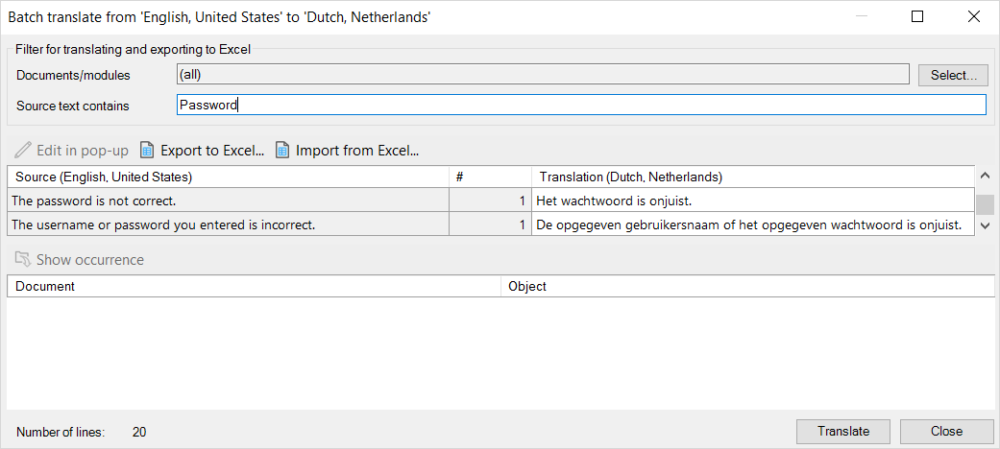

## 1 Introduction

### 4.3 Performing Batch Translation {#batch-translate}

Instead of going through the pages and translating labels one-by-one, it's much more efficient to use the batch translate option.

You can also filter to specific modules and use the search to find specific labels.

To enable batch translation, follow these steps:

1. Go to **Language** > **Batch Translate**.
2. Select the **Source language** and **Destination language**.
3. In the **Source text contains** field of the **Batch translate** dialog box, enter the word you want to search for.
4.  The results will appear in the table with the column headers **Source** and **Translation** (as in the example image below, in which "Password" is being searched).

	

5. Enter the translated text for the various results under **Translation**, and then click **Translate**.

#### 4.3.1 Text Occurrence & Context

Because some labels and other texts are in the list multiple times, it’s important to know where in your app they’re being used. You can see this using the **Occurrence** window at the bottom of the **Batch translate** dialog box.

For example, there may be two English labels with the word "address." If you translate this to Dutch, it’s important to know if the word is used in the context of "someone's contact details" or in the context of "talking to a person in a certain way" (for example, in Dutch, the first meaning translates to “adres,” but the second meaning translates to "aanspreken").

## 5 Exporting & Importing Translations

If you want to translate a language outside Studio Pro, you can export the translatable texts to the Excel (*.xlsx*) format by clicking **Export to Excel** on the **Batch translate** dialog box. This produces an Excel file with two columns, one for each language. When you’re done, simply import the Excel file into your app project by clicking **Import from Excel** on the **Batch translate** dialog box.

## OLD INTRO - USE AS REQUIRED

Studio Pro makes it easy to translate your application into another language. You can add a language in the [Project Settings](project-settings) and then switch to that language by 

For texts that have not been translated yet, the text in the default language is shown between angle brackets. For example, a caption can be shown as `<Name>`. This means that the caption has not been translated yet and was `Name` in the default language. By simply typing the text in the currently selected language (for example, `Naam` in Dutch), the caption will be translated.

{}
To ease the translation if you have a lot of texts, a **Batch Translate** feature can be found in the [Language](menus#language) menu. By using this feature you can quickly translate all occurrences of a word to a word in another language. It is even possible to export all texts to Excel and later import the translations again.
{}
