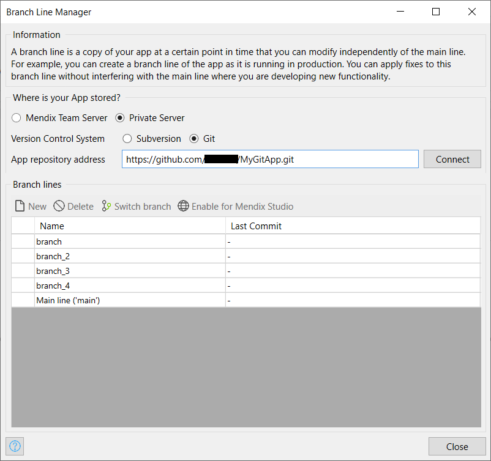

## 1 Introduction

The **Branch Line Manager** is used to manage the [branch lines](version-control#branches) of an app that are stored on a version control server.

	
	
	

To view the **Branch Line Manager** dialog box, open **Version Control** > **Manage Branch Lines**.

A branch line allows independent development from other development lines. There are two main reasons for creating a branch line:

* To do maintenance development on a version of your app that is running in production. You can keep on developing in the main line while you fix issues in the branch line.
* To start the development of a very large feature that will take more than a day to develop. By doing this in a branch line, you can commit the half-implemented feature (possibly even with errors) without disturbing other development in the main line.

## 2 Location

Use this setting to select the location where your app is stored. This can be either the [Team Server](#team-server-app) or a [private SVN or Git repository](#byo-server-app).

{}
This option is only available when support for private SVN or Git servers is enabled in [Preferences](preferences-dialog).
{}

### 2.1 Team Server App {#team-server-app}

Select the Team Server app for which you want to manage the branch lines. If you have an app open in Studio Pro, it will be selected automatically. However, you can also manage branch lines without opening an app first, in which case no app will be selected.

For more information about the Mendix Team Server, see [Team Server](/developerportal/collaborate/team-server).

### 2.2 Bring Your Own (BYO) SVN or Git Server App {#byo-server-app}

In the **App repository address** field, enter the address of the app you want to manage and click **Connect** to load the available branches from the repository.

## 3 Managing Branch Lines

In the **Branch Line Manager**, you can create and delete branch lines, and enable and disable Mendix Studio for the app. For more information on how to perform these actions, see the [Managing Studio on Development Lines](collaborative-development#managing-studio) and [Managing Development Lines](collaborative-development#managing-branches) sections in *Collaborative Development*. 

## 4 Read More

* [Version Control](version-control)
* [Collaborative Development](collaborative-development)
