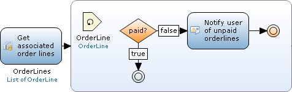

A break event is used to stop iterating over the list of objects and continue with the rest of the flow. Please note that break events can only be used inside [loops](loop).

{}

If you have a situation where you want to notify the user of any unpaid orderlines you could use a break event. First you retrieve all objects of entity 'OrderLine' that are associated with the order. For each orderline you check whether they are paid or not. If the orderline is paid, the microflow continues to the next orderline. However, if an unpaid orderline is found the user is notified and the loop is stopped; the microflow breaks from the loop and continues with the rest of the microflow.

{}
