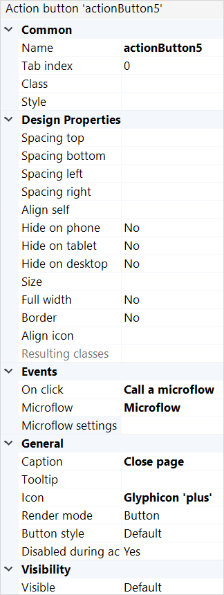

## 1 Introduction

A button can perform various actions such as calling a microflow or nanoflow or opening a page. 

## 2 Properties

An example of button properties is represented in the image below:

{}
{}

Button properties consist of the following sections:

* [Common](#common) 
* [Design Properties](#design)
* [Events](#events)
* [General](#general)
* [Visibility](#visibility)

### 2.1 Common Section {#common}

{}

### 2.2 Design Properties Section {#design}

### 2.3 Events Section {#events}

{}

### 2.4 General Section {#general}

#### 2.4.1 Caption

The caption defines the text that will be shown. The template can contain parameters that are written as a number between braces, e.g. {1}. The first parameter has number 1, the second 2 etcetera. Note that to use template parameters the widget must be placed in a context of an entity, e.g. inside a [data view](data-view) or [list view](list-view). The parameters will be replaced by the values of the attributes.

#### 2.4.2 Tooltip

The tooltip property determines the text you will see in the tooltip that appears when you hover over the button. The tooltip text is translatable. See [Translatable Texts](translatable-texts). If the tooltip is not specified, no tooltip will be shown when hovering over the button.

#### 2.4.3 Icon

The icon property determines the icon that will be shown in front of the caption of the button. There are three options: no icon, a glyph icon or a (bitmap) image. Glyph icons come from the Bootstrap Halflings collection. The advantages of a glyph icon over a bitmap image are that glyphs are scalable, look sharp on high-resolution screens and their color can be changed by changing the font color. The advantage of an image icon is that it can have multiple colors.

#### 2.4.4 Render Mode

This property indicates how the button is rendered.

| Value  | Description                             |
| ------ | --------------------------------------- |
| Button | The trigger is rendered as a button.    |
| Link   | The trigger is rendered as a hyperlink. |

_Default value:_ Button

#### 2.4.5 Button Style

This property applies a predefined styling to the button.

#### 2.4.6 Disable During Action

Only for Microflow Actions. Disables the action button until the action is completed or failed.

*Default value*: false.

### 2.5 Visibility Section {#visibility}

{}

## 3 Read More

