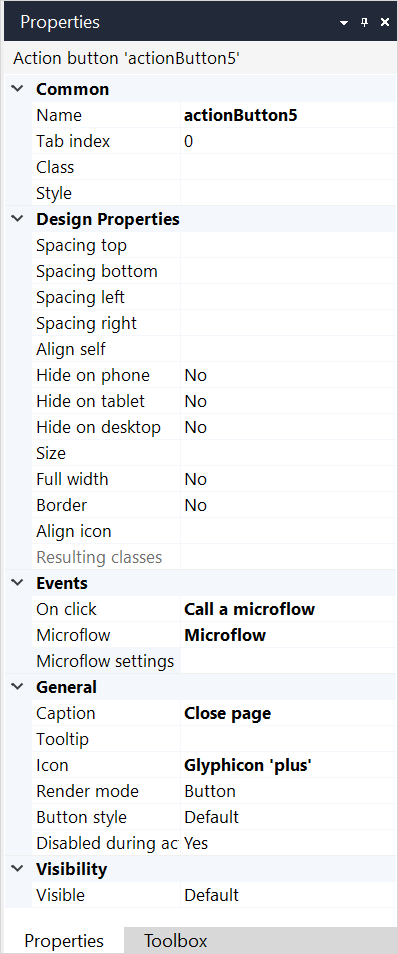
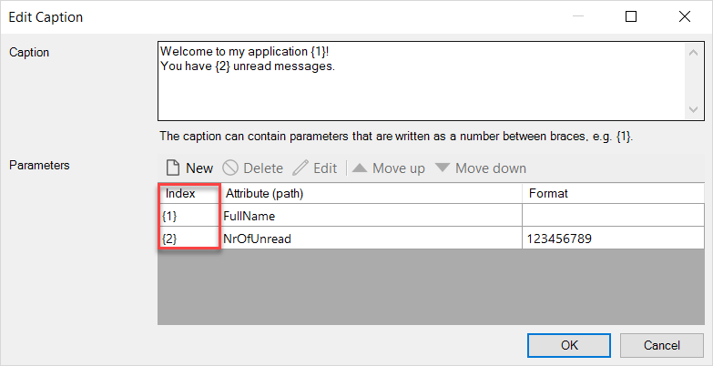

## 1 Introduction

A button can perform various actions such as calling a microflow or nanoflow or opening a page. 

## 2 Properties

An example of button properties is represented in the image below:

{}
{}

Button properties consist of the following sections:

* [Common](#common) 
* [Design Properties](#design)
* [Events](#events)
* [General](#general)
* [Visibility](#visibility)

### 2.1 Common Section {#common}

{}

### 2.2 Design Properties Section {#design}

{} 

### 2.3 Events Section {#events}

{}

### 2.4 General Section {#general}

#### 2.4.1 Caption {#caption}

**Caption** defines a text that will be shown. The caption can contain parameters that are written between braces, e.g. {1}.  

For more information on using parameters, see the [Parameters]() section below. 

#### 2.4.2 Parameters {#parameters}

Parameters are attributes the value of which will be displayed. To view **Parameters**, do one of the following:

* Double-click the **Caption** setting in properties

* Double-click the text widget on the page and click **Edit** in the **General** section > **Caption**:

   

Parameters have the following settings:

* **Index** – an identification number of a parameter 

* **Attribute (path)** – an attribute a value of which will be displayed 

* **Format** – a format in which an attribute value will be displayed

  

##### 2.2.2.1 Adding New Parameters

To use parameters, do the following:

1. Place the **Text** widget must be placed in a context of an entity, i.e. inside a [data widget](data-widgets).

2. Double-click the **Caption** setting in the text widget properties.

3. In the **Edit Caption** dialog window > **Parameters** section click **New**:

   

4. In the **Edit Template Parameter** dialog window, click **Select**, choose an attribute and confirm your choice.

5. In the **Caption** setting, write the text you would like to display and type **Index** of the parameter you would like to include. In the example below, to include a full name of your customer and a number of unread messages, you need to use indexes {1} for the *FullName* attribute, and {2} for the *NrOfUnread* attribute:  

   

##### 2.2.2.2 Performing Other Actions on Parameters

In addition to adding new parameters, you can perform the following actions on parameters:

* **Delete** – to delete a parameter click Delete or press <kbd>Delete</kbd> on your keyboard

* **Edit** – double-click a parameter to edit it or click Edit

* **Move up** – to move a parameter up in the list of parameters and also to change its index, click **Move up**

* **Move down** – to move a parameter down in the list of parameters and also to change its index, click **Move down**

  

#### 2.4.2 Tooltip

The **Tooltip** property determines the text end-users will see in the tooltip that appears when you hover over the button. The tooltip text is translatable. For more information on translatable texts, see [Translatable Texts](translatable-texts). If the tooltip is not specified, no tooltip will be shown when hovering over the button.

#### 2.4.3 Icon

The **Icon** property determines the icon that will be shown in front of the caption of the button. There are three options: no icon, a glyph icon or a (bitmap) image. Glyph icons come from the Bootstrap Halflings collection. The advantages of a glyph icon over a bitmap image are that glyphs are scalable, look sharp on high-resolution screens and their color can be changed by changing the font color. The advantage of an image icon is that it can have multiple colors.

#### 2.4.4 Render Mode

Defines the way the button will be shown to the end-user. Possible options are the following:

* **Button** – the widget will be rendered as a button
* **Link** – the widget will be rendered as a hyperlink

*Default render mode:* Button

#### 2.4.5 Button Style

The **Button style** property applies a predefined styling to the button. Possible options are the following:

* Default
* Inverse
* Primary
* Info
* Success
* Warning
* Danger

#### 2.4.6 Disable During Action

Only for Microflow Actions. Disables the action button until the action is completed or failed.

*Default value*: false.

### 2.5 Visibility Section {#visibility}

{}

## 3 Read More

