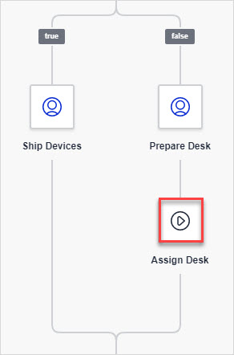
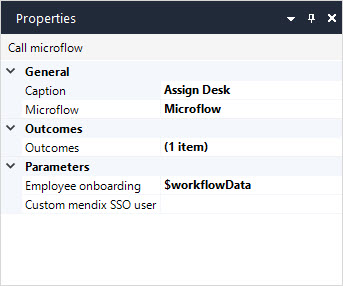

## 1 Introduction

**Call microflow** is used to call a selected [microflow](microflow). Arguments can be passed to the microflow and the result can be stored.

## 2 Properties

An example of **Call microflow** properties is represented in the image below:

Call microflow properties consist of the following sections:

* [General](#general)
* [Outcomes](#outcomes)
* [Parameters](#parameters)

### 2.1 General Section {#general}

#### 2.1.1 Caption

The **Caption** describes what happens in this element. It is displayed in the workflow element to make the workflow easier to read and understand without needing to add annotations.

#### 2.1.2 Microflow

The microflow that is called by this element.

### 2.2 Outcomes Section {#outcomes}

**Outcomes** depends on the return value of the microflow. For example, for the Boolean, you have **true** and **false** outcomes, and for the enumeration: an outcome per each enumeration value and an empty one when the value is unassigned.  . 

### 2.3 Parameters Section {#parameters}

Parameters of the selected microflow. Depending on the selected microflow, you will see a list of its parameters. Parameters pass data to the element. To view **Parameters**, click the ellipsis icon next to the property name. 

## 3 Read More

* [Workflow Properties](workflow-properties)