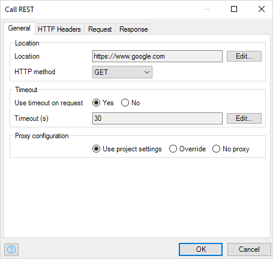

The **Call REST service** action can be used to call a REST endpoint. You can specify the location and how the response of the REST call should be handled.

## 1 General

### 1.1 Location

The **Location** property defines the REST endpoint to be called. The location needs to be entered using a string template. The string template should result in a valid URL string. Parameters can be used by writing a number between braces (for example, `{1}`). For each parameter in the template, you can specify its value using a [Microflow Expression](microflow-expressions) resulting in a string value. To escape the opening brace (`{`), a double opening brace should be used (`{{`).

The **HTTP method** property defines the HTTP method to use when calling a REST endpoint. The possible values are: GET, POST, PUT, PATCH, DELETE.

### 1.2 Timeout

Set **Use timeout on request** to _Yes_ to be able specify how long the Call REST activity should wait for the REST endpoint 
to respond. If the REST endpoint hasn't responded after the number of seconds in **Timeout (s)**, an exception will be 
thrown and the microflow will rollback or go into your custom error handler.

## 2 HTTP Headers

### 2.1 Authentication

The **Use HTTP authentication** check box defines whether basic authentication should be used.

The **User name** property defines the user name that will be used to authenticate over HTTP. The user name needs to be entered using [Microflow Expressions](microflow-expressions). The microflow expression should result in a string.

The **Password** property defines the password that will be used to authenticate over HTTP. The password needs to be entered using [Microflow Expressions](microflow-expressions). The microflow expression should result in a string.

### 2.2 Custom HTTP Headers

These headers are added to the HTTP request header. Each custom header is a pair with a key and a value (a microflow expression).

## 3 Request

The sections below describe the options in the drop-down menu for generating the request. Requests can only be generated for HTTP methods POST, PUT and PATCH.

### 3.1 Export Mapping for the Entire Request

This option allows you to use a single [Export Mapping](export-mappings) for the body of the request. 

#### Mapping

Select the mapping that you want to apply

#### Parameter type

If the [Export Mapping](export-mappings) requires input, this field shows the type of the input.

#### Parameter

If the [Export Mapping](export-mappings) requires input, you can select a variable of the correct type.

#### Content type

If the [Export Mapping](export-mappings) is based on a message definition, it can export both XML and JSON. Choose which type of output you want.

### 3.2 Binary for the Entire Request

This option allows you to send binary data (the contents of a FileDocument, for example).

### 3.3 Custom Request Template

This option allows you to generate the request using a string template. The template defines the structure of the request in plain text. Parameters can be used by writing a number between braces (for example, `{1}`). For each parameter in the template, you can specify its value using a [Microflow Expression](microflow-expressions) resulting in a string value. To escape the opening brace (`{`), a double opening brace should be used (`{{`).

## 4 Response

### 4.1 Response Handling

These are the options in the drop-down menu for handling the response:

* **Apply import mapping** – if the response is JSON or XML, it can be transformed directly into objects using an [Import Mapping](import-mappings). The fields that you can choose here are described in the [Import Mapping Action](import-mapping-action).
* **Store in an HTTP response** – any successful HTTP response can be stored directly in an [HttpResponse](http-request-and-response-entities#http-response) object, and the [$latestHttpResponse](call-rest-action#latesthttpresponse-variable) variable is also updated
* **Store in a file document variable** – if the response is a binary content (for example, a PDF), it can be stored in an entity – this entity should inherit from `System.FileDocument`
* **Store in a string** – if the response is a string (for example, CSV), it can be stored directly in a string variable
* **Do not store in a variable** - use this option when the call does not return anything useful.

### 4.2 Output

The **Type** field defines the type of the output variable.

The **Name** field defines the name for the variable that will hold the result of the operation.

### 4.3 Error Handling

This section is applicable when the HTTP response status code is not successful (for example, a redirection [3xx] or an error [4xx and 5xx]).

When the **Store message body in $latestHttpResponse variable** option is selected, `$latestHttpResponse/Content` will be set with the response body. It might contain some useful information provided by the server (for example, why the authentication is rejected).

### 4.4 $latestHttpResponse Variable

The `$latestHttpResponse` variable is of the [HttpResponse](http-request-and-response-entities#http-response) type. It is available after a Call REST activity.

However, its `Content` attribute will be left empty in most cases in order to minimize memory usage.

This attribute is filled when one of the following scenarios occur:
* The **Response handling** is **Store in an HTTP response** and the call succeeded
* The **Store message body in $latestHttpResponse variable** option in the **Error handling** section is checked and the call failed

This variable can be accessed from any microflow action in the scope.
