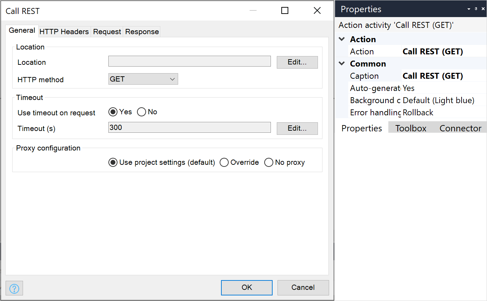

{}
This activity can only be used in **Microflows**.
{}

## 1 Introduction

The **Call REST service** activity can be used to call a REST endpoint. You can specify the location and how the response of the REST call should be handled.

## 2 Properties

An example of call rest action properties is represented in the image below:

There are two sets of properties for this activity, those in the dialog box on the left, and those in the properties pane on the right.

The call rest action properties pane consists of the following sections:

* [Action](#action)
* [Common](#common)

## 3 Action Section{#action}

The **Action** section of the properties pane shows the action associated with this activity.

You can open a dialog box to configure this action by clicking the ellipsis (**…**) next to the action.

You can also open the dialog box by double-clicking the activity in the microflow or right-clicking the activity and selecting **Properties**.

The properties dialog box consists of four tabs:

* [General](#general)
* [HTTP Headers](#http-headers)
* [Request](#request)
* [Response](#response)

## 4 General Tab {#general}

### 4.1 Location

The **Location** property defines the REST endpoint to be called.

The location needs to be entered using a string template which must result in a valid URL string.

#### 4.1.1 String Template{#string-template}

The template for the location can contain parameters that are written as a number between braces (for example, `{1}`). The first parameter has the number `1`, the second `2`, etc. You can escape the opening brace (`{`), by using a double opening brace (`{{`).

#### 4.1.2 Parameters

For each parameter in the template, you can specify its value using a [microflow expression](expressions) resulting in a string value. This value will be inserted at the position of the parameter.

### 4.2 HTTP Method

The **HTTP method** property defines the HTTP method to use when calling a REST endpoint. The possible values are: GET, POST, PUT, PATCH, DELETE, HEAD, and OPTIONS.

### 4.3 Use Timeout on Request

Set **Use timeout on request** to **Yes** to be able specify how long the Call REST activity should wait for the REST endpoint to respond. 

{}
It is recommended that you keep this set to **Yes**. Most cloud infrastructure services (including those used by the Mendix Cloud) will close HTTP connections automatically if there is no traffic for a few minutes, even if your activity is still waiting for a response. This means that, if your activity calls a web service which takes a long time to respond, the connection may be closed without the activity being aware of this, and your activity will not receive a response. Under these circumstances, if **Use timeout on request** is set to **No**, your activity will get stuck waiting indefinitely for data to arrive.
{}

Default value: *Yes* (as of Studio Pro [8.5.0](/releasenotes/studio-pro/8.5#850); in earlier versions, the default value was No)

### 4.4 Timeout (s)

If the REST endpoint has not responded after the number of seconds in **Timeout (s)**, an exception will occur and the microflow will roll back or go into your custom error handler.

Default value: *300 seconds* (as of Studio Pro [8.5.0](/releasenotes/studio-pro/8.5#850); in earlier versions, the default value for **Use timeone on request** was No)

### 4.5 Proxy Configuration

In almost all cases, you can ignore this setting. **Use project settings** is a good default value.

If desired, you can configure whether to use a proxy for the request. These are the choices:

* **Use project settings** – use whatever settings are defined at the project level (default)
* **Override** – override the project-level settings for this action
* **No proxy** – do not use a proxy for this action, even if there is a proxy configured at the project level

When you select **Override**, you can configure dynamically whether to use a proxy. You then supply the host, port, username, and password settings for the proxy.

## 5 HTTP Headers Tab {#http-headers}

### 5.1 Use HTTP Authentication

The **Use HTTP authentication** check box defines whether basic authentication should be used.

### 5.2 User Name

The **User name** property defines the user name that will be used to authenticate over HTTP. The user name needs to be entered using [microflow Expressions](expressions). The microflow expression should result in a string.

### 5.3 Password

The **Password** property defines the password that will be used to authenticate over HTTP. The password needs to be entered using [expressions](expressions). The microflow expression should result in a string.

### 5.4 Custom HTTP Headers

These headers are added to the HTTP request header. Each custom header is a pair with a key and a value (a microflow expression).

## 6 Request Tab {#request}

The sections below describe the options in the drop-down menu for generating the request.

{}
Requests can only be generated for HTTP methods POST, PUT, PATCH, and OPTIONS.
{}

### 6.1 Export Mapping for the Entire Request

This option allows you to use a single [export mapping](export-mappings) for the body of the request. 

#### 6.1.1 Mapping

Select the mapping that you want to apply.

#### 6.1.2 Parameter Type

If the [export mapping](export-mappings) requires an input, this field shows the type of the input.

#### 6.1.3 Parameter

If the [export mapping](export-mappings) requires an input, you can select a parameter of the correct type.

#### 6.1.4 Content Type

If the [export mapping](export-mappings) is based on a message definition, it can export either XML or JSON. Choose the type of output you want.

{}
**Content-Type header** is not set by default. To set it, use the **Custom HTTP Headers** tab.
{}

### 6.2 Binary for the Entire Request

This option allows you to send binary data (for example, the contents of a FileDocument).

### 6.3 Form-Data

This option allows you to generate a multipart/form-data request for multiple parts. Each part is a pair with a key and a value (microflow expression). 

FileDocuments and images are are also supported for this option when used as variables in microflow expressions.

#### 6.3.1 Content Type

Setting up a **Content-Type header** for a form-data request will result in a consistency error, as it will automatically be set to **multipart/form-data**. 

The content type for the FileDocument part is **application/octet-stream**.

### 6.4 Custom Request Template

This option allows you to generate the request using a string template. The template defines the structure of the request in plain text. 

See [String Template](#string-template), above, for more information on constructing strings from templates.

## 7 Response Tab {#response}

### 7.1 Response Handling

These are the options in the drop-down menu for handling the response:

* **Apply import mapping** – if the response is JSON or XML, it can be transformed directly into objects using an [import mapping](import-mappings); the fields that you can choose here are described in the [Import Mapping action](import-mapping-action)
* **Store in an HTTP response** – any successful HTTP response can be stored directly in an [HttpResponse](http-request-and-response-entities#http-response) object, and the [$latestHttpResponse](#latesthttpresponse) variable is also updated
* **Store in a file document** – if the response contains binary content (for example, a PDF), it can be stored in an object of an entity type which inherits from `System.FileDocument`
* **Store in a string** – if the response is a string (for example, CSV), it can be stored directly in a string variable
* **Do not store in a variable** - use this option when the call does not return anything useful

### 7.2 Type

The **Type** field defines the type of the output.

### 7.3 Variable

The **Variable** field defines the name for the result of the operation.

### 7.4  Store Message Body in $latestHttpResponse Variable {#latesthttpresponse}

If HTTP response status code is not successful (for example, `[4xx]` or `[5xx]`), the flow will continue in an [error handler](error-event#errorhandlers).

{}
You should always add an error handler for a [call REST service](/refguide/call-rest-action) action.
{}

## 8 Common Section{#common}

{}
