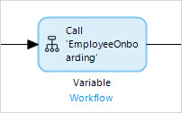
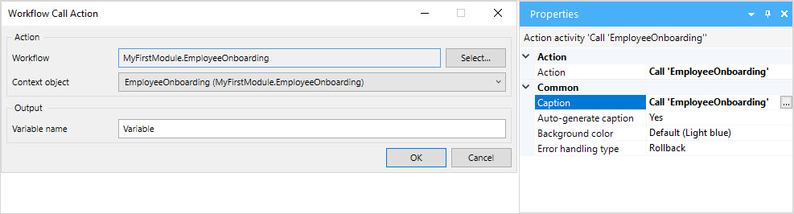

{}
This activity can only be used in **Microflows**.
{}

## 1 Introduction

The **Call workflow** activity can be used to call a [workflow](workflows). 

Arguments can be passed to the microflow and the result can be stored.

## 2 Properties

There are two sets of properties for this activity, those in the dialog box on the left, and those in the properties pane on the right:

The **Call workflow** properties pane consists of the following sections:

* [Action](#action)
* [Common](#common)

## 3 Action Section {#action}

The **Action** section of the properties pane shows the action associated with this activity.

You can open a dialog box to configure this action by clicking the ellipsis (**…**) next to the action.

You can also open the dialog box by double-clicking the activity in the microflow or right-clicking the activity and selecting **Properties**.

### 3.1 Workflow

The workflow that is called by this activity. 

### 3.2 Context Object

An object which you want to use as a context.

### 3.3 Variable Name, Object Name, or List Name {#name}

The name of the variable, list, or object returned by the activity.

## 4 Common Section {#common}

{}