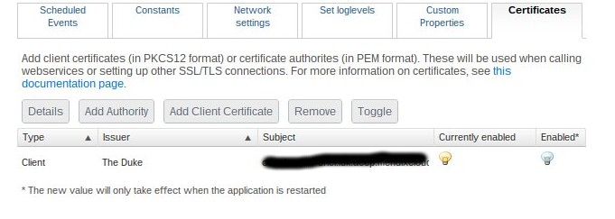
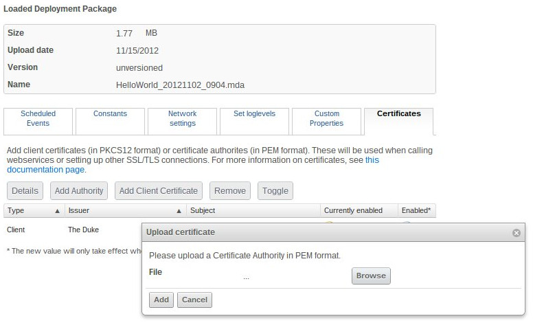

You may want to use certificates to integrate with third parties that require SSL/TLS. There are two scenarios:

*   a third party may require authentication via certificates (client certificates)
*   a third party may use a certificate that is signed by their own authority (certificate authorities)

## Client Certificates

For client certificates, only the Public-Key Cryptography Standard #12 (PKCS12) format is supported. You can upload a PKCS12 file on the Environment Details page:

After uploading a client certificate, you will be requested to fill in a password to unlock the certificate container. Note that certificates require an app restart before they become active.

For more information, see:

*   [http://en.wikipedia.org/wiki/Transport_Layer_Security](http://en.wikipedia.org/wiki/Transport_Layer_Security)
*   [http://computer.howstuffworks.com/encryption.htm](http://computer.howstuffworks.com/encryption.htm)

### Converting certificates to PKCS12

Virtually all certificate formats can be converted to the PKCS12 format. For more information, see these links:

*   [https://www.tbs-certificates.co.uk/FAQ/en/288.html](https://www.tbs-certificates.co.uk/FAQ/en/288.html)
*   [https://www.openssl.org/docs/manmaster/man1/openssl.html](https://www.openssl.org/docs/manmaster/man1/openssl.html)

## Certificate Authorities

Loading certificate authorites works much the same way, although they do not require authentication as these are public certificates.

If you run into any problems installing a client certificate or certificate authority, please file a ticket at [https://support.mendix.com](https://support.mendix.com)
