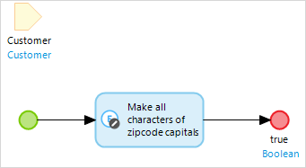

A change object can be used to change the members of an object. This can be done with or without committing and with or without events.

{}

Before a customer is saved you want to make sure all characters of the zip code are capitals. You do this by creating an [event handler](event-handlers) for the entity 'Customer'. The microflow that is used as event handler is shown below. It consists of a parameter and a change object activity. The parameter contains the current customer being saved.

The properties are configured as below.

| Property | Value | Reason |
| --- | --- | --- |
| Object | InputCustomer (Module.Customer) | The change activity applies to the current customer being saved |
| Commit type | No | The object is changed before commit and the changes are still 'remembered' by the server when it is committed |
| Refresh in client | No | Objects of the entity 'Customer' are automatically refreshed by the server when a object is committed in a form |
| Change member action _set_ on _zipcode_ | toUpperCase($InputCustomer/zipcode) | A [microflow expression](microflow-expressions) can be used to set all characters to upper case (capitals) |

{}{}

See [Microflow Element Common Properties](microflow-element-common-properties) for properties that all activities share (e.g. caption). This page only describes the properties specific to the action.

{}

## Input Properties

### Object

Object defines the object variable that is changed.

## Action Properties

### Commit Type

Commit type defines the way the object is committed.

| Option | Description |
| --- | --- |
| Yes with event handlers | The object is saved in the database and the [event handlers](event-handlers) are triggered |
| Yes without event handlers | The object is saved in the database, but the [event handlers](event-handlers) are not triggered |
| No | The object is changed without being saved in the database |

{}

If a microflow is triggered from a data view (for example by the 'on change' of an text field) you often do not want to commit the changes you make to the data view object yet. The end user can press the Save or Cancel button to commit or rollback the changes.

However, if the microflow is triggered from a data grid button that just performs an operation on a selection you will want to commit the changes to avoid losing them.

{}

{}
Nanoflows do not support committing changes without events. Committing while running in an online app sends a commit request to the Mendix Runtime and runs the events. If a change object action is used in an offline app, the changes are committed to the offline database.
{}

_Default value:_ No

### Refresh in Client

Refresh in client defines whether pages that use the entity of the object being changed are refreshed.

| Option | Description |
| --- | --- |
| Yes | Objects of same entity are refreshed in the user's browser |
| No | Objects of same entity are not refreshed in the user's browser |

{}
Nanoflows do not have the refresh in client option. All the changes made in a nanoflow refresh the client by default.
{}

_Default value_: No

### Change Members

You can specify a list of changes that will be applied to the object. Values for members are specified with [microflow expressions](microflow-expressions) and should be of the same type as the member. For a reference set association it is also possible to add and remove instead of only set the member. With 'add' an object or a list of objects can be added to the currently associated objects. With 'remove' an object or a list of objects can be removed from the currently associated objects.

### Related Topics

*   [Microflow Expressions](microflow-expressions)
