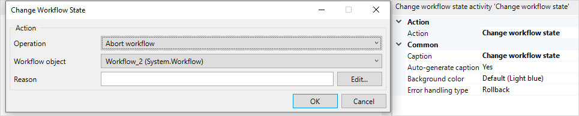

{}
This activity can only be used in **Microflows**.
{}

## 1 Introduction

The **Change workflow state** activity can be used to add **Abort**, **Restart**, **Continue**, **Pause**, and **Resume** actions to a workflow and control workflow instances. 

## 2 Properties

An example of change workflow state properties is represented in the image below:

{}[Update the screenshot]{}

There are two sets of properties for this activity, those in the dialog box on the left, and those in the properties pane on the right.

The **Change workflow state** properties pane consists of the following sections:

* [Action](#action)
* [Common](#common)

## 3 Action Section {#action}

The **Action** section of the properties pane shows the action associated with this activity.

You can open a dialog box to configure this action by clicking the ellipsis (**…**) next to the action.

You can also open the dialog box by double-clicking the activity in the microflow or right-clicking the activity and selecting **Properties**.

### 3.1 Operation

### 3.2 Workflow Object

### 3.3 Reason

## 4 Common Section {#common}

{}