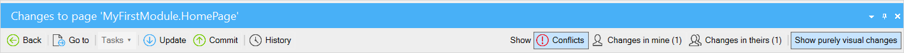
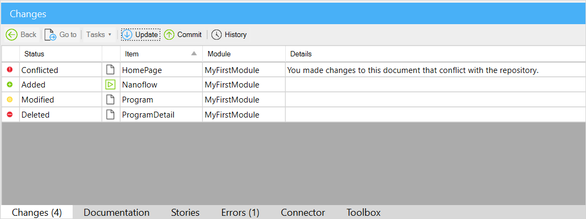
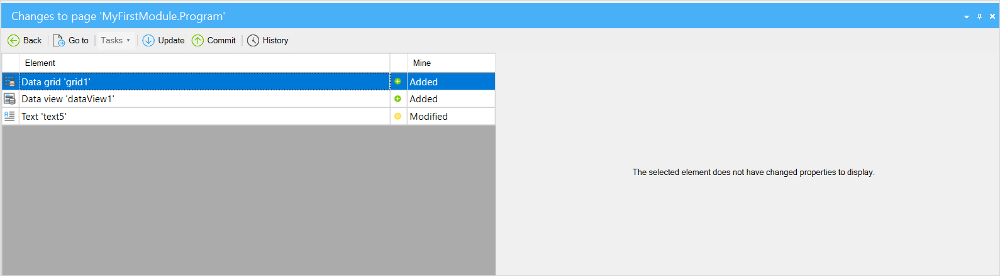
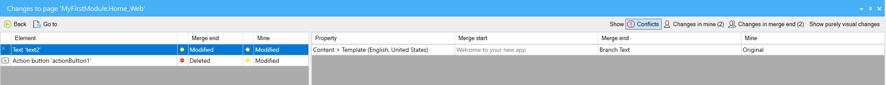
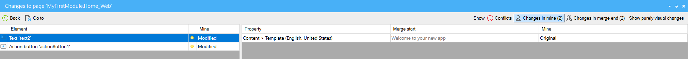
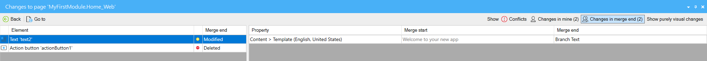
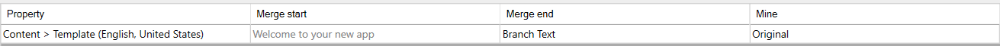
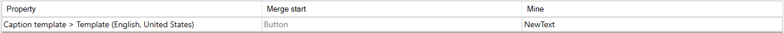

## 1 Introduction 

For version control enabled projects (projects with Team Server or other SVN servers), the **Changes** pane shows the local changes to the app project since the last commit. You can commit changes, update to the latest revision, and view the history from it. 

This pane consists of the following:

* The [top bar](#top-bar) contains various buttons, such as **Back**, **Go to**, **Tasks**. 
* The [top level](#top-level) shows you a list of documents that were changed, for example, a page where a widget was deleted
* The [zoomed-in level](#zoomed-in-level) of the pane is split into two grids, with elements in the left grid and changed or conflicting properties of the selected element in the right grid

## 2 Top Bar {#top-bar}

The top bar of the top level of the **Changes** pane consists of various buttons:

Buttons allow you to perform the following actions:

* **Back** – goes back up one level; at the top level, this button is disabled
* **Go to** – opens a zoomed-in level and opens up the selected document 
* **Tasks** – allows you to perform specific actions such as reverting the change to the latest commit, or solving conflicts
* **Update** – retrieves latest changes from the repository (for more information on the update concept, see the [Update](version-control#update) section in *Version Control*) 
* **Commit** – commits your changes to the repository and starts a new revision (for more information on the commit concept, see the [Commit](version-control#commit) section in *Version Control*)
* **History** – opens the **History** dialog box that shows the changes made on the current development line of the project (for more information on history, see [History](history-dialog))

The **Back** and **Go to** buttons are common throughout all the levels, while other buttons will only apply to a specific one.

## 3 Top Level {#top-level}

The top level of the **Changes** pane is a grid listing changed documents, for example, a page or a nanoflow:

The grid contains information on the following items:

* **Status** – shows the type of changes applied to the document. The status can be one of the following:
  * **Added** – a new document was created; indicated with a green circle
  * **Modified** – changes to an existing document were made, such as adding or deleting elements or changing element properties; indicated with a yellow circle
  * **Deleted** – a document was deleted; indicated with a red circle with a minus
  * **Conflicted** – a document contains conflicting changes; indicated with a red circle with an exclamation mark
* **Item** – indicates a name of the changes document
* **Module** – a module where the changed document is
* **Details** – can contain details on the status, for example, when you have conflicting changes 

## 4 Zoomed-In Level {#zoomed-in-level}

You can zoom into a changed or conflicting document, by doing one of the following:

* Double-click a line in the grid on the top level 
* Click the **Go to** button
* Press <kbd>Enter</kbd>

To exit the zoomed-in level, click the **Back** button or press <kbd>Backspace</kbd>.

There are two types of zoomed-in levels:

* [For modified documents](#modified)
* [For conflicting documents](#conflicts)

Each of them contains their own set of buttons.

### 4.1 Zoomed-In Level for Modified Documents {#modified}

The zoomed-in level for modified documents is split into two grids, with elements on the left and changed properties on the right. If no properties were changed for an element, for example, when an element was added or deleted, the right grid will be empty:

The toolbar at this level contains the following buttons:

* **Back** – takes you back to the top level
* **Go to** – takes you directly to the changed element 
* **Show purely visual changes** – shows visual changes, such as dragging an entity to a new location in the domain model

The left side of the grid contains the following columns:

* **Element** – the name of the modified element
* **Mine** – indicates the status of the change on the current development line

The grid on the right contains the following columns:

* **Property** – the property that was modified
* **Original** – the original property value
* **Mine** – the change to the property that was made on the current development line

### 4.2 Zoomed-In Level for Conflicted Documents {#conflicts}

The zoomed-in level for conflicted documents is split into two grids, with elements on the left and conflicting properties on the right.

The toolbar at this level contains the following buttons:

* **Back** – takes you back to the top level
* **Go to** – takes you directly to the selected element 
* **Show purely visual changes** – shows visual changes, such as dragging an entity to a new location in the domain model
* **Show Conflicts** – it shows details of a conflict. It will be selected by default when first zooming into this level.
* **Show Changes in mine** – it shows changes to a document on a current development line (for more information on how to solve conflicts, see the [Dealing With Conflicts](using-version-control-in-studio-pro#conflicts) section in *Using Version Control in Studio Pro*)
* **Show Changes in theirs** – it shows incoming changes to a document from another development line (for more information on how to solve conflicts, see the [Dealing With Conflicts](using-version-control-in-studio-pro#conflicts) section in *Using Version Control in Studio Pro*)

	{}**Show Conflicts**, **Show Changes in mine**, and **Show Changes in theirs** described above are toggles, and each selection de-selects the other two.
	{}

The columns on the left side of the grid will vary based on what toggle button is pressed on the toolbar.

The left side of the grid contains the following columns when **Show Conflicts** toggle is enabled:

* **Element** – the name of the modified element
* **Merge end** – the status of the incoming change on another development line
* **Mine** – indicates the status of the change on the current development line

	

The left side of the grid contains the following columns when **Show Changes in mine** toggle is enabled:

* **Element** – the name of the modified element
* **Mine** – indicates the status of the change on the current development line

	

The left side of the grid contains the following columns when **Show Changes in mine** toggle is enabled:

* **Element** – the name of the modified element
* **Merge end** – indicates the status of the change on the other development line

	
	

The columns on the grid on the right will vary depending on what kind of conficting element is selected on the left side.

If the selected item on the left side is a conflict that resulted in both sides changing the same element, then the following columns will be displayed on the right side of the grid:

* **Property** – the property that was modified
* **Merge start** – the original property value
* **Merge end** – the change to the property that was made on the other development line
* **Mine** – the change to the property that was made on the current development line

	

If the selected item on the left side is a conflict that resulted in one side changing an element and the other side deleting it, then the following columns will be displayed on the right side of the grid:

* **Property** – the property that was modified
* **Merge start** – the original property value
* **Mine** – the change to the property that was made on the current development line

	

##  5 Read More

* [Studio Pro Overview](studio-pro-overview)
* [Version Control](version-control) 
