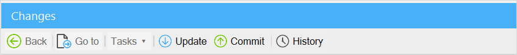
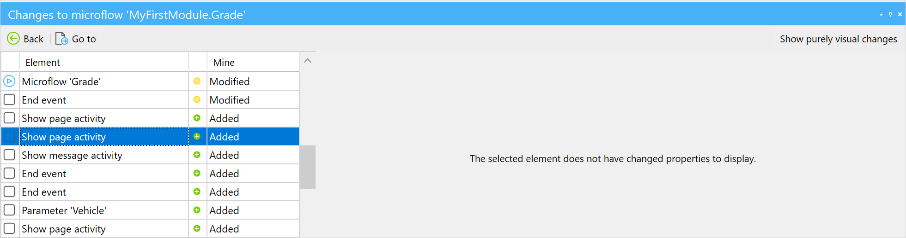
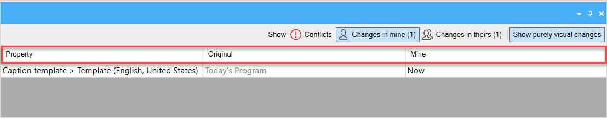

## 1 Introduction 

For [Team Server](/developerportal/develop/team-server) app projects, the **Changes** pane shows the local changes to the app project since the last commit. You can commit changes, update to the latest revision, and view the history from it. 

This pane consists of the following:

* The [top bar](#top-bar) contains various buttons, such as **Back**, **Go to**, **Tasks**, etc. 
* The [top level](top-level) shows you the document that was changed, for example, a page where a widget was deleted
* The [zoomed-in level](#zommed-in-level) of the pane is split into two grids, with elements on the left and changed properties on the right

## 2 Top Bar {#top-bar}

The top bar of the **Changes** pane consists of the following buttons:

* **Back** – takes you back to the top level if you were on the zoomed-in level

* **Go to** – opens a zoomed-in level or takes you directly to the changed element 

* **Tasks** – allows you to perform specific actions such as reverting the change to the latest commit, or solving conflicts

* **Update** – retrieves latest changes from the repository, for more information on the update concept, see the [Update](version-control#update) section in *Version Control* 

* **Commit** – commits your changes to the repository and starts a new revision; for more information on the commit concept, see the [Commit](version-control#commit) section in *Version Control*

* **History** – opens the **History** dialog window that shows the changes made on the development line of the project; for more information on history, see [History](history-dialog)

* **Show Conflicts** – available only for a zoomed-in level, shows details of a conflict

* **Changes in mine** – available only for a zoomed-in level, shows changes to a document on a current development line (for more information on how to solve conflicts, see the [Dealing With Conflicts](using-version-control-in-studio-pro#conflicts) section in *Using Version Control in Studio Pro*)

* **Changes in theirs** – available only for a zoomed-in level, shows incoming changes to a document from another development line (for more information on how to solve conflicts, see the [Dealing With Conflicts](using-version-control-in-studio-pro#conflicts) section in *Using Version Control in Studio Pro*)

	

## 3 Top Level {#top-level}

The top level of the **Changes** pane is a grid listing changes to a specific document, for example, a page or a nanoflow:

The grid contains information on the following items:

* **Status** – shows the type of changes applied to the document. The status can be one of the following:
  * **Added** – a new document was created; indicated with a green circle
  * **Modified** – changes to an existing document were made, such as adding or deleting elements or changing element properties; indicated with a yellow circle
  * **Deleted** – a document was deleted; indicated with a red circle with a minus
  * **Conflicted** – a document contains conflicting changes; indicated with a red circle with an exclamation mark
* **Item** – indicates the document that contains changes
* **Module** – a module where the changed document is
* **Details** – can contain details on the status, for example, when you have conflicting changes 

## 4 Zoomed-In Level {#zoomed-in-level}

You can zoom into a changed document, double-clicking a line in the grid on the top level or clicking the **Go to** button. 

The zoomed-in level is split into two grids, with elements on the left and changed properties on the right. If no properties were changed for an element, for example, when an element was *added* or *deleted*, the leftgrid will be empty:

The grid on the left can contain the following columns:

* **Element** – the name of the modified element

* **Mine** – indicates the status of the change on the current development line

* **Theirs** – only displayed for conflicts; indicates the status of the incoming change on another development line

	
	

The grid on the right can contain the following columns:

* **Property** – the property that was modified

* **Original** – the original property setting

* **Mine** – the change to the property that was made on the current development line

* **Theirs** – only displayed for conflicts; the change to the property that was made on the another development line

	

##  5 Read More

* [Studio Pro Overview](studio-pro-overview)
