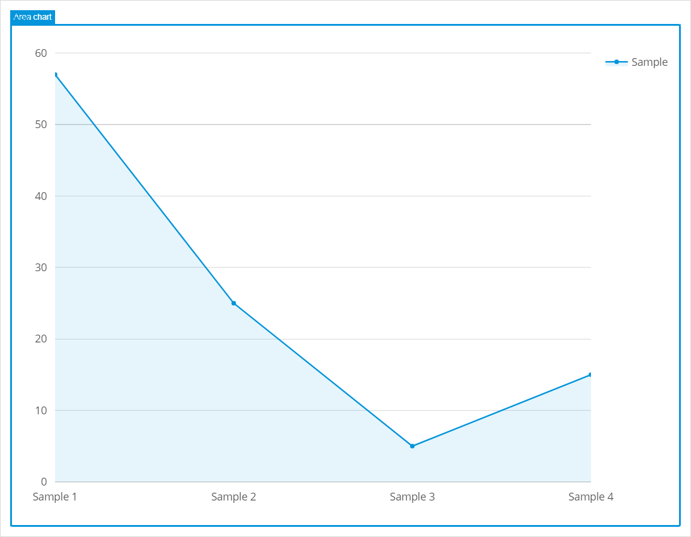
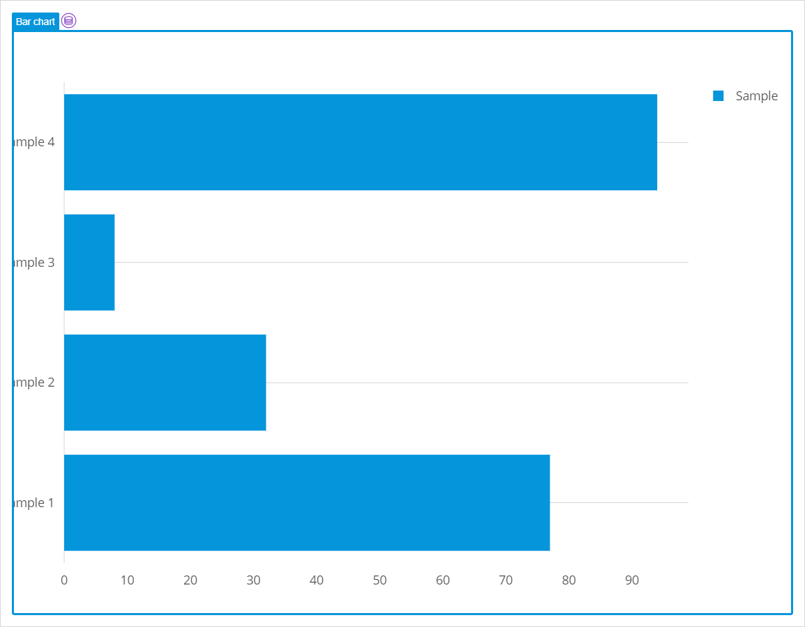
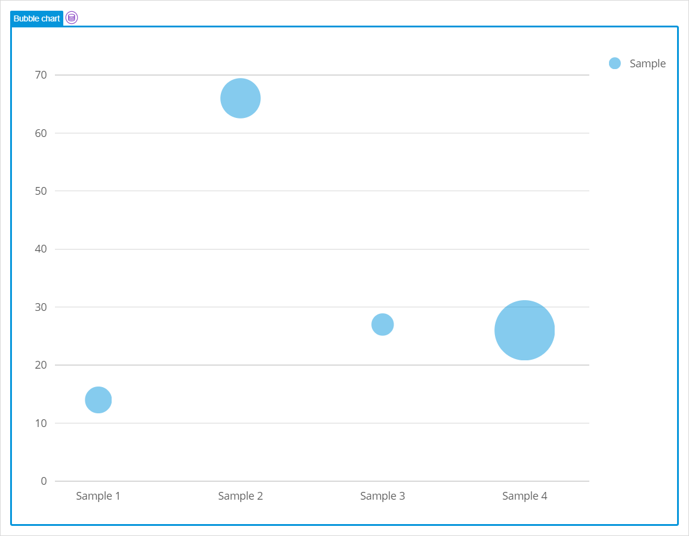
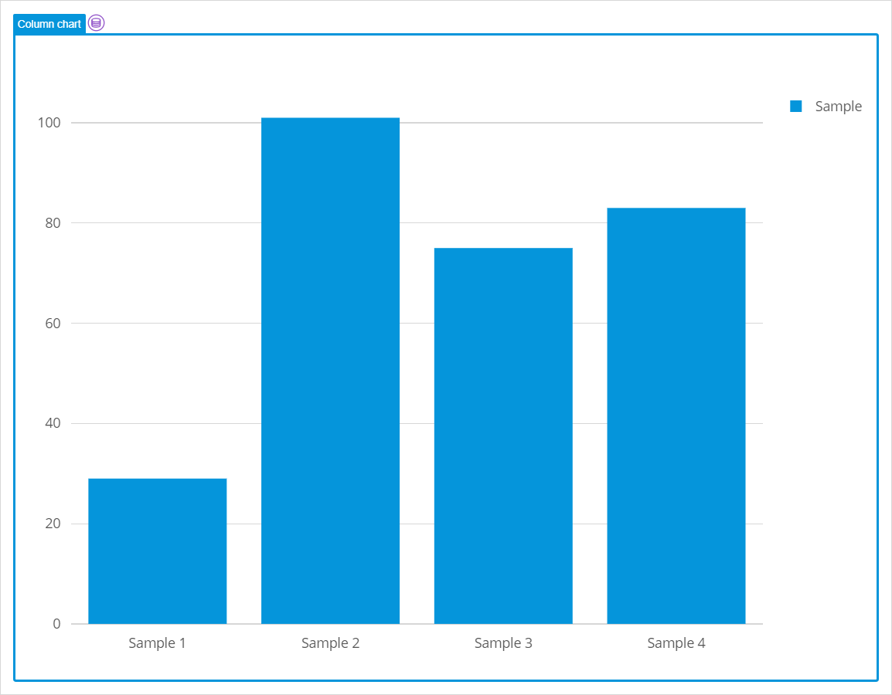
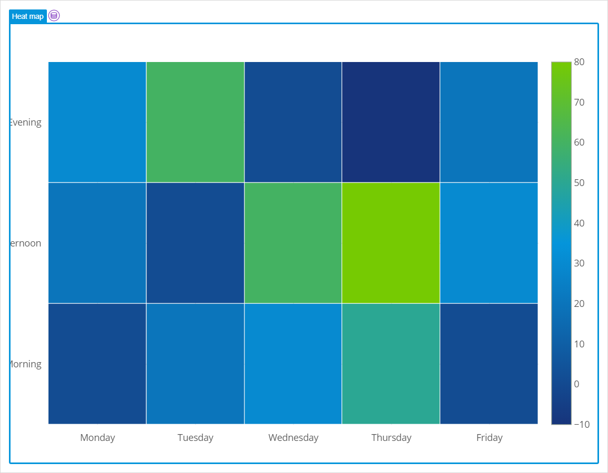
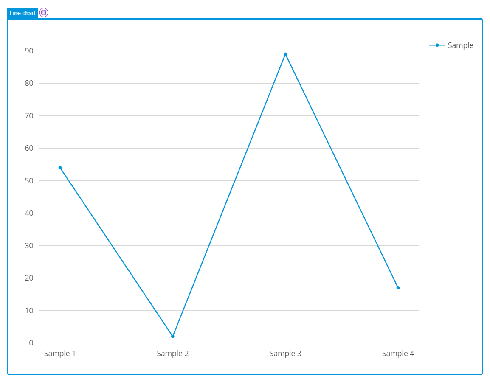
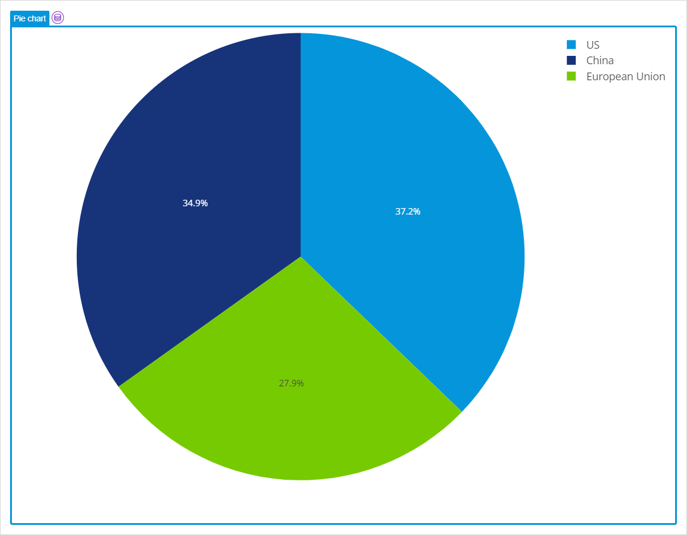
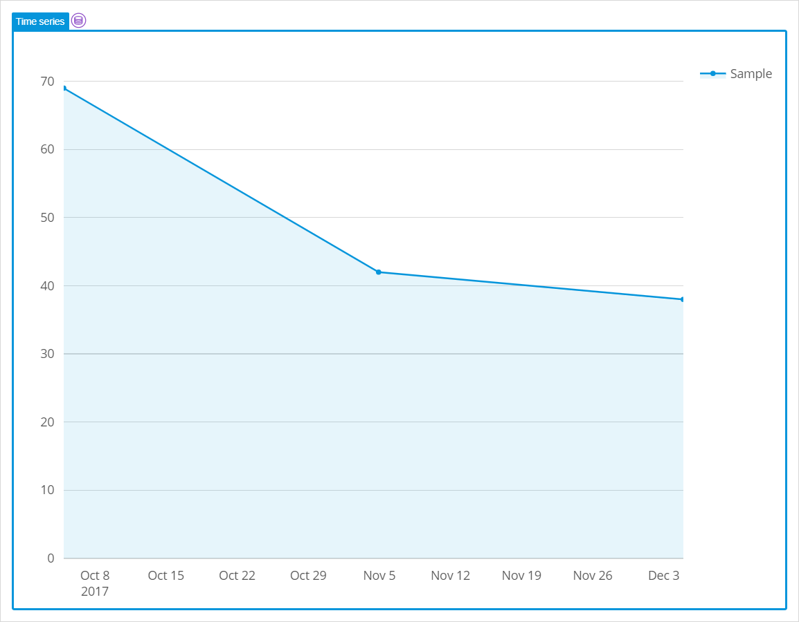
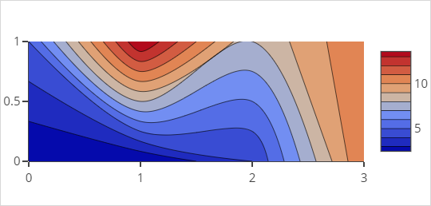

## 1 Introduction

Chart widgets allow you to display data series visually on your app pages in a wide range of charts.

[Basic Charts](#basic-charts) are included in Mendix app templates based on Atlas UI. They can be included in other Mendix apps by downloading them from the Mendix Marketplace (for more information, see [Charts](/appstore/widgets/charts)). Basic charts are based on version 1.47.4 of plotly.js.

[Any Chart](#any-chart) gives much more control and allows more flexible use of the features of [plotly.js](https://plot.ly/). The [Any Chart](/appstore/modules/any-chart) widget can be included in your app. See the widget description in the Marketplace to see what version of plotly.js is supported.

## 2 Basic Charts {#basic-charts}

With Mendix Charts you can quickly create beautiful charts. The following charts are included:

* **Area** chart – a line chart with a fill to the X-axis {}{}
* **Bar** chart – horizontal bars, grouped or stacked {}{}
* **Bubble** chart – add a size dimension to your chart {}{}
* **Column** chart – vertical bars, grouped or stacked {}{}
* **Heat map** – show data values by color in a 2D matrix {}{}
* **Line** chart – straight or curved lines, with or without markers {}{}
* **Pie** chart – a pie or a doughnut chart {}{}
* **Time series** – show data ordered by time {}{}

The widgets contain several settings which can be changed in Studio Pro to customize the look and feel and also offer support for on click events and custom tooltips. See [Chart Configuration](charts-configuration) to learn how to configure Mendix charts.

If the standard chart settings are not sufficient for your purposes, see [Chart Advanced Cheat Sheet](charts-advanced-cheat-sheet) for information on advanced configuration of your basic charts.

Note that only features up to version 1.47.4 of plotly.js can be used when configuring charts.

**Dynamic Series Chart**

From version 1.4 of the basic charts you can create charts with a variable number of data series. For instructions on how to do this, see [How to Create a Dynamic Series Chart](/howto/front-end/charts-dynamic-series).

## 3 Any Chart {#any-chart}

With *Any Chart* you can build all the chart types that are possible with Plotly.js up to the version supported by the widget (see the widget description in the Marketplace for more details). If you want to build a chart which is not available in the Basic charts, *Any Chart* is your friend.

{}{}

The plotly charts require a configuration based on JSON, therefore *Any Chart* has JSON as input parameters. You can create this JSON dynamically in your microflow via a JSON Structure document and use this in the *Any Chart* configuration. It is also possible to define static JSON configuration which is combined with the dynamic JSON.

This module also contains several [building blocks](charts-any-building-blocks) for inspiration and as starting point. If you want to create a new chart, we suggest you check out the plotly.js website.

See [Any Chart Widgets](charts-any-configuration) to learn how to configure *Any charts* widgets.

The [Any Chart Cheat Sheet](charts-any-cheat-sheet) lists the most common chart types and the JSON required to create them in Any Chart.

## 4 Performing Basic Functions

{}

## 5 Documents in This Section

The following documents explain how to use charts in more detail:

* [Chart Configuration](charts-configuration)
* [Chart Advanced Cheat Sheet](charts-advanced-cheat-sheet)
* [Any Chart Widgets](charts-any-configuration)
* [Any Chart Building Blocks](charts-any-building-blocks)
* [Any Chart Cheat Sheet](charts-any-cheat-sheet)
