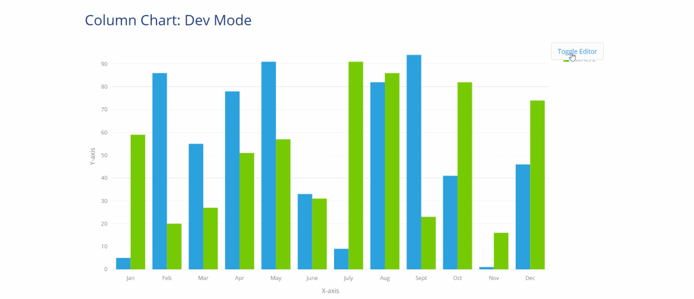
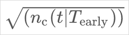
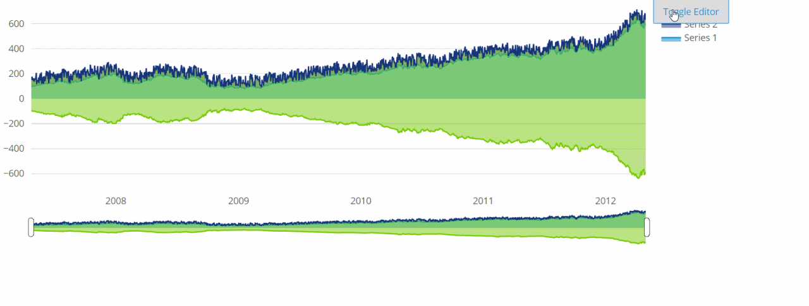
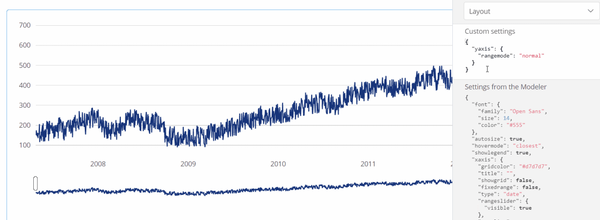
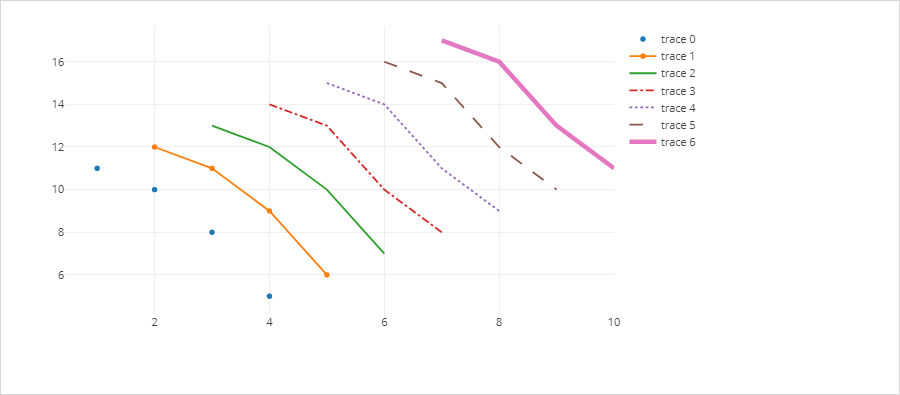
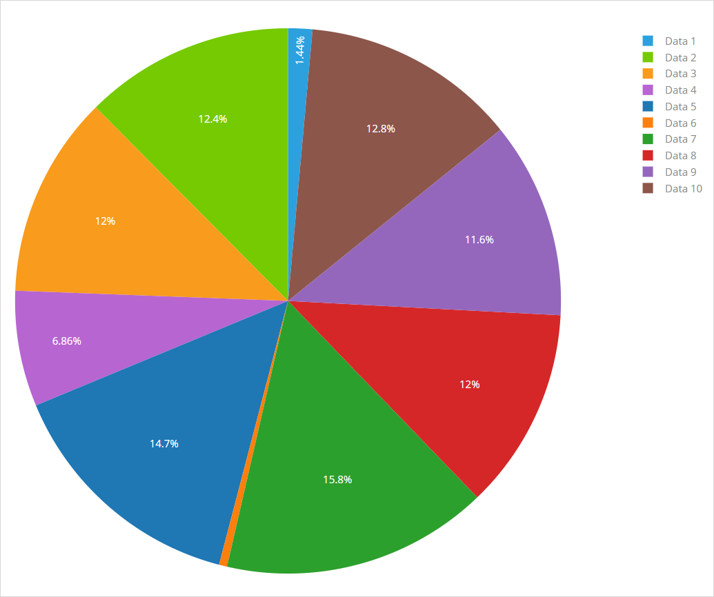
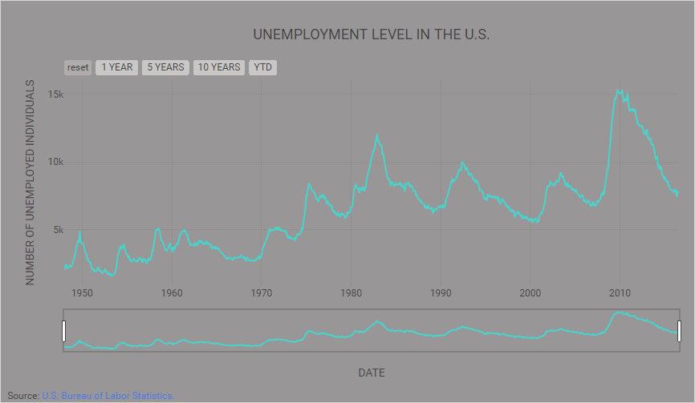
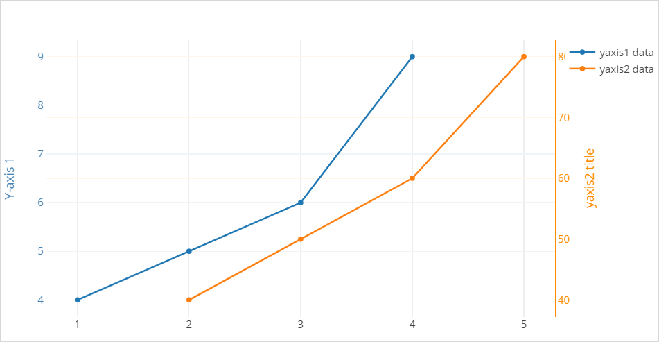
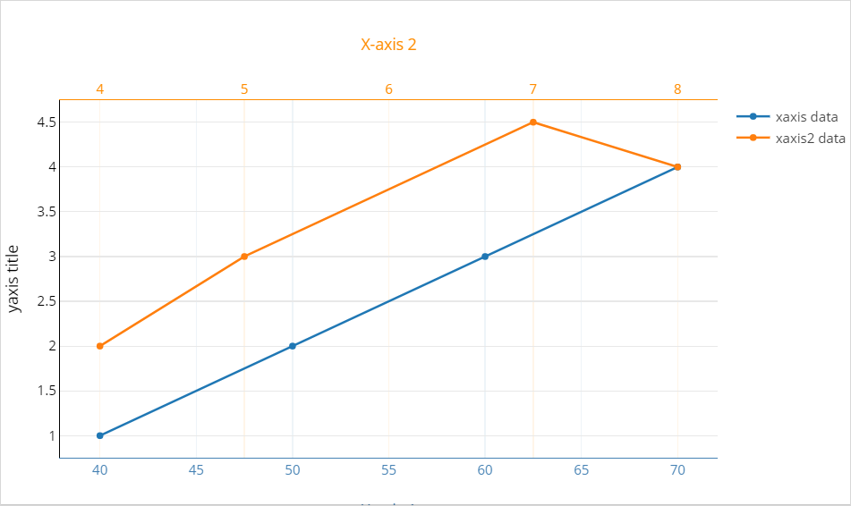

## Advanced configuration settings
The standard charts provide the most common settings trough the widget configuration. Additional settings can set via the Advanced settings. 
This cheat sheet with JSON snippets will provide some sample for the advance configuration.

The full reference is found be found at [https://plot.ly/javascript/](https://plot.ly/javascript/).

When the advanced configuration does not suffice have a look at the [Any Chart](https://appstore.home.mendix.com/link/app/106437/Mendix/Any-Chart) from the app store.

## Layout (all charts) {#layout-all}
Layout controls the general appearance of the chart. The chart is customized by adding JSON properties to the layout.
Below is a basic configuration.
``` json
{
  "font": {
    // font properties
  },
  "title": "CHART TITLE",
  "titlefont": {
    // title font properties
  },
  "hovermode": "closest",
  "showlegend": true,
  "legend": {
    // legend properties
  },
  "hoverlabel": {
    // hover label properties
  },
  "margin": {
    // margin properties
  }
}
```
To use this layout snippet above, endeavour to replace all lines that begin with "// some text properties" with actual properties specific to it.

### Legend
The legend properties below are added to the layout configuration to apply custom style to it. Below are legend properties
``` json
{
  "legend": {
    "showlegend": true,
    "legend": {
      "bgcolor": "#fff",
      "bordercolor": "#444",
      "borderwidth": 0,
      "font":{
        "family": "Open Sans, verdana, arial, sans-serif",
        "size": 12,
        "color": "black"
      },
      "orientation": "v",
      "traceorder": "normal",
      "tracegroupgap": 10,
      "x": -0.1,
      "xanchor": "right"
    }
  }
}
```

#### Right:
``` json
{
  "showlegend": true,
}
```
#### Left:
Adjust x for long series names or y axis ticks
``` json
{
  "showlegend": true,
  "legend": {
    "xanchor": "right",
    "x": -0.1
  }
}
```

#### Top:
``` json
{
  "showlegend": true,
  "legend": {
    "orientation": "h",
    "y": 1.1
  }
}
```

#### Bottom:
Adjust y to -0.2 for long x axis ticks
``` json
{
  "showlegend": true,
  "legend": {
    "orientation": "h",
    "y": "auto"
  }
}
```

#### Inside
``` json
{
  "showlegend": true,
  "legend": {
    "x": 0
  }
}
```

#### None:
``` json
{
  "showlegend": false
}
```

  
See more[ Legend configurations ](https://plot.ly/javascript/reference/#layout-legend)

### Axes
The axes properties apply to charts with x and y axes. They can be configured as:
``` json
{
  "xaxis": {
    "gridcolor": "#eaeaea",
    "title": "X-axis",
    "color": "#0000FF",
    "showgrid": false,
    "fixedrange": true,
    "showline": true,
    "side": "bottom"
  },
  "yaxis": {
    "rangemode": "tozero",
    "zeroline": true,
    "zerolinecolor": "#eaeaea",
    "gridcolor": "#eaeaea",
    "color": "#0000FF",
    "title": "Y-axis",
    "showgrid": true,
    "showline": true,
    "fixedrange": true
  }
}
```


See more[ Axes configurations ](https://plot.ly/javascript/reference/#layout-xaxis)

### Multiple Y axes
The properties apply to charts with more than one Y axis. They can be configured as:
``` json
{
  "yaxis": {
    "title": "Y-axis 1",
    "zeroline": true,
    "color": "#4682B4",
    "showgrid": true,
    "showline": true
  },
  "yaxis2": {
    "title": "Y-axis 2",
    "color": "#FF8C00",
    "showgrid": true,
    "showline": true,
    "zeroline": true,
    "overlaying": "y",
    "side": "right"
  }
}
```

The layout properties above should be used with the corresponding [ data properties ](#multiple-y-axes-data-properties).

See more[ Multiple Y axes configurations ](https://plot.ly/javascript/multiple-axes/)

### Multiple X axes
These properties apply to charts with more than one X axis. They can be configured as:
``` json
{
  "xaxis": {
    "title": "X-axis 1",
    "color": "#4682B4",
    "showgrid": true,
    "showline": true,
    "zeroline": true
  },
  "xaxis2": {
    "title": "X-axis 2",
    "titlefont": {
      "color": "#FF8C00"
    },
    "tickfont": {
      "color": "#FF8C00"
    },
    "zeroline": true,
    "color": "#FF8C00",
    "showgrid": true,
    "showline": true,
    "overlaying": "x",
    "side": "top"
  }
}
```

The layout properties above should be used with the corresponding [ data properties ](#multiple-x-axes-data-properties).
  
See more[ Multiple X axes configurations ](https://plot.ly/javascript/multiple-axes/)

#### Math LaTeX formulas
Titles, axis and series can contain complex mathematical expression.

```
$\sqrt{(n_\text{c}(t|{T_\text{early}}))}$
```

Add to the index.html of the theme.
``` javascript
<script type="text/javascript" async src="https://cdnjs.cloudflare.com/ajax/libs/mathjax/2.7.1/MathJax.js?config=TeX-AMS-MML_SVG"></script>
```
More information LatTex Syntax : https://en.wikibooks.org/wiki/LaTeX/Mathematics

### Title
The title appears above the chart. It can be configured as: 
``` json
{
  "title": "CHART TITLE",
  "titlefont": {
    "family": "Droid Sans, Droid Serif, sans-serif",
    "size": 20,
    "color": "black"
  }
}
```
  
See more[ Title configurations ](https://plot.ly/javascript/reference/#layout-title)  

### Color
Sets the a background color to graph.
``` json
{
  "paper_bgcolor": "#FFF"
}
```

### Margin
creates space around the chart.
``` json
{
  "margin": {
    "l": 70,
    "r": 60,
    "b": 60,
    "t": 60,
    "pad": 10,
    "autoexpand": true
  }
}
```

  
See more[ Margin configurations ](https://plot.ly/javascript/reference/#layout-margin)

### Tooltip
A small pop-up box that appears when the user moves the mouse pointer over an chart data points.

``` json
{
  "hovermode": "text",
  "hovertext": "text",
  "hoverinfo": "all",
  "textposition": "inside",
  "hoverlabel": {
    "bgcolor": "#888",
    "bordercolor": "#888",
    "font": {
      "color": "white"
    }
  }
}
```
  
See more [ Tooltip configurations ](https://plot.ly/javascript/reference/#layout-hovermode)

### Fonts
Sets a global font on the root level will be applied to all chart elements. Or set for it for specific elements.
``` json
{
  "font": {
    "family": "Open Sans,verdana, arial, sans-serif",
    "size": 12,
    "color": "black"
  },
  "legend": {
    "font": {}
  },
  "titlefont": {},
  "hoverlabel": {
    "font": {}
  },
  "xaxis": {
    "titlefont": {},
    "tickfont": {}
  },
  "yaxis": {
    "titlefont": {},
    "tickfont": {}
  }
}
```

### Range mode 
Sets how the range of a given axis should be displayed.

#### normal
Sets the range based on the plotted values, adjusting to fit them.
```json
{
  "yaxis": {
    "rangemode": "normal"
  }
}
```
  

#### nonnegative
Shows only positive values, the range based on the plotted positive values.
```json
{
  "yaxis": {
    "rangemode": "nonnegative"
  }
}
```
  

#### tozero
This is the default range mode in charts. Both positive and negative ranges for the axes will start from the zero mark.
```json
{
  "yaxis": {
    "rangemode": "tozero"
  }
}
```
  

:heavy_exclamation_mark: **NB:** When **fill** is not set to *none* in the series, the y-axis range is forced to start from zero (*tozero*).  
Layout
```json
{
  "yaxis": {
    "rangemode": "normal"
  }
}
```
Data
```json
{
  "fill": "tonexty"
}
```

  
See more [ range mode configurations ](https://plot.ly/javascript/reference/#layout-yaxis-rangemode)

## Data/Series Properties {#data-series}
These properties are applied to specific charts only. For each chart, data properties are distinct. They make the chart appear as its supposed to be.

### Lines
A mode and line configuration can be added in the **Advanced** configuration of the series.

``` json
[
  {
    "mode": "markers"
  },
  {
    "mode": "lines+markers"
  },
  {
    "mode": "lines"
  },
  {
    "mode": "lines",
    "line": {
      "dash": "dashdot"
    }
  },
  {
    "mode": "lines",
    "line": {
      "dash": "dot"
    }
  },
  {
    "mode": "lines",
    "line": {
      "dash": "longdash"
    }
  },
  {
    "mode": "lines",
    "line": {
      "width": 5
    }
  }
]
```

### Combine Chart Types
The type of a series can be changes. Make a bar series into line series


### Pie Chart
 Displays a circular graph divided into slices to illustrate numerical proportion.
``` json
{
  "hole": 0.9
}
```
  
See more [ Pie chart data properties ](https://plot.ly/javascript/reference/#pie)

### Fill
Displays a line chart with the areas below the lines filled with colors.
``` json
{
  "line": {
    "color": "#17202A",
    "shape": "linear",
    "dash": "dot"
  },
  "type": "scatter",
  "fill": "tonexty",
  "fillcolor": "#B2BABB"
}
```

  
See more [ Area chart data properties ](https://plot.ly/javascript/reference/#area)

### Time series

#### Filter buttons

``` json
{
  "xaxis": {
    "rangeslider": {
      "visible": true
    },
    "rangeselector": {
      "buttons": [
        {
          "step": "all",
          "label": "reset"
        },
        {
          "step": "year",
          "stepmode": "backward",
          "count": 1,
          "label": "1 YEAR"
        },
        {
          "step": "year",
          "stepmode": "backward",
          "count": 5,
          "label": "5 YEARS"
        },
        {
          "step": "year",
          "stepmode": "backward",
          "count": 10,
          "label": "10 YEARS"
        },
        {
          "step": "year",
          "stepmode": "todate",
          "count": 1,
          "label": "YTD"
        }
      ]
    }
  }
}
```

See more properties on the [Range Selector](https://plot.ly/javascript/reference/#layout-xaxis-rangeselector)

### Multiple Y axes data properties
Displays two different Y axes with different scales, in the data set.
``` json
[
  {
    "name": "yaxis2 data",
    "yaxis": "y2",
    "type": "scatter"
  },
  {
    "name": "yaxis data",
    "type": "scatter"
  }
]
```


### Multiple X axes data properties
Displays two different X axes with different scales.
``` json
[
  {
    "name": "xaxis data",
    "xaxis": "x",
    "type": "scatter"
  },
  {
    "name": "xaxis2 data",
    "xaxis": "x2",
    "type": "scatter"
  }
]
```


### Configurations options (all charts) {#config-options}
```json
{
  "displayModeBar": true,
  "displaylogo": false,
  "modeBarButtonsToRemove": [ "sendDataToCloud", "lasso2d", "select2d", "hoverClosestCartesian", "hoverCompareCartesian", "toggleSpikelines" ],
  "locale": "nl",
  "locales": {
    "nl": {
      "dictionary": {
        "Download plot as a png": "Opslaan als PNG"  
      }
    }
  }
 }
```
