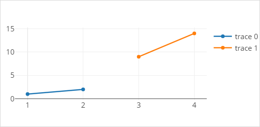
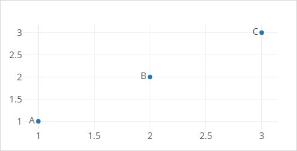
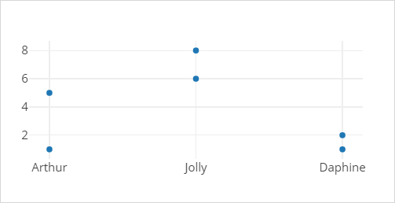
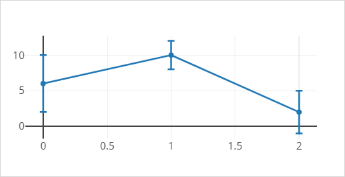

## Any Chart Cheat types
This cheat sheet lists the most common chart types, more chart types could be found at [https://plot.ly/javascript/](https://plot.ly/javascript/).

### Basic Chart

#### Line Chart

``` json
[
  {
    "x": [ 1, 2 ],
    "y": [ 1, 2 ],
    "type": "scatter"
  },
  {
    "x": [ 3, 4 ],
    "y": [ 9, 14 ],
    "type": "scatter"
  }
]
```

#### Bubble Chart

``` json
[ {
  "x": [ 1, 2, 3 ],
  "y": [ 1, 2, 3 ],
  "marker": {
    "color": [ "red", "blue", "green" ],
    "size": [ 20, 50, 80 ]
  },
  "mode": "markers"
} ]
```

#### Scatter Chart

``` json
[ {
  "x": [ 1, 2, 3 ],
  "y": [ 1, 2, 3 ],
  "text": [ "A", "B", "C" ],
  "textposition": "left center",
  "mode": "markers+text"
} ]
```

#### Heatmap

``` json
[ {
  "z": [ [ 1, 2 ], [ 3, 4 ] ],
  "type": "heatmap"
} ]
```

#### Bar Chart

``` json
[ {
  "y": [ "giraffe", "elephant" ],
  "x": [ 2, 4 ],
  "type": "bar",
  "orientation": "h"
} ]
```

#### Column Chart

``` json
[ {
  "x": [ "giraffe", "elephant" ],
  "y": [ 2, 4 ],
  "type": "bar",
  "orientation": "v"
} ]
```

#### Pie Chart

``` json
[ {
  "values": [ 10, 20, 30 ],
  "labels": [ "Uganda", "Netherlands", "US" ],
  "type": "pie"
} ]
```

#### Doughnut Chart

```json
[ {
  "values": [ 10, 20, 30 ],
  "labels": [ "Uganda", "Netherlands", "US" ],
  "hole": 0.4,
  "type": "pie"
} ]
```

#### Area Chart

``` json
[ {
  "x": [ 1, 2, 3 ],
  "y": [ 1, 2, 3 ],
  "mode": "scatter",
  "fill": "tonexty"
} ]
```

### Statistical Chart

#### Histograms

``` json
[ {
  "x": [ 0, 2, 1, 3, 4, 2 ],
  "type": "histogram"
} ]
```

#### Box Chart

``` json
[ {
  "x": [ 1, 2, 3, 4, 5 ],
  "type": "box"
} ]
```

#### 2D Histogram

``` json
[ {
  "x": [ 1, 2, 3, 4, 5 ],
  "y": [ 1, 2, 3, 4, 5 ],
  "type": "histogram2d"
} ]
```

### Maps

#### Bubble Map

``` json
[ {
  "lon": [ 100, 400 ],
  "lat": [ 0, 0 ],
  "type": "scattergeo",
  "marker": {
    "color": [ "red", "blue" ],
    "size": [ 20, 50 ]
  },
  "mode": "marker"
} ]
```

#### Choropleth Map
  
Data
``` json
[ {
  "locations": [ "AZ", "CA", "VT" ],
  "locationmode": "USA-states",
  "z": [ 10, 20, 40 ],
  "type": "scattergeo"
} ]
```
Layout
``` json
{ 
  "geo": { 
    "scope": "usa" 
  }
}
```

#### Scatter Map

``` json
[ {
  "lon": [ 12, 22 ],
  "lat": [ 42, 39 ],
  "type": "scattergeo",
  "text": [ "Rome", "Greece" ],
  "mode": "marker"
} ]
```
### 3D Chart

#### 3D Surface Chart

``` json
[ {
  "colorscale": "Viridis",
  "z": [ [ 3, 5, 7, 9 ], [ 21, 13, 8, 5 ] ],
  "type": "surface"
} ]
```

#### 3D Line Chart

``` json
[ {
  "x": [ 9, 8, 5, 1 ],
  "y": [ 1, 2, 4, 8 ],
  "z": [ 11, 8, 15, 3 ],
  "mode": "lines",
  "type": "scatter3d"
} ]
```

#### 3D Scatter Chart

``` json
[ {
  "x": [ "9", "8", "5", "1" ],
  "y": [ "1", "2", "4", "8" ], 
  "z": [ "11", "8", "15", "3" ],
  "mode": "markers",
  "type": "scatter3d"
} ]
```

### Other Chart

#### Contour Chart

``` json
[ {
  "z": [ [ 2, 2, 4, 11 ], [ 5, 14, 8, 11 ] ],
  "type": "contour"
} ]
```

#### Time Series

``` json
[ {
  "type": "scatter",
  "mode": "lines",
  "x": [ "2018-09-04", "2018-10-04", "2018-11-04", "2018-12-04", "2018-12-04" ],
  "y": [ 5, 2, 7, 10 ]
} ]
```

#### Group By Chart

``` json
[ {
    "type": "scatter",
    "x": [ "Arthur","Jolly","Daphine","Arthur","Jolly","Daphine" ],
    "y": [ 1, 6, 2, 5, 8, 1 ],
    "mode": "markers"
} ]
```

#### Symmetric Error Bar

``` json
[ {
  "x": [ 0, 1, 2 ],
  "y": [ 6, 10, 2 ],
  "error_y": {
    "type": "data",
    "array": [ 4, 2, 3 ]
  },
  "type": "scatter"
} ]
```

#### Polar Chart

``` json
[ {
  "type": "scatterpolar",
  "r": [ 34, 11, 39, 37, 34 ],
  "theta": [ "A", "B", "C", "D", "A" ],
  "fill": "toself"
} ]
```

#### Ternary Plot
  
Data
``` json
[{
    "type": "scatterternary",
    "mode": "markers",
    "a": [ 5, 4, 5, 2, 10 ],
    "b": [ 2, 1, 15, 20, 8 ],
    "c": [ 1, 20, 5, 15, 10 ],
    "text":[ "point 1", "point 2", "point 3", "point 4", "point 5" ]
}]
```

Layout
```json
{
  "ternary": {
    "sum":100
  }
}
```
