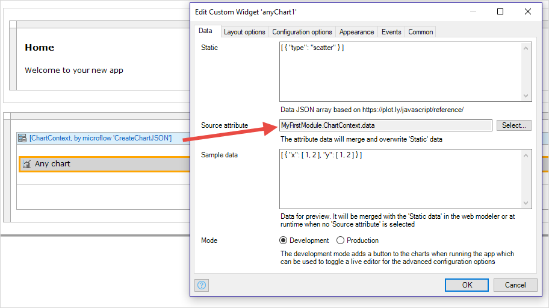

## 1 Introduction

With **Any Chart**, you can build all the chart types that are possible with Plotly.js, including 'dynamic' charts with a data-driven structure. So if you want to build a 3D chart or have a dynamic set of series, Any Chart is your friend.

The configuration of this chart type is complex and it is recommended to start by looking at the building blocks that are delivered in the [Any Chart module](https://appstore.home.mendix.com/link/app/106517/) from the Mendix App Store. Alternatively, use [How to Use Any Chart](/howto/extensibility/charts-any-usage) or the [Any Chart cheat sheet](charts-any-cheat-sheet) for a quick start.

Any Charts are configured with a JSON **Data** array and **Layout** object. The configuration can be set statically, via the **Source attribute** and **Sample data** properties.

The layout JSON, which is created dynamically or retrieved from the database, will be merged into the static settings and will overwrite any common properties.

The Sample data is for demo purposes at run time when there is no Source attribute selected or when rendering sample data in the modeler preview.

## 2. Location of Any Chart Widget

The Any Chart Widget must be placed in the context of a Data View. The data view contains an entity object which contains a **Source attribute** (unlimited length string) which contains the JSON representation of the data which you want to plot. Unlike the normal chart widgets, the Any Chart widget does not work directly on the data in your domain model. You have to convert the data you want to plot into the JSON format which Any Chart expects. See [How to Use Any Chart](/howto/extensibility/charts-any-usage) for a step-by-step explanation of how to do this.

## 3 Data

The data to be plotted is described in an array. The elements of this array are the points to be plotted on the selected chart type (scatter or bar, for example) as documented in the [Full Reference](https://plot.ly/javascript/reference).

### Static

A JSON array (based on https://plot.ly/javascript/reference/) which contains the *static* parts of the chart description. These is the default description of the chart and could be, for example, the type of chart which you want to plot.

### Source attribute

This is an unlimited string attribute which is an attribute of the entity which forms the context of the data view in which the **Any Chart** widget is placed.

In the image below, the **Source attribute** is the *data* attribute of the *ChartContext* entity which is the data view context in which the Any Chart widget is placed.



The **Source attribute** contains a JSON structure which will merge with, and overwrite, the **Static** data. Commonly, this contains the data which you wish to plot, but it can also overwrite other static elements such as the type of chart, colors of lines, or the orientation of bars in a bar chart.

### Sample data

The data for previewing the chart. This will be merged with the **Static data** in the modeler or at runtime when no **Source attribute** is selected.

### Mode

**Development** mode adds a button to the charts when running the app. This button is used to toggle a live editor for testing advanced configuration options.

**Production** mode removes this button so that the user sees the chart as you have designed it.

## 4 Layout options

The layout of the plot – non-data-related visual attributes such as the title, annotations etc – is described in a json object as documented in the [Full Reference](https://plot.ly/javascript/reference/#layout).

### Static

A JSON object describing the default layout of the chart based on https://plot.ly/javascript/reference/.

### Source attribute

This is an unlimited length string attribute of the entity which forms the context of the data view in which the **Any Chart** widget is placed. It contains a JSON structure which will merge with, and overwrite, the **Static** layout. This allows you to dynamically change layout information from within your app.

### Sample layout

Layout options for preview. It will be merged with the 'Static' in the modeler or at runtime when no 'Source attribute' is selected.

## 5 Configuration options

The JSON containing the Plotly high-level configuration options for the plot, such as the scroll/zoom/hover behavior. These high-level configuration options are documented here: https://plot.ly/javascript/configuration-options.

The difference between **config** and **layout** is that layout relates to the content of the plot, whereas config relates to the context in which the plot is being shown. The **Any Chart** widget does not allow the configuration options to be changed dynamically in your app.

## 6 Appearance

The appearance settings are use to set the dimensions of the chart.

### Width unit

The type of unit which is used for the **Width** property: Percentage or Pixels.

### Width

The width of the chart in pixels or as a percentage based on the **Width unit** setting.

### Height unit

**Percentage of width** allows you to change the aspect ratio, **Pixels** is an absolute measure, and **Percentage of parent** allows you to set the height in relation to the parent container.

{}
Warning: When using **Percentage of parent** the parent container must have an absolute height, else nothing is displayed.
{}

### Height

The height in pixels or as a percentage based on the settings of the **Height unit**.

## 7 Events

The **Any Chart** widget supports two sorts of event, related to the points plotted on the chart:

* **hover**: which resolves as a *Tooltip* request
* **click**: which resolves as an *On click* event

When an event occurs plotly will return a JSON object as described here: https://plot.ly/javascript/plotlyjs-events/#event-data. This JSON data is stored in an attribute of an entity object which is passed to **Any Data**.

The JSON should interpreted in the microflow which is triggered by the event.

{}
Events will be triggered by clicking or hovering on the points plotted on the chart. Clicks on other parts of the chart will NOT trigger an event.
{}

### Event entity

The entity used to receive the event data from plotly.

### Event data attribute

The attribute to store the JSON data from the chart event.

### On click microflow

The microflow that will be executed when a data point on the chart is clicked on.

### On click nanoflow

The nanoflow that will be executed when a data point on the chart is clicked on.

### Tooltip form entity

When a **Tooltip microflow** is triggered by a plotly hover event, it needs to return an entity object which forms the context of the **Tooltip form**.

The entity that is returned by tooltip microflow is identified here. The developer can determine its structure, based on the requirements of the Tooltip form, and the information provided by the hover event.

### Tooltip microflow

The microflow identified here is called by an on hover event received from plotly. It receives an event object of the type **Event entity** with the **Event data attribute** containing the JSON event data. The data should be interpreted and an object of the type **Tooltip form entity** is returned. This will form the context of the **Tooltip form**.

### Tooltip form

The form to show when a user hovers over a chart plot point. It has the context **Tooltip entity**.

## 8 Chart Theming

Advanced JSON settings can also be added in a global context via the theme folder of your mendix project root directory.

To the theme folder, add a `.json` file named *com.mendix.charts*. The JSON should be in the following format:

``` json
{
  "layout": {
    // Add shared layout options here (for all charts)
  },
  "configuration": {
    // Add shared configuration options here (for all charts)
  },
  "charts": {
    "LineChart": {
      "layout": {
        // Add line chart only layout options here
      },
      "data": {
        // Add line chart only data options here
      },
      "configuration": {
          // Add line chart only configuration options here
      }
    },
    "AreaChart": {
      // Same arrangement as the line chart
    },
    "BubbleChart": {
      // Same arrangement as the line chart
    },
    "TimeSeries": {
      // Same arrangement as the line chart
    },
    "ColumnChart": {
      // Same arrangement as the line chart
    },
    "BarChart": {
      // Same arrangement as the line chart
    },
    "PieChart": {
      // Same arrangement as the line chart
    },
    "HeatMap": {
      // Same arrangement as the line chart
    }
  }
}
```

For guidance on how to set up chart theming see: [How to Use the Charts Theme](/howto/extensibility/charts-theme).

{}

Please use with caution, as the configuration set up here will be applied to every chart in your application. Only the advanced configurations set up in the widget itself have a higher precedence.

{}
