## 1 Introduction

This guide explains the options for configuring chart widgets. The chart widgets are included in Mendix starter apps based on Atlas UI. They can be included in other Mendix apps by downloading them from the Mendix App Store here: https://appstore.home.mendix.com/link/app/105695/.

This guide covers the following widgets:

* Area chart
* Bar chart
* Bubble chart
* Column chart
* Heat map
* Line chart
* Pie chart
* Time series
  * Note that some apps may have two *Time series* widgets. This document refers to the one with this icon: 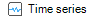

The configuration of *Any chart* widgets is in another document, here: [Any Chart Widgets](charts-any-configuration).

## 2 Common configuration

The common configuration for all charts is described here. For chart specific configuration see [Configuration by Chart Type](#configuration-by-chart-type),  below.

### 2.1 Chart properties

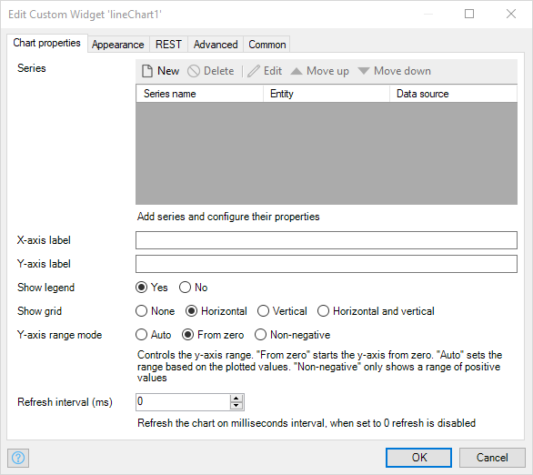

#### 2.1.1 Series

Add series and configure their properties, each series represents a data set. For example a line on a line chart.

* The *Pie Charts* and *Heat Maps* support only a single series containing a single set of data

  In this case, the **Data source** and **Data points** are shown as separate tabs in the widget.

  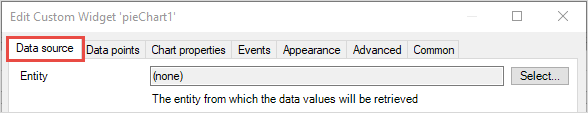

  The fields are the same as the ones described in the sections [Data source](#data-source) and [Data points](#data-points), below.

* Charts which support multiple series of data, like a line chart with multiple lines, support more than one series of data

  In this case, new series can be added by clicking the **Series > New** button in the **Chart properties** tab.

  {}From version 1.4 of charts you can create charts with a variable number of data series. For instructions on how to do this, see [How to Create a Dynamic Series Chart](/howto/extensibility/charts-dynamic-series).{}

1. Data source<a name="data-source"></a>

    The data for each each series can originate from a different data source. You can add additional data series in the **Chart properties** tab.
  
    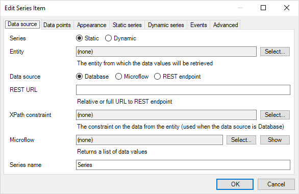

    * **Static/Dynamic**: Choose whether there is a fixed number of data series (lines, for example), or whether the number of data series is variable and will be decided by the app.

    * **Entity**: The entity from which the data values will be retrieved

    * **Data source**: the data source type for the series: *Database*, *Microflow* or *REST endpoint*

    * **REST URL**: Relative or full URL to REST endpoint. For more information on setting up a REST end point see [REST Charts](../howto/extensibility/charts-basic-rest)

    * **XPath constraint**: The constraint on the data from the entity (used when the data source is Database)

    * **Microflow**: A microflow that returns a list object with data values

2. Data points<a name="data-points"></a>

    The attribute(s) within the data source used for the values to be plotted.
    
    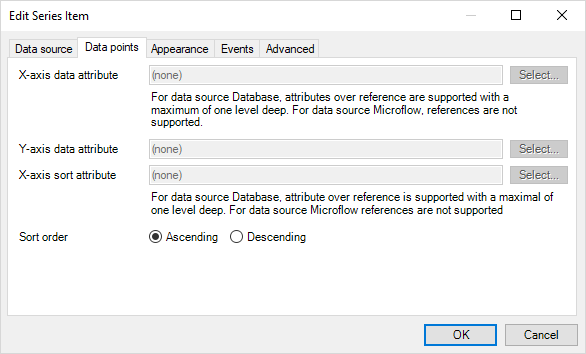

    * **X-axis data attribute**: For data source Database attributes over reference are supported with a maximum of one level deep. For data source Microflow, references are not supported

    * **Y-axis data attribute**: For data source Database attributes over reference are supported with a maximum of one level deep. For data source Microflow references are not supported

    * **X-axis sort attribute**: For data source Database attributes over reference are supported with a maximum of one level deep. For data source Microflow references are not supported

    * **Sort order**: The sort-order of the data provided by the "X-axis sort attribute"

    * **Aggregation type**: What to do if there are two y values in this series for one x value (for example if there are two data points in one series: (2,3), and (2,4)) – most of the options are self-explanatory, examples are:
      * Sum: plot the sum of the two values – (2,7) for the example above
      * Average: plot the mean of the two values (2,3.5)
      * None: plot just the first data point (2,3)

3. Appearance

    The appearance of the series. This is customized for each type of chart, see: [3 Configuration per chart type](#configuration-by-chart-type), below.

    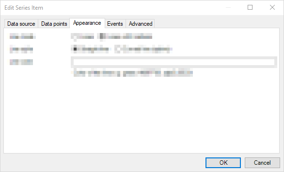

4. Static Series

    Additional configuration for the appearance of the series if it is a static series. This is customized for each type of chart, see: [3 Configuration per chart type](#configuration-by-chart-type), below.    

    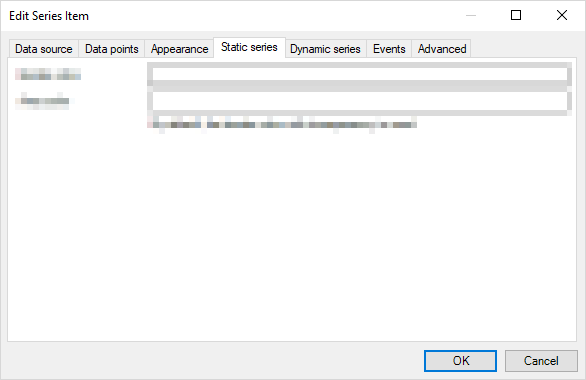

5. Dynamic Series

    Configuration of the series if it is a dynamic series.

    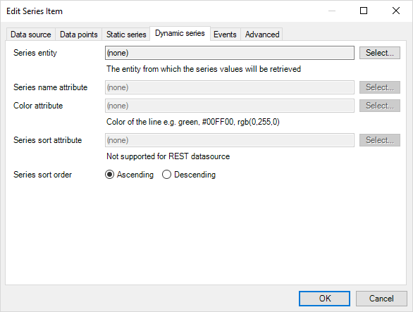

    * **Series entity**: the entity which defines a series – the list of objects of this entity type will be used to construct the series; one series for each object.
    
      Each entity is associated with the values which will be plotted, see [How to Create a Dynamic Series Chart](/howto/extensibility/charts-dynamic-series) for more information.

    * **Series name attribute**: the attribute in the series entity which will be displayed as the series name if a legend is displayed

    * **Color attribute**: the attribute in the series entity which defines the HTML color used when displayed this series – *there may be more than one color attribute if the chart allows different values (for example an area chart has separate line and fill colors)

    * **Series sort attribute**: allows you to sort the series by an attribute of the series entity – *this is not supported for **non-persistent** entities, such as those used when defining a REST datasource*

    * **Series sort order**: *Ascending* or *Descending*

6. Events

    The events to be supported if the user interacts with the chart.
    
    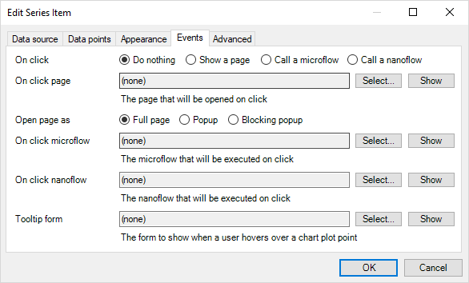

    {}The context of the page, microflow, or nanoflow selected for an event or tooltip will be the plotted object from which the point on the chart is drawn. This means you can display or use the x and y values, _and_ any other values stored in that object.<br /><br />For example you could use the tooltip to display the precise y value of a point, plus information on when the data was collected{}
    
    * **On click**: Select the way a click of a data point should be handled:
      * Do nothing
      * Show a page
      * Call a microflow
      * Call a nanoflow

        Configure the corresponding setting.

      * **On click page**: The page that will be opened on click. Required when the **On click > Show a page** option is selected

      * **Open page as**: Full page, Popup or Blocking popup

      * **On click microflow**: The microflow that will be executed on click

      * **On click nanoflow**: The nanoflow that will be executed on click

    * **Tooltip form**: The page to show when a user hovers over a chart plot point

7. Advanced <a name="advanced"></a>

    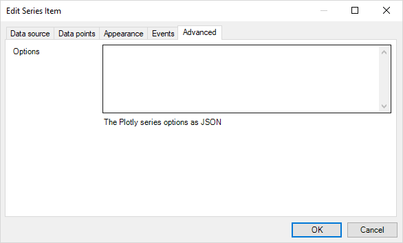

    * **Options**: The Plotly *series options* in JSON format; these options will only be used when the *widget* tab **Advanced > Mode** is set to *Advanced* or *Developer*: see [Advanced](#advanced-mode), below.

#### 2.1.2 Appearance

The **Appearance** settings are used to set the size of the chart on the page.

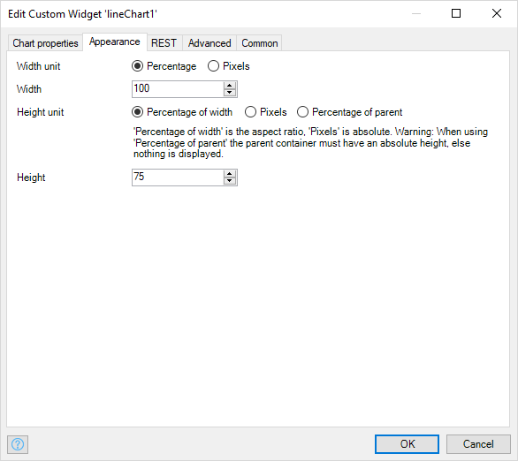

* **Width unit**: The type of unit which is used for the **Width** property - *Percentage* or *Pixels*

* **Width**: The width of the chart in pixels or percentage based on the **Width unit** setting

* **Height unit**: The type of unit which is used for the **Height** property

  * **Percentage of width**: sets the aspect ratio
  * **Pixels**: is an absolute height
  * **Percentage of parent**: sets the height in relation to a container in which the widget is placed
  
  {}When using **Percentage of parent** the parent container must have an **absolute** height, else nothing is displayed.{}

* **Height**: The height in pixels or percentage based on the setting of **Height unit**

#### 2.1.3 REST

Add parameters to a REST request (see [Data source](#data-source)). The contextId, and series name are provided by default.

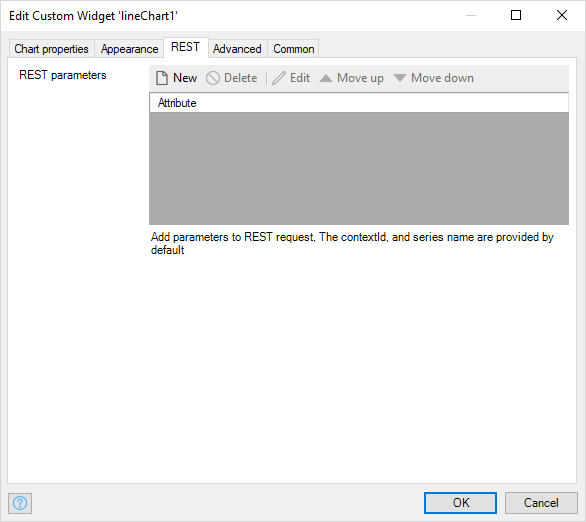

#### 2.1.4 Advanced {#advanced-mode}

The charts are based on the popular framework plotly.js which uses JSON to configure the charts. In the advanced and developer mode, you can specify additional JSON: unlocking the many features of plotly.js. You can also do this with a live preview.

See the following link for more information about plotly.js and the options: https://plot.ly/javascript/.

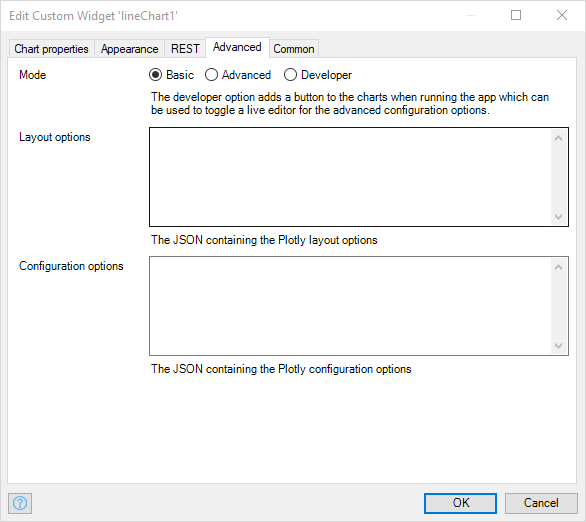

* **Mode**: You can use these charts in three different modes:

  * **Basic**: quickly setup a chart with the various widget options
  * **Advanced**: specify additional JSON configuration
  * **Developer**: this will add a **Toggle Editor** button to the chart at runtime which toggles an editor to play with different advanced configuration options

    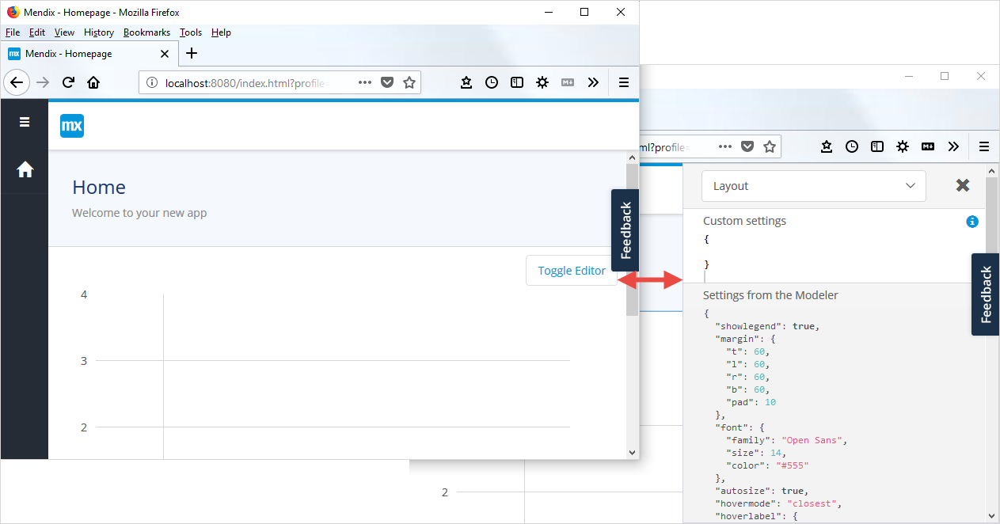

* **Layout options**: The JSON containing the Plotly layout options
  * [Samples](charts-advanced-cheat-sheet#layout-all)
  * [Full reference](https://plot.ly/javascript/reference/#layout)

* **Configuration options**: The JSON containing the Plotly configuration options
  * [Samples](charts-advanced-cheat-sheet#config-options)
  * [Documentation](https://plot.ly/javascript/configuration-options/)
  * [Full reference](https://github.com/plotly/plotly.js/blob/master/src/plot_api/plot_config.js)

#### 2.1.5 Common

These are properties which are common to many widgets. For information see [Common Widget Properties](common-widget-properties#common-properties).

## 3 Configuration by Chart Type {#configuration-by-chart-type}

The properties above are common across the chart types. In this section, the properties described are specific to the chart type.

### 3.1 Column Chart

**Series New or Edit**

1. **Static series** Tab

    * **Series name**: this will be displayed in any legend on the chart

    * **Column color**: HTML color of the column e.g. green, #00FF00, rgb(0,255,0), rgba(0,255,0, 0.5)

### 3.2 Line Chart

**Series New or Edit**

1. **Appearance** Tab

    * **Line mode**: *Lines* (without showing markers where the data points are) or *Lines with markers*

    * **Line style**: join the data points with a *Straight line* or a *Curved line (spline)*

2. **Static series** Tab

    * **Series name**: this will be displayed in any legend on the chart

    * **Line color**: HTML color of the line e.g. green, #00FF00, rgb(0,255,0), rgba(0,255,0, 0.5)

### 3.3 Pie Chart

**Chart properties**

* **Chart type**: The type of pie chart to use, either *pie* or *doughnut*

* **Show legend**: Displays a legend on the pie chart

* **Colors**: Contains the color of each slice e.g. green, #00FF00, rgb(0,255,0), rgba(0,255,0, 0.5)

* **Refresh interval (ms)**: Refresh the chart in intervals of ms, when set to 0 refresh is disabled

### 3.4 Area Chart

**Series New or Edit**

1. **Data source** Tab

    * **Series name**: this will be displayed in any legend on the chart

2. **Appearance** Tab

    * **Border**: No, Yes, Yes with markers

    * **Border style**: Straight, Curved

3. **Static series** Tab

    * **Border color**: HTML color of the border e.g. green, #00FF00, rgb(0,255,0), rgba(0,255,0, 0.5)

    * **Area color**: HTML color of the area within the border e.g. green, #00FF00, rgb(0,255,0), rgba(0,255,0, 0.5). Default is the border color with transparency

### 3.5 Bar Chart

**Series New or Edit**

1. **Static series** Tab

    * **Series name**: this will be displayed in any legend on the chart
    
    * **Bar color**: HTML color of the bar e.g. green, #00FF00, rgb(0,255,0), rgba(0,255,0, 0.5)

### 3.6 Time Series Chart

**Series New or Edit**

1. **Appearance** Tab

    * **Border**: No, Yes, Yes with markers

    * **Border style**: Straight, Curved

    * **Fill area**: Fill area between data points and x-axis: Yes, No

2. **Static series** Tab

    * **Series name**: this will be displayed in any legend on the chart

    * **Line color**: HTML color of the line e.g. green, #00FF00, rgb(0,255,0), rgba(0,255,0, 0.5)

    * **Area color**: HTML color of the area within the border e.g. green, #00FF00, rgb(0,255,0), rgba(0,255,0, 0.5). Default is the line color with transparency

### 3.7 Heat Map

**Scale**

* **Colors**: The percentage at which each color should be applied, together with the associated color. At least two values must be specified, otherwise the default colors are used

* **Show scale**: Display scale on the chart: Yes , No

* **Show values**: Display data values on the chart: Yes , No

* **Font value color**: HTML color of the values displayed on the heat map e.g. green, #00FF00, rgb(0,255,0), rgba(0,255,0, 0.5)

* **X-axis label**: Label to be displayed on the X-axis

* **Y-axis label**: Label to be displayed on the Y-axis

* **Smooth color**: Gradual color gradient between data points: Yes , No

### 3.8 Bubble Chart

**Series New or Edit**

1. **Static series** Tab

    * **Series name**: this will be displayed in any legend on the chart

    * **Serie color**[sic]: Color of the bubbles e.g green,#00FF00, rgb(2,255,0)

## 4 Chart Theming

Advanced JSON settings can also be added in a global context via the theme folder of your mendix project root directory.

To the theme folder, add a `.json` file named *com.mendix.charts*. The JSON should be in the following format:

``` json
{
  "layout": {
    // Add shared layout options here (for all charts)
  },
  "configuration": {
    // Add shared configuration options here (for all charts)
  },
  "charts": {
    "LineChart": {
      "layout": {
        // Add line chart only layout options here
      },
      "data": {
        // Add line chart only data options here
      },
      "configuration": {
          // Add line chart only configuration options here
      }
    },
    "AreaChart": {
      // Same arrangement as the line chart
    },
    "BubbleChart": {
      // Same arrangement as the line chart
    },
    "TimeSeries": {
      // Same arrangement as the line chart
    },
    "ColumnChart": {
      // Same arrangement as the line chart
    },
    "BarChart": {
      // Same arrangement as the line chart
    },
    "PieChart": {
      // Same arrangement as the line chart
    },
    "HeatMap": {
      // Same arrangement as the line chart
    }
  }
}
```

{}

Please use with caution, as the configuration set up here shall be applied to every instance of the charts in your application.  
Only the advanced configurations set up in the widget itself have a higher precedence.

{}
