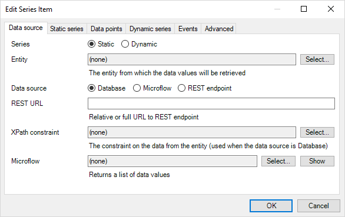
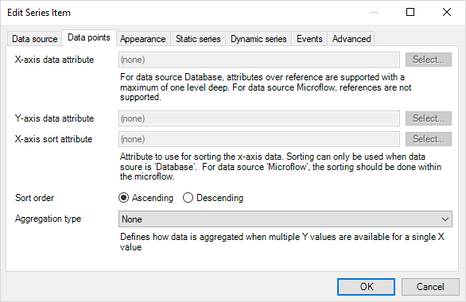
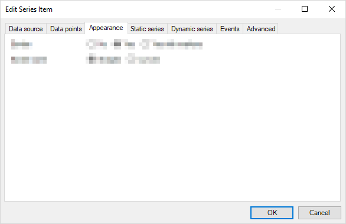
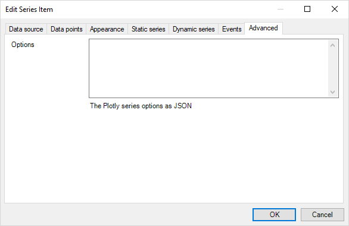

## 1 Introduction

This guide explains the options for configuring chart widgets. It covers the following widgets:

* Area chart
* Bar chart
* Bubble chart
* Column chart
* Heat map
* Line chart
* Pie chart
* Time series

The configuration of *Any chart* widgets is in another document here: [Any Chart Widgets](charts-any-configuration).

## 2 Common configuration
The common configuration for all charts is described here. For chart specific configuration see [Configuration by Chart Type](#configuration-by-chart-type),  below.

### 2.1 Chart properties


#### 2.1.1 Series

Add series and configure their properties, each series represents a data set. For example a line on a line chart.

* The *Pie Charts* and *Heat Maps* support only a single series containing a single set of data

    In this case, the **Data source** and **Data points** are shown as separate tabs in the widget.

    

    The fields are the same as the ones described in the sections [Data source](#data-source) and [Data points](#data-points), below.

* Charts which support multiple series of data, like a line chart with multiple lines, support more than one series of data

    In this case, new series can be added by clicking the **Series > New** button in the **Chart properties** tab.

    {}The charts described in this guide do not support **Dynamic series** (that is, changing the number of series on a multiple-series chart dynamically at runtime).

    The basic charts only support a fixed number of series which is set in the modeler. You need to use *Any chart* to set up dynamic series. See [Any charts](charts-any-configuration).{}

1. Data source<a name="data-source"></a>

    The data for each each series can originate from a different data source. You can add additional data series in the **Chart properties** tab.
    
    

  * **Series name**: A name for the series, for use in legends (when enabled)

  * **Entity**: The entity from which the data values will be retrieved

  * **Data source**: the data source type for the series: *Database*, *Microflow* or *REST endpoint*

  * **REST URL**: Relative or full URL to REST endpoint. For more information on setting up a REST end point see [REST Charts](../howto/extensibility/charts-basic-rest)

  * **XPath constraint**: The constraint on the data from the entity (used when the data source is Database)

  * **Microflow**: A microflow that returns a list object with data values

2. Data points<a name="data-points"></a>

    The attribute(s) within the data source used for the values to be plotted.
    
    

  * **X-axis data attribute**: For data source Database attributes over reference are supported with a maximum of one level deep. For data source Microflow, references are not supported

  * **Y-axis data attribute**: For data source Database attributes over reference are supported with a maximum of one level deep. For data source Microflow references are not supported

  * **X-axis sort attribute**: For data source Database attributes over reference are supported with a maximum of one level deep. For data source Microflow references are not supported

  * **Sort order**: The sort-order of the data provided by the "X-axis sort attribute"

3. Appearance

    The appearance of the series. This is customized for each type of chart, see: [3 Configuration per chart type](#configuration-by-chart-type), below.

    

4. Events

    The events to be supported if the user interacts with the chart.
    
    
    
  * **On click**: Select the way a click of a data point should be handled:
    * Do nothing
    * Show a page
    * Call a microflow
    * Call a nanoflow

    Configure the corresponding setting.

  * **On click page**: The page that will be opened on click. Required when the **On click > Show a page** option is selected

  * **Open page as**: Full page, Popup or Blocking popup

  * **On click microflow**: The microflow that will be executed on click

  * **On click nanoflow**: The nanoflow that will be executed on click

  * **Tooltip form**: The page to show when a user hovers over a chart plot point

5. Advanced <a name="advanced"></a>

    

* **Options**: The Plotly *series options* in JSON format; these options will only be used when the *widget* tab **Advanced > Mode** is set to *Advanced* or *Developer*: see [Advanced](#advanced-mode), below.

#### 2.1.2 Appearance

The **Appearance** settings are used to set the size of the chart on the page.


* **Width unit**: The type of unit which is used for the **Width** property - *Percentage* or *Pixels*

* **Width**: The width of the chart in pixels or percentage based on the **Width unit** setting

* **Height unit**: The type of unit which is used for the **Height** property

  * **Percentage of width**: sets the aspect ratio
  * **Pixels**: is an absolute height
  * **Percentage of parent**: sets the height in relation to a container in which the widget is placed
  
  {}When using **Percentage of parent** the parent container must have an **absolute** height, else nothing is displayed.{}

* **Height**: The height in pixels or percentage based on the setting of **Height unit**

#### 2.1.3 REST

Add parameters to a REST request (see [Data source](#data-source)). The contextId, and series name are provided by default.


#### 2.1.4 Advanced <a name="advanced-mode"></a>

The charts are based on the popular framework plotly.js which uses JSON to configure the charts. In the advanced and developer mode, you can specify additional JSON: unlocking the many features of plotly.js. You can also do this with a live preview.

See the following link for more information about plotly.js and the options: https://plot.ly/javascript/.


* **Mode**: You can use these charts in three different modes:

  * **Basic**: quickly setup a chart with the various widget options
  * **Advanced**: specify additional JSON configuration
  * **Developer**: this will add a **Toggle Editor** button to the chart at runtime which toggles an editor to play with different advanced configuration options

    

* **Layout options**: The JSON containing the Plotly layout options
  * [Samples](charts-advanced-cheat-sheet#layout-all)
  * [Full reference](https://plot.ly/javascript/reference/#layout)

* **Configuration options**: The JSON containing the Plotly configuration options
  * [Samples](charts-advanced-cheat-sheet#config-options)
  * [Documentation](https://plot.ly/javascript/configuration-options/)
  * [Full reference](https://github.com/plotly/plotly.js/blob/master/src/plot_api/plot_config.js)

## 3 Configuration by Chart Type <a name="configuration-by-chart-type"></a>

The properties above are common across the chart types. In this section, the properties described are specific to the chart type.

### 3.1 Column Chart

#### 3.1.1 Series New or Edit

1. **Appearance** Tab

    * **Column color**: HTML color of the column e.g. green, #00FF00, rgb(0,255,0), rgba(0,255,0, 0.5)

### 3.2 Line Chart

#### 3.2.1 Series New or Edit

1. **Appearance** Tab

    * **Line mode**: *Lines* (without showing markers where the data points are) or *Lines with markers*

    * **Line style**: join the data points with a *Straight line* or a *Curved line (spline)*

    * **Line color**: HTML color of the line e.g. green, #00FF00, rgb(0,255,0), rgba(0,255,0, 0.5)

### 3.3 Pie Chart

#### 3.3.1 Chart properties

* **Chart type**: The type of pie chart to use, either *pie* or *doughnut*

* **Show legend**: Displays a legend on the pie chart

* **Colors**: Contains the color of each slice e.g. green, #00FF00, rgb(0,255,0), rgba(0,255,0, 0.5)

* **Refresh interval (ms)**: Refresh the chart in intervals of ms, when set to 0 refresh is disabled

### 3.4 Area Chart

#### 3.4.1 Series New or Edit

1. **Appearance** Tab

    * **Border**: No, Yes, Yes with markers

    * **Border style**: Straight, Curved

    * **Border color**: HTML color of the border e.g. green, #00FF00, rgb(0,255,0), rgba(0,255,0, 0.5)

    * **Area color**: HTML color of the area within the border e.g. green, #00FF00, rgb(0,255,0), rgba(0,255,0, 0.5). Default is the border color with transparency

### 3.5 Bar Chart

#### 3.5.1 Series New or Edit

1. **Appearance** Tab

    * **Bar color**: HTML color of the bar e.g. green, #00FF00, rgb(0,255,0), rgba(0,255,0, 0.5)

### 3.6 Time Series Chart

#### 3.6.1 Series New or Edit

1. **Appearance** Tab

    * **Border**: No, Yes, Yes with markers

    * **Border style**: Straight, Curved

    * **Line color**: HTML color of the line e.g. green, #00FF00, rgb(0,255,0), rgba(0,255,0, 0.5)

    * **Fill area**: Fill area between data points and x-axis: Yes, No

    * **Area color**: HTML color of the area within the border e.g. green, #00FF00, rgb(0,255,0), rgba(0,255,0, 0.5). Default is the line color with transparency

### 3.7 Heat Map

#### 3.7.1 Scale

* **Colors**: The percentage at which each color should be applied, together with the associated color. At least two values must be specified, otherwise the default colors are used

* **Show scale**: Display scale on the chart: Yes , No

* **Show values**: Display data values on the chart: Yes , No

* **Font value color**: HTML color of the values displayed on the heat map e.g. green, #00FF00, rgb(0,255,0), rgba(0,255,0, 0.5)

* **X-axis label**: Label to be displayed on the X-axis

* **Y-axis label**: Label to be displayed on the Y-axis

* **Smooth color**: Gradual color gradient between data points: Yes , No

### 3.8 Bubble Chart

#### 3.8.1 Series New or Edit

1. **Appearance** Tab

    * **Serie color**[sic]: Color of the bubbles e.g green,#00FF00, rgb(2,255,0)

## 4 Chart Theming

Advanced JSON settings can also be added in a global context via the theme folder of your mendix project root directory.

To the theme folder, add a `.json` file named *com.mendix.charts*. The JSON should be in the following format:

``` json
{
  "layout": {
    // Add shared layout options here (for all charts)
  },
  "configuration": {
    // Add shared configuration options here (for all charts)
  },
  "charts": {
    "LineChart": {
      "layout": {
        // Add line chart only layout options here
      },
      "data": {
        // Add line chart only data options here
      },
      "configuration": {
          // Add line chart only configuration options here
      }
    },
    "AreaChart": {
      // Same arrangement as the line chart
    },
    "BubbleChart": {
      // Same arrangement as the line chart
    },
    "TimeSeries": {
      // Same arrangement as the line chart
    },
    "ColumnChart": {
      // Same arrangement as the line chart
    },
    "BarChart": {
      // Same arrangement as the line chart
    },
    "PieChart": {
      // Same arrangement as the line chart
    },
    "HeatMap": {
      // Same arrangement as the line chart
    }
  }
}
```

{}

Please use with caution, as the configuration set up here shall be applied to every instance of the charts in your application.  
Only the advanced configurations set up in the widget itself have a higher precedence.

{}
