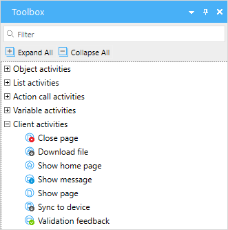

## 1 Introduction

**Client Activities** perform activities in the client, for example, opening a page or showing a message. The activities described in this document are in the **Client Activities** section of the **Toolbox** and can differ for microflows and nanoflows:

The following are the client activities you can use in your microflow or nanoflow:

* [Nanoflow call](nanoflow-call) *(only in nanoflows)* – calls another nanoflow
* [Close page](close-page) – closes the currently open page
* [Download file](download-file) *(only in microflows)* – downloads a file using the browser
* [Show home page](show-home-page) *(only in microflows)* – opens the home page for the end-user 
* [Show message](show-message) – shows a message to the end-user
* [Show page](show-page) – shows a selected page to the end-user 
* [Synchronize to device](synchronize-to-device) *(only in microflows)* – enables selectively synchronizing a set of objects to the device when calling a microflow from a nanoflow
* [Synchronize](synchronize) *(only in nanoflows)* – synchronizes data between your device and the server
* [Validation feedback](validation-feedback) – does a validation check, and if this check fails, it shows a message to the end-user

## 2 Read More

* [Activities](activities)
