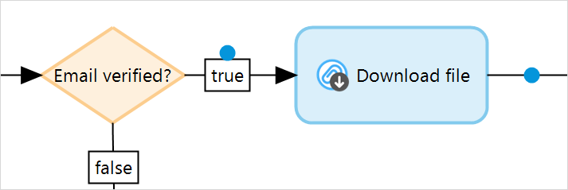
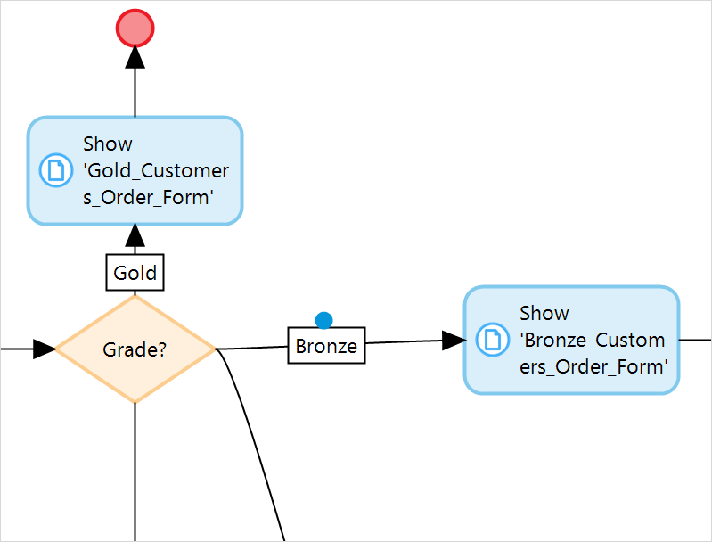
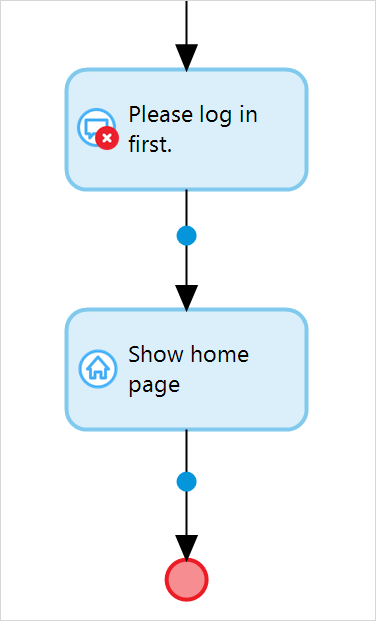
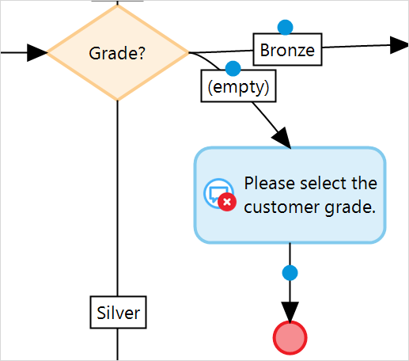
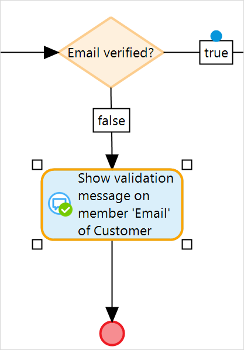

## 1 Introduction

**Client Activities** perform activities in the client, for example, open a page or show a message. 

There are following types of client activities:

* [Close page](close-page) – closes the currently open page

	

* [Download file](download-file) – enables the browser to download a specific file

	

* [Show page](show-page) – shows a selected page to an end-user

	

* [Show home page](show-home-page) – opens a home page for an end-user 

	

* [Show message](show-message) – shows a message to an end-user

	

* [Validation feedback](validation-feedback) – does a validation check, and if this check fails, it shows a message to the end-user

	

