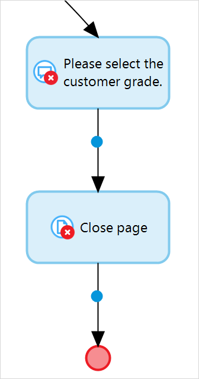

## 1 Introduction

**Client Activities** perform activities in the client, for example, opening a page or showing a message. 

The following are the client activities you can use in your microflow or nanoflow:

* [Close page](close-page) – closes the currently open page

	

* [Download file](download-file) *(only in microflows)* – downloads a file using the browser

	

* [Show home page](show-home-page) *(only in microflows)* – opens the home page for the end-user 

	

* [Show message](show-message) – shows a message to the end-user

	

* [Show page](show-page) – shows a selected page to the end-user

	

* [Validation feedback](validation-feedback) – does a validation check, and if this check fails, it shows a message to the end-user

	
