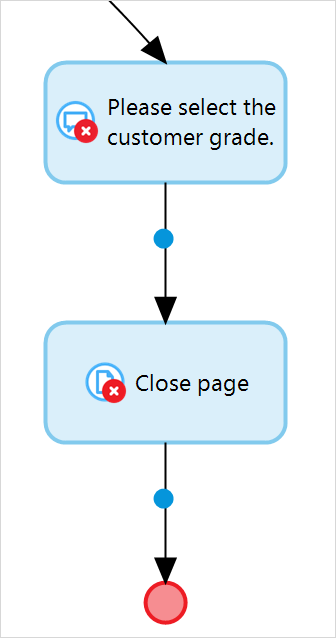

{}
This activity can be used in both **Microflows** and **Nanoflows**.
{}

{}
This action is ignored and does not work when a microflow is called from an offline, native, or hybrid app. For more information, see the [Microflows](offline-first#microflows) section of the *Offline-First Reference Guide*.
{}

## 1 Introduction

The **Close page** activity closes the currently open page. For example, it can be used to close a pop-up page:

## 2 Properties

The **Close page** activity properties consists of the following sections:

* **Action** – shows the activity type
* **Common**  – contain properties common for many microflow elements; for more information on these properties, see the [Common Properties](microflow-element-common-properties) 

