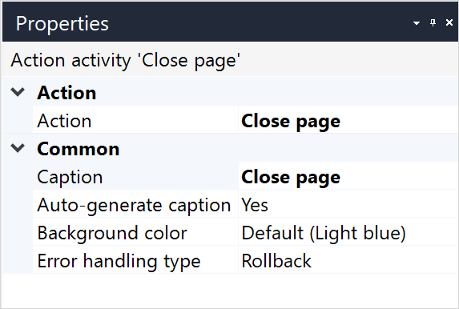

{}
This activity can be used in both **Microflows** and **Nanoflows**.
{}

{}
This action is ignored and does not work when a microflow is called from an offline, native, or hybrid app. For more information, see the [Microflows](offline-first#microflows) section of the *Offline-First Reference Guide*.
{}

## 1 Introduction

The **Close page** activity closes the currently open page. For example, it can be used to close a pop-up page:

{}

{}

## 2 Properties

The **Close page** activity properties consists of the following sections:

* [Action](#action) 

* [Common](#common)  

    {}

{}

## 3 Action Section {#action}

The **Action** section of the properties pane shows the action associated with this activity.

### 3.1 Number of Pages

{}
This option is only available for native mobile and was introduced with Mendix Studio Pro v8.14.
{}

This property allows you to control how many pages should be closed.

| Value | Description |
| --- | --- |
| Single | Close one page (default behavior). |
| Multiple | Close multiple pages at once, showing only a single animation. This number can be configured using an expression.  |

## 4 Common Section {#common}

{}

## 5 Read More

* [Show Page](show-page)
