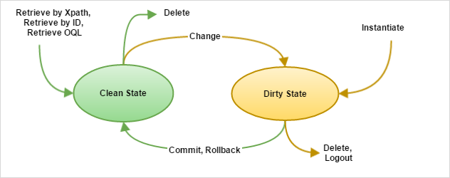

## 1 Introduction

This page describes the behavior and impact of running Mendix Runtime as a cluster. Using the cluster functionality, you can set up your Mendix application to run behind a load balancer to enable a failover and/or high availability architecture.

The main feature enabling clustering is Mendix's stateless runtime architecture. This means that the dirty state (the non-persistable entity instances and not-yet-persisted changes) are stored on the client and not on the server. This enables much easier scaling of the Mendix Runtime, as each cluster node can handle any request from the client. The stateless runtime architecture also allows for better dirty state maintainability and better insight in application state.

## 2 Clustering Support

Clustering support is built natively into our Cloud Foundry buildpack implementation. This means that you can simply scale up using Cloud Foundry. The buildpack ensures that your system automatically starts behaving as a cluster.

Clustering is also supported on Kubernetes, but you will have to use a *StatefulSet*. There is more information on this in the [Some Notes on Scaling](/developerportal/deploy/run-mendix-on-kubernetes#scaling) section of *How to Run Mendix on Kubernetes*.

## 3 Cluster Infrastructure

The Mendix Runtime cluster requires the following infrastructure:

This means that a Mendix cluster requires a load balancer to distribute the load of the clients over the available Runtime cluster nodes. It also means that all the nodes need to connect to the same Mendix database, and the files need to be stored on S3 (for details, see the [File Storage](#file-storage) section below). The number of nodes in your cluster depends on the application, the high availability requirements, and its usage.

### 3.1 Pivotal Web Services

The infrastructure described above is easily supported in [Pivotal Web Services](https://run.pivotal.io/). Pivotal Web Services allows for easy scaling by increasing the number of running nodes for your app and providing a built-in load balancer for accessing the nodes.

For information on deploying your application into Pivotal Web Services and other Cloud Foundry platforms, see [Cloud Foundry](/developerportal/deploy/cloud-foundry-deploy).

Scaling out can be done using the Pivotal App Manager. For details on using the Pivotal App Manager, see the [Getting Started with Apps Manager](http://docs.run.pivotal.io/console/dev-console.html).

## 4 Cluster Leader & Cluster Slaves

Mendix Runtime has the concept of a cluster leader. This is a single node within a Mendix Runtime cluster that performs cluster management activities. These are the activities:

* **Session cleanup handling** – each node expires its sessions (meaning, not being used for a configured timespan) and the cluster leader removes the sessions persisted in the database
	* In exceptional cases (for example, a node crash), some sessions may not be removed from the database, in which case the cluster leader makes sure this removal still happens
* **Cluster node expiration handling** – removing cluster nodes after they have expired (meaning, not giving a heartbeat for a configured timespan)
* **Background job expiration handling** – removing data about background jobs after the information has expired (meaning, older than a specific timespan)
* **Unblocking blocked users**
* **Executing Scheduled Events** – scheduled events are only executed on the cluster leader
* **Performing database synchronization after new deploy**
* **Clear persistent sessions after new deploy** – invalidating all existing sessions so that they get in sync with the latest model version

These activities are only performed by the cluster leader. If the cluster leader is not running, the cluster will still function. However, the activities listed above will not be performed.

The Cloud Foundry Buildpack determines which cluster node becomes the cluster leader and which become cluster slaves.

## 5 Cluster Startup

Individual nodes in a cluster can be started and stopped with no impact on the uptime of the app. However, when you deploy a new version of the app the whole cluster is restarted and the cluster leader determines whether database synchronization is required. This means that there will be some downtime when the app is deployed while this is done.

If database synchronization is required, all the cluster slaves will wait until the cluster leader finishes the database synchronization. When the database synchronization has finished, all the cluster nodes will become fully functional.

If no database synchronization is required, all the cluster nodes will become fully functional directly after startup.

## 6 File Storage {#file-storage}

Uploaded files should be stored in a shared file storage facility, as every Mendix Runtime node should access the same files. Either the local storage facility is shared or the files are stored in a central storage facility such as an Amazon S3 file storage, Microsoft Azure Blob storage, or IBM Bluemix Object Storage. 

For more information about configuring the Mendix Runtime to store files on these storage facilities,  see [Runtime Customization](custom-settings).

## 7 After-Startup & Before-Shutdown Microflows {#startup-shutdown-microflows}

It is possible to configure `After-Startup` and `Before-Shutdown` microflows in Mendix. In a Mendix cluster, this means that those microflows are called per node. This lets you register request handlers and other activities. However, doing database maintenance during these microflows is strongly discouraged, because it might impact other nodes of the same cluster. There is no possibility to run a microflow on cluster startup or shutdown.

## 8 Cluster Limitations

### 8.1 Microflow Debugging

While running a multi-node cluster, you cannot predict the node on which a microflow will be executed. Therefore, it is not possible to debug such a microflow execution in a cluster from Mendix Studio Pro. However, you can still debug a microflow while running a single instance of the Mendix Runtime.

### 8.2 Cluster-Wide Locking (Guaranteed Single Execution)

Some apps require a guaranteed single execution of a certain activity at a given point in time. In a single node Mendix Runtime, this could be guaranteed by using JVM locks. However, in a distributed scenario, those JVMs run on different machines, so there is no locking system available. Mendix does not support cluster-wide locking, either. If this cannot be circumvented, you might need to resort to an external distributed lock manager. However, keep in mind that locking in a distributed system is complex and prone to failure (for example, via lock starvation or lock expiration.).

{}
For the reason described above, the **Disallow concurrent execution** property of a microflow only applies to a single node.
{}

## 9 Dirty State in a Cluster

When a user signs in to a Mendix application and starts going through a certain application flow, the system can temporarily retain some data while not persisting it yet in the database. The data is retained in the Mendix Client memory and communicated on behalf of the user to a Mendix Runtime node.

For example, imagine you are booking a vacation through a Mendix app with a flight, hotel, and rental car. In the first step, you select and configure the flight, in the second one your hotel, in the third your rental car, and in the final step, you confirm the booking and payment. Each of these steps could be in a different screen, but when you go from step one to step two, you would still like to remember your booked flight. This is called the "dirty state." The data is not finalized yet, but should be retained between different requests. Because it is necessary to reliably scale out and support failover scenarios, the state cannot be stored in the memory of one Mendix Runtime node between requests. Therefore, the state is returned to the caller (the Mendix Client) and added to subsequent requests, so that every node can work with that state for those requests.

The following image describes this behavior:

Reading objects and deleting (unchanged) objects from the Mendix database is still a "clean state." Changing an existing object or instantiating a new object will create "dirty state." Dirty state needs to be sent from the Mendix Client to the Mendix Runtime with every request. Committing objects or rolling back will remove them from the dirty state. The same will happen if an instantiated or changed object is deleted. Non-persistable entities are always part of the dirty state.

Only the dirty state for requests that originate from the Mendix Client (both synchronous and asynchronous calls) can be retained between requests. For all other requests—such as scheduled events, web services, or background executions—the state only lives for the current request. After that, the dirty state either has to be persisted or discarded. The reason for only allowing Mendix Client requests to retain their dirty state is that this is currently the only channel that works with actual user input. User input requires more interaction and flexibility with the data between requests. By only allowing these requests to retain their dirty state, the load on the Mendix Runtime and the external source is minimized, and performance is optimized.

{}
Whenever the Mendix Client is restarted, all the state is discarded, as it is only kept in the Mendix Client memory. The Mendix Client is restarted when reloading the browser tab (for example, when pressing <kbd>F5</kbd>), restarting a mobile hybrid app, or explicitly signing out.
{}

The more objects that are part of the dirty state, the more data has to be transferred in the requests and responses between the Mendix Runtime and the Mendix Client. As such, this has an impact on performance. In cluster environments, it is advised to minimize the amount of dirty state to minimize the impact of the synchronization on performance.

The Mendix Client attempts to optimize the amount of state sent to the Mendix Runtime by only sending data that can potentially be read while processing the request. For example, if you call a microflow that gets `Booking` as a parameter and retrieves `Flight` over association, then the client will pass only `Booking` and the associated `Flight`s from the dirty state along with the request, but not the `Hotel`s. Note that this behavior is the best effort; if the microflow is too complex to analyze (for example, when a Java action is called with a state object as a parameter), the entire dirty state will be sent along. This optimization can be disabled via the [Optimize network calls](project-settings#3-2-optimize-network-calls) project setting.

{}
It is important to realize that when calling external web services in Mendix to fetch external data, the responses of those actions are converted into Mendix entities. As long as they are not persisted in the Mendix database, they will be part of the dirty state and have a negative impact on the performance of the application. To reduce this impact, this behavior is likely to change in the future.
{}

To reduce the performance impact of large requests and responses, an app developer should be aware of the following scenarios that cause large requests and responses:

* A microflow that creates a large number of non-persistable entities and shows them in a page
* A microflow that calls a web service to retrieve external data and convert them to non-persistable entities
* A page that has multiple microflow data source data views, each causing the state transferred to the Mendix Runtime to handle the microflow

{}
To make sure the dirty state does not become too big when the above scenarios apply to your app, it's recommended to explicitly delete objects when they are no longer necessary, so that they are not part of the state anymore. This frees up memory for the Mendix Runtime nodes to handle requests and improves performance.
{}

## 10 Associating Entities with `System.Session` or `System.User`

The `$currentSession` *Session* object is available in microflows so that a reference to the current session can easily be obtained. When an object needs to be stored, its association can be set to `$currentSession`, and when the object needs to be retrieved again, `$currentSession` can be used as a starting point from which the desired object can be retrieved by association. The associated object can be designed so that it meets the desired needs. This same pattern applies to entities associated with `System.User`. In that case, you can use the `$currentUser` *User* object.

For example, you can add `Key` and `Value` members to a `Data` entity associated with `System.Session` (and have constants for key values).

The `Value` values can easily be obtained by performing a find on the `Key` values of a list of `Data` instances.

{}
When data is associated to the current user or current session, it cannot be automatically garbage-collected. As such, this data will be sent with every request to the server and returned by the responses of those requests. Therefore, associating entity instances with the current user and current session should be done when no other solutions are possible to retain this temporary data.
{}

## 11 Sessions Are Always Persistent

To support seamless clustering, sessions are always persisted in the database. In previous versions, this was a known performance bottleneck. Mendix now contains optimizations to mitigate this performance hit.

Roundtrips to the database for this purpose are reduced by giving the persistent sessions a maximum caching time of thirty seconds (by default). This means that after signing out of a session, the session might still be accessible for thirty seconds on other nodes of the cluster, but only in case that node has handled a previous request on that session just before the logout happened. This timeout can be configured. Lowering it makes the cluster more secure, because the chance that the session is still accessible within the configured time window is smaller. However, this also requires more frequent roundtrips to the database (which impacts performance). Increasing the timeout has the opposite effect. This can be configured by setting `SessionValidationTimeout` (value in milliseconds).

Persistent sessions also store a last-active date upon each request. To improve this particular aspect of the performance, the last-active date attribute of a session is no longer committed to the database immediately on each request. Instead, this information is queued for an action to run at a configurable interval to be stored in the Mendix database. This action verifies whether the session has not been logged out by another node and whether the last active date is more recent than the one in the database. The interval can be configured by setting `ClusterManagerActionInterval` (value in milliseconds).

{}
Overriding the default values for the `SessionTimeout` and `ClusterManagerActionInterval` custom settings can impact the behavior of "keep alive" and results in an unexpected session logout. The best practice is to set the `ClusterManagerActionInterval` to half of the `SessionTimeout` so that each node gets the chance to run the clean-up action at least once during the session time out interval.
{}

