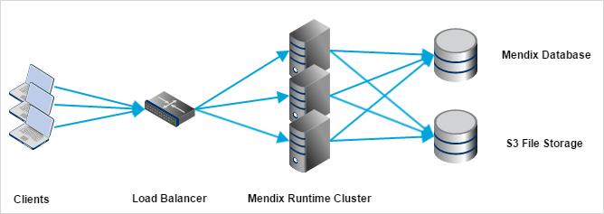

## 1 Introduction

This page describes the impact and its behavior of running Mendix Runtime as a Cluster. Using the Cluster functionality you can setup your Mendix application to run behind a load balancer to enable a failover and/or high availability architecture.

Mendix 7 contains a completely new build approach for clustering. The main feature enabling this is the stateless runtime architecture. This means that the dirty state (the non-persistable entity instances and not yet persisted changes) are not stored on the server but on the client. This enables much easier scaling of the Mendix Runtime as each cluster node can handle any request from the client. The stateless runtime architecture also allows for better dirty state maintainability and better insight in application state.

## 2 Clustering Support

Using clustering is only supported in combination with Cloud Foundry. Clustering support is built in natively into our Cloud Foundry buildpack implementation. This means that you can simply scale up using Cloud Foundry. The buildpack ensures that your system automatically starts behaving as a cluster.

## 3 Cluster Infrastructure

The Mendix Runtime Cluster requires the following infrastructure:

This means that a Mendix Cluster requires a Load Balancer to distribute the load of the clients over the available Runtime Cluster nodes. It also means that all the nodes need to connect to the same Mendix Database and that files need to be stored on S3 (see the File Storage topic). The number of nodes in your cluster depends on the application, the high availability requirements, and its usage.

### 3.1 Pivotal Web Services

The above depicted infrastructure is supported in an easy way in Pivotal Web Services. Pivotal Web Services allows easy scaling by increasing the number of running nodes for your app and provides a built-in load balancer for accessing the nodes.

Deploying your application into Pivotal Web Services is described on this page: [Deploying a Mendix App to Pivotal](/deployment/cloud-foundry/deploy-a-mendix-app-to-pivotal).

Scaling out can be done using the Pivotal App Manager. Using the Pivotal App Manager is documented in the [Pivotal Webservices Documentation](http://docs.run.pivotal.io/console/dev-console.html).

## 4 Cluster Leader, Cluster Slaves

Mendix Runtime has the concept of a Cluster Leader. This is a single node within a Mendix Runtime Cluster that performs cluster management activities. Those activities are:

* `Session Expiration handling` - removing sessions after they have expired (not been used for a configured timespan)
* `Cluster node expiration handling` - removing cluster nodes after they have expired (not giving a heartbeat for a configured timespan)
* `Background job expiration handling` - removing data about background jobs after the information has expired (older than a specific timespan)
* `Unblocking blocked users`
* `Executing Scheduled Events` - scheduled events are only executed on the cluster leader now
* `Performing database synchronization after new deploy`
* `Clear persistent sessions after new deploy` - to invalidate all existing sessions such that they get in sync with the latest model version

These activities are only performed by the Cluster Leader. If the Cluster Leader is not running, the cluster will still function, however, the above mentioned activities will not be performed.

Which cluster node becomes the Cluster Leader and which one becomes a Cluster Slave is determined by the Cloud Foundry Buildpack.

## 5 Cluster Startup

The Cluster Leader is responsible for performing the database synchronization. So if a new app deploy has been detected, all Cluster Slaves will wait until the Cluster Leader finishes the database synchronization. When the database synchronization has finished, the Cluster Slaves and Cluster Leader will automatically become fully functional.

If no database synchronization is required, all cluster nodes will become fully functional directly after startup.

## 6 File Storage

Uploaded files should be stored in a shared file storage facility, as every Mendix Runtime node should access the same files. Either the local storage facility is shared or the files are stored in a central storage facility such as an Amazon S3 file storage, Microsoft Azure Blob storage, or IBM Bluemix Object Storage (see [custom settings](custom-settings) for more information about configuring the Mendix Runtime to store files on these storage facilities).

## 7 After-Startup and Before-Shutdown Microflows

It is possible to configure `After-Startup` and `Before-Shutdown` microflows in Mendix. In a Mendix Cluster this means that those microflows are called per node. This lets you register request handlers and other activities. However, doing database maintainance during these microflows is strongly discouraged because it might impact other nodes of the same cluster. There is no possibility to run a microflow on cluster startup or shutdown.

## 8 Cluster Limitations

### 8.1 Microflow Debugging
While running a multi-node cluster it is not predictable on which node a microflow will be executed. Therefore, it is not possible to debug such a microflow execution in a cluster from the Mendix Modeler. However, you can still debug a microflow while running a single instance of the Mendix Runtime.

### 8.2 Cluster-Wide Locking (Guaranteed Single Execution)

Some apps require a guaranteed single execution of a certain activity at a given point in time. In a single node Mendix Runtime this could be guaranteed by using JVM locks. However, in a distributed scenario those JVMs run on different machines, so there is no locking system available. Mendix does not support cluster wide locking either. If this can't be circumvented, you might need to resort to an external distributed lock manager. However, keep in mind that locking in a distributed system is complex and prone to failure (lock starvation, lock expiration, etc.).

## 9 Dirty State in a Cluster

When a user signs in to a Mendix application and starts going through a certain application flow, some data can be temporary retained, while not persisting it yet in the database. The data is retained in the Mendix Client memory and communicated on behalf of the user to a Mendix Runtime node.

For example, imagine you are booking a vacation through a Mendix app that consists of a flight, hotel, and rental car. In the first step you would select and configure the flight, in the second one your hotel, in the third your rental car, and in the final step you confirm the booking and payment. Each of these steps could be in a different screen, but when you go from step one to step two you would still like to remember your booked flight. This is called the 'dirty state'. The data is not finalized yet, but should be retained between different requests. As reliably scaling out and supporting failover scenarios is necessary, the state can not be stored in the memory of one Mendix Runtime node between requests. Therefore, the state is returned to the caller (the Mendix Client) and added to subsequent requests, so that every node can work with that state for those requests.

The following picture describes its behavior:

Reading objects and deleting (unchanged) objects from the Mendix Database is still a 'Clean State'. Changing an existing object or instantiating a new object will create 'Dirty State'. 'Dirty State' needs to be sent from the Mendix Client to the Mendix Runtime with every request. Committing objects or rolling back will remove them from the 'Dirty State'. The same will happen if an instantiated or changed object is deleted. Non-persistable entities are always part of the 'Dirty State'.

Only the 'Dirty State' for requests which originate from the Mendix Client (both synchronous and asynchronous calls) can be retained between requests. For all other requests, such as scheduled events, web services, or background executions, the state only lives for the current request. After that, the 'Dirty State' either has to be persisted or will be discarded. The reason for only allowing Mendix Client requests to retain their 'Dirty State' is that this is currently the only channel that works with actual user input. User input requires more interaction with and flexibility of data between requests. By only allowing these requests to retain their 'Dirty State', the load on the Mendix Runtime and the external source is minimized and performance optimized.

Note that whenever the Mendix Client is restarted, all state is discarded, as it's only kept in the Mendix Client memory. The Mendix Client is restarted when reloading the browser tab (e.g. when pressing <kbd>F5</kbd>), restarting a mobile hybrid app, or explicitly logging out.

The more objects that are part of the 'Dirty State', the more data has to be transferred in the requests and responses between the Mendix Runtime and the Mendix Client. As such, it has an impact on performance. In cluster environments it is advised to minimize the amount of 'Dirty State' to minimize the impact of the synchronization on performance.

The Mendix Client attempts to optimize the amount of state sent to the Mendix Runtime by only sending the data which can potentially be read while processing the request. For example, if you call a microflow which gets the `Booking` as a parameter and retrieves the `Flight` over association, then the Client will pass only the `Booking` and the associated `Flight`s from the Dirty State along with the request, but not the `Hotel`s. Note that this behavior is best effort, if the microflow is too complex to analyze (e.g. when a Java action is called with a State object as a parameter) the entire Dirty State will be sent along. This optimization can be disabled by the [`Optimize network calls` Project Setting](project-settings#3-2-optimize-network-calls).

{}

It's important to realize that when calling external web services in Mendix to fetch external data, the responses of those actions are converted into Mendix entities. As long as they are not persisted in the Mendix Database, they will be part of the `Dirty State` and have a negative impact on the performance of the application. To reduce this impact, this behavior is likely to change in the future.

{}

To reduce the performance impact of large requests and responses, an app developer should be aware of situations that cause those. There are several scenarios which can cause these:

| Scenario |
| --- |
| Microflow that creates a large number of non-persistable entities and shows them in a page. |
| Microflow that calls a web service/app service to retrieve external data and convert them to non-persistable entities. |
| A page has multiple microflow data source data views, each causing the state transferred to the Mendix Runtime to handle the microflow. |

{}

To make sure the dirty state does not become too big when the above scenarios apply to your app, it's recommended to explicitly delete objects when they are no longer necessary, so that they are not part of the state anymore. This frees up memory for the Mendix Runtime nodes to handle requests and improves performance.

{}

## 10 Associating Entities with `System.Session` or `System.User`

The `$currentSession` variable is available in microflows so that a reference to the current session can easily be obtained. When an object needs to be stored, its association can be set to `$currentSession`, and when the object needs to be retrieved again `$currentSession` can be used as a starting point from which the desired object can be retrieved by association. The associated object can be designed so that it meets the desired needs. This same pattern applies to entities associated with `System.User`. In that case you can use the `$currentUser` variable.

For example, you can add `Key` and `Value` members to a `Data` entity associated with `System.Session` (and have constants for key values).

The `Value` values can easily be obtained by performing a find on the `Key` values of a list of `Data` instances.

{}

When data is associated to the current user or current session it can not be automatically garbage collected. As such, this data will be sent with every request to the server and returned by the responses of those requests. Therefore, associating entity instances with current user and current session should be done when no other solutions are possible to retain this temporary data.

{}

## 11 Sessions are Now Always Persistent

To support seamless clustering, sessions will always be persisted in the database. In previous versions this was a known performance bottleneck. Mendix 7 contains a couple of optimizations to migitate this performance hit. Roundtrips to the database for this purpose are reduced by giving the persistent sessions a maximum caching time of thirty seconds (by default). This means that after logging out of a session, the session might still be accessible for thirty seconds on other nodes of the cluster, but only in case that node has handled a previous request on that session just before the logout happened. This timeout can be configured. Lowering it makes the cluster more secure because the chance that the session is still accessible within the configured timewindow is smaller, but also requires more frequent roundtrips to the database (impacting performance). Increasing the timeout has the opposite effect. The setting can be configured by setting `SessionValidationTimeout` (value in milliseconds).

Persistent Sessions also store a 'last active' date upon each request. To improve this particular aspect of the performance, the 'last active' date attribute of a session is no longer committed to the database immediately on each request. Instead, this information is queued for an action to run at a configurable interval to be stored in the Mendix Database. This action verifies whether the session has not been logged out by another node and whether the last active date is more recent than the one in the database. The interval can be configured by setting `ClusterManagerActionInterval` (value in milliseconds).

{}

Overriding the default values for `SessionTimeout` and `ClusterManagerActionInterval` custom settings can impact the behavior of keep alive and results in an unexpected session logout. In particular, the best practice is to set the `ClusterManagerActionInterval` to half of the `SessionTimeout` so that each node gets the chance to run at least once before the Cluster Leader attempts to delete a session.

{}
