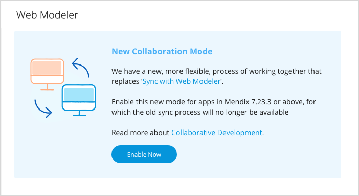
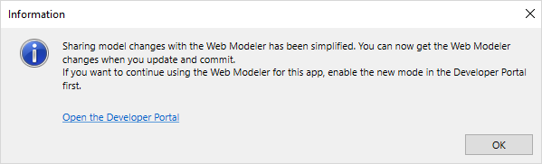

## 1 Introduction 

For projects with Mendix version 7.23.3 or above, the [sync process](/web-modeler/general-sync-webmodeler-desktopmodeler) between the Desktop Modeler and the Web Modeler is replaced by [collaborative development](collaborative-development) with the Web Modeler.

The new collaborative development process is automatically used for newly created apps with Mendix version 7.23.3 and above. 

If you upgrade an existing project to Mendix version 7.23.3 or above, you need to enable the new, simplified, way of sharing model changes with the Web Modeler to continue collaborating using both
modelers. 

{}

Existing projects with Mendix 7.23.2 or below can continue using **Sync with Web Modeler** until September 2019. After that migration to Mendix 7.23.3 or above is required for collaborative development with the Web Modeler, as the old syncing process will become unavailable. 

{}

## 2 Enabling Collaborative Development with the Web Modeler

To enable the new process for a project, do the following:

1. Open the project in the Developer Portal > **Settings** > **General**.

2.  In the **Web Modeler** section, click **Enable Now**.

	

The Web Modeler can now be used for collaborative development in projects with Mendix version 7.23.3 or above.

{}

When you migrate to collaborative development with the Web Modeler, no information will be lost or changed. However, the old sync process will be unavailable and, therefore, to collaborate with the Web Modeler your team will need to upgrade to Mendix 7.23.3 or above. 

{}

If you do not enable collaborative development for a project with Mendix 7.23.3 or above, you will see a notification in the Desktop Modeler:

Click **Open the Developer Portal** and follow the procedure described above.

If you ignore this message, you will be able to work in the Web Modeler, but will not be able to retrieve changes from it and to synchronize its changes with the Desktop Modeler. 

## 4 Read More

* [Version Control](version-control)
* [Collaborative Development Troubleshooting](collaborative-development-troubleshooting)
* [Collaborative Development in the Web Modeler](/web-modeler/general-collaborative-development)