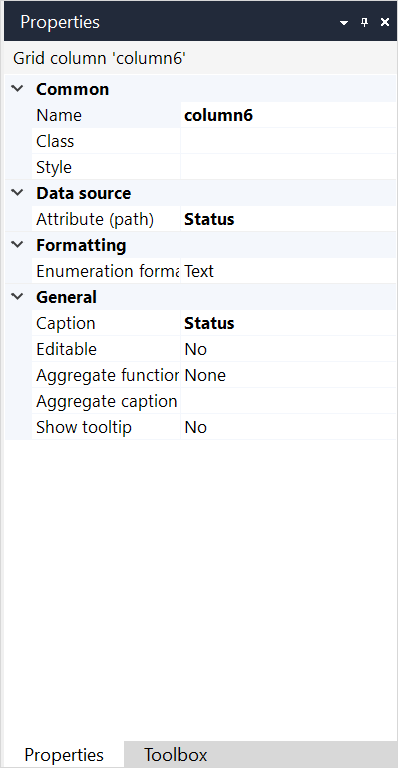

## 1 Introduction

Grid columns allow you to set properties for a [data grid](data-grid) or [reference set selector](reference-set-selector) column. 

## 2 Properties

 An example of grid column properties is represented in the image below: 

{}
{}

Grid column properties consist of the following sections:

* [Common](#common) 
* [Data source](#data-source)
* [Formatting](#formatting) 
* [General](#general)

### 2.1 Common Section {#common}

{}

### 2.2 Data Source Section {#data-source}

#### 2.2.1 Attribute (Path)

The attribute (path) property specifies the attribute's value that is displayed in this column. It can be an attribute of the grid entity, or it can be an attribute of an associated entity, in which case we speak of an attribute path. The path can follow multiple associations of type reference, and at the end (optionally) one of type reference set. If you show a reference set in a column the values will be separated by a comma.

### 2.3 Formatting Section {#formatting}

#### 2.3.1 Enumeration Format 

Only for Attributes of the Enumeration Type. A column connected to an attribute of type enumeration can show its contexts as text (default) or as image.

| Value | Description |
| --- | --- |
| Text | Show the caption text of the enumeration. |
| Image | Show the image of the enumeration value. |

#### 2.3.2 Decimal Precision 

Only for Decimal Attributes.  The precision of a value is defined the number of digits that is used to express that value. This property indicates the number of decimal places (the number of digits following the decimal point).

Default: *2*

#### 2.3.3 Group Digits

Only for Numeric Attributes. For ease of reading, numbers with many digits before the decimal separator may be divided into groups using a delimiter. This property defines whether the end-user will see these groups, or not.

Default: *False*

#### 2.3.4 Date Format

Only for Attributes of the Type Date and Time. The date format determines whether the date part, the time part or both are shown. How the date and time parts are formatted depends on the localization of the user using the application.

These are the possible values:

* **Date** *(default)*
* **Time**
* **Date and time**
* **Custom** (see below for more details)

If you choose **Custom** as the date format (see above), this property determines how the attribute value is formatted. The custom date format is a string that allows for any combination of symbols found in the table below. Any punctuation will be rendered literally.

{}

### 2.4 General Section {#general}

#### 2.4.1 Caption

The caption of a column is the text that appears as a header above the rows. This is a translatable text. See [Language Menu](translatable-texts).

#### 2.4.2 Editable

The editable property indicates whether the values of the column will be editable inline, as in, without opening a page with a data view. In-line editing allows the data grid to behave like you would expect from a spreadsheet application.

#### 2.4.3 Aggregate Function

The values in a column can be aggregated in several ways. The aggregate function determines the way in which the values are aggregated. The aggregate will be shown at the bottom of the column that precedes by the aggregate caption (see below).

| Value | Description |
| --- | --- |
| None | Do not aggregate the values in the column. |
| Average | Show the average of the values. |
| Minimum | Show the smallest value. |
| Maximum | Show the largest value. |
| Sum | Show the sum of the values. |
| Count | Show the count of the values. |

{}

Note that all objects will be taken into account, and not just the ones on the current page.

{}

#### 2.4.4 Aggregate Caption

The aggregate caption is the text that appears in front of the computed value. This is a translatable text. See [Language Menu](translatable-texts).

{}

'Total' could be an aggregate caption for a column that shows the sum of the values.

{}

#### 2.4.5 Show Tooltip

This property determines whether the tooltip page is shown as the mouse is hovered over this column. The tooltip page can be configured on the [Data grid](data-grid).

Default: *False*

## 3 Read More

* [Data Grid](data-grid)
* [Template Grid](template-grid)