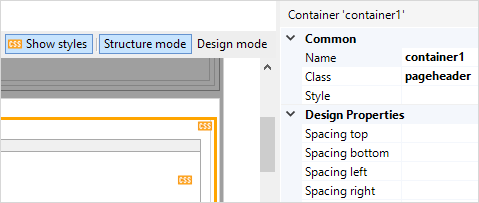
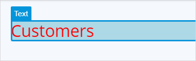

## 1 Introduction

These are properties that are shared by many widgets. For a complete list of properties, take a look at the relevant widget.

## 2 Behavior Section

### 2.1 Required 

This property indicates whether this widget must be filled in by the end user or not. If set to true, this widget can not be left empty and a message will be shown if the end user presses the *Save* button.

_Default value:_ False

### 2.2 Required Message 

This property determines the message that is shown to the end user if the widget is empty and the *Required* property is set to true. This is a translatable text. For more information,  see [Translatable Texts](translatable-texts).

{}

For example, if an address field is required, the required message for the text box of the address could be something like "The address is required."

{}

## 3 Common Section {#common-properties}

### 3.1 Name

The internal name of the widget. You can use this to give sensible names to widgets. The name property also appears in the generated HTML: the widget DOM element automatically includes the class `mx-name-{NAME}`, which can be useful for [Selenium testing](/howto7/integration/selenium-support).

### 3.2 Tab Index 

The tab index influences the order in which the end-user navigates through the page using the tab key. By default tab indices are zero and the tab order is determined automatically by the client system. A value of minus one (-1) means that the widget will be skipped when tabbing through the page.

_Default value:_ 0

{}Tab index is not supported on native mobile pages.{}

### 3.3 Class {#class}

The class property allows you to specify one or more cascading style sheet (CSS) classes for the widget. The classes should be separated by a space. The classes will be applied to the widget in the browser and the widget will get the corresponding styling. The classes should be classes in the theme that is used in the project. It overrules the default styling of the widget.

Styling is applied in the following order: 
 
1) the default styling defined by the theme the project uses 
2) the `Class` property of the widget 
3) the `Style` property of the widget.

You can see which widgets in a page have styling applied via the class or style property by clicking the <strong>Show styles</strong> button.

### 3.4 Style {#style}

The style property allows you to specify additional CSS styling. If a class is also specified, this styling is applied *after* the class. For example: 
 
<code>background-color:lightblue; color:red;</code> 
 
will result in red text on a blue background:

You can see which widgets in a page have styling applied via the style or class property by clicking the <strong>Show styles</strong> button.

## 4 Data Source Section

### 4.1 Attribute (Path)

Many input widgets, like text boxes and drop-down widgets, can be connected to:

1. An attribute of the entity of the data view that contains the widget.
2. An attribute of an entity associated with the data view entity by following one or more associations of type reference through the domain model.

In the first case we say the widget is connected to an attribute and in the second case to an attribute path.

An input widget connected to an attribute <strong>path</strong> must be read-only. Studio Pro will check this for you.

## 5 Visibility Section {#visibility-properties}

### 5.1 Visible

By default, whether or not an element is displayed in the browser is determined by how the page is designed and the user's roles within the application. However, the page can be configured to hide the element unless a certain condition is met.

#### 5.1.1 Context

The widget can be made visible only if the object of the data view that contains the widget satisfies the specified criteria.

A practical example would be a web shop in which the user must submit both billing and delivery information. In this case, you might not wish to bother the user with a second set of address input fields unless they indicate that the billing address and delivery address are not the same. You can accomplish this by making the delivery address fields conditionally visible based on the Boolean attribute `SameBillingAndDeliveryAddress`.

##### Based on Attribute Value {#visibility-based-on-attribute-value}

When selected, this shows the widget while a particular attribute has a certain value. Only Boolean and enumeration attributes can be used for this purpose.

##### Based on Expression {#visibility-based-on-expression}

When selected, this shows the widget while a provided [expression](expressions) evaluates to true. The object of the containing data view is available inside an expression as a `$currentObject` variable.

Note that the expression is evaluated in the browser, and hence, we advise against using "secret" values (like access keys) in it. In particular, we disallow usages of [constants](constants). Also, client-side expressions currently do not support all the functions that are available in the microflows. Please refer to an autocomplete list to know what functions are supported in your version.

#### 5.2.1 Module Roles

The widget can be made visible to a subset of the user roles available in your application. When activated, this setting will render the widget invisible to all users that are not linked to one of the selected user roles.

## 6 Editability Section

### 6.1 Editable

The editable property indicates whether the end user will be able to change the value displayed by the widget.

| Value       | Description                                                  |
| ----------- | ------------------------------------------------------------ |
| Default     | The value is editable if security allows it (i.e. if the user that is signed in has write rights to the selected attribute). |
| Never       | The value is never editable.                                 |
| Conditional | The value is editable if the specified condition holds. (see below) |

*Default value*: Default

### 6.2 Condition

A widget can be made editable based on the value of an attribute of the enclosing data view. The attribute must be of type Boolean or enumeration. For each value, you specify whether the widget is editable. Upon opening the page and upon changing the condition attribute the edit state of the widget will be updated.

Example: you do not have to ask for the marriage date if the end-user indicates that he or she is not married.
