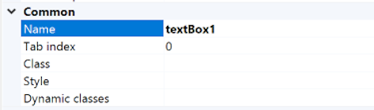
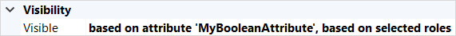

## 1 Introduction

These are properties that are shared by many elements in the page editor, such as a page or widgets. For a complete list of properties, take a look at the relevant element.

## 2 Accessibility Section {#accessibility-properties}

### 2.1 Screen reader caption ###

The screen reader caption property allows to provide useful information to be announced by screen readers when 'Show label' is set to false in an input widget.

{}Screen reader caption is not supported on native mobile pages.{}

#### 2.1.1 Screen reader caption Input Widgets ####

With the following widgets, the Screen reader caption can be set:

*   [Text Box](text-box)
*   [Text Area](text-area)
*   [Drop-down](drop-down)
*   [Check Box](check-box)
*   [Radio Buttons](radio-buttons)
*   [Date Picker](date-picker)
*   [File Input](file-input)
*   [Reference Selector](reference-selector)
*   [Input Reference Set Selector](input-reference-set-selector)

## 3 Common Section {#common-properties}

### 3.1 Name {#name}

The internal name of the widget. You can use this to give sensible names to widgets. The name property also appears in the generated HTML: the widget DOM element automatically includes the class `mx-name-{NAME}`, which can be useful for [Selenium testing](/howto7/integration/selenium-support).

### 3.2 Tab Index{#tab-index}

The tab index influences the order in which the end-user navigates through the page using the tab key. By default tab indices are zero and the tab order is determined automatically by the client system. A value of minus one (-1) means that the widget will be skipped when tabbing through the page.

Default: *0*

{}Tab index is not supported on native mobile pages.{}

### 3.3 Class {#class}

The class property allows you to specify one or more cascading style sheet (CSS) classes for the widget. The classes should be separated by a space. The classes will be applied to the widget in the browser and the widget will get the corresponding styling. The classes should be classes in the theme that is used in the project. It overrules the default styling of the widget.

Styling is applied in the following order: 
 
1) the default styling defined by the theme the project uses 
2) the `Class` property of the widget 
3) the `Style` property of the widget.

You can see which widgets in a page have styling applied via the class or style property by clicking the <strong>Show styles</strong> button.

### 3.4 Style {#style}

The style property allows you to specify additional CSS styling. If a class is also specified, this styling is applied *after* the class. For example: 
 
<code>background-color:lightblue; color:red;</code> 
 
will result in red text on a blue background:

You can see which widgets in a page have styling applied via the style or class property by clicking the <strong>Show styles</strong> button.

### 3.5 Documentation {#documentation}

Some widgets, for example snippets and building blocks, have a **Documentation** property which can be used to store developer documentation. This can be used to explain to other developers how to use these widgets. End-users will never see this documentation.

## 4 Data Source Section {#data-source}

### 4.1 Attribute (Path)

This property identifies an attribute which is used in an input widget.

#### 4.1.1 Attribute Input Widgets

With the following widgets, the Attribute (Path) specifies the attribute which is being changed (or displayed) by the widget:

*   [Text Box](text-box)
*   [Text Area](text-area)
*   [Drop-down](drop-down)
*   [Check Box](check-box)
*   [Radio Buttons](radio-buttons)
*   [Date Picker](date-picker)

The attribute can be one of the following:

1. An attribute of the entity of the data container that contains the widget.

2. An attribute of the entity of any enclosing data container that contains the widget. Available since Mendix 8.8.

3. An attribute of an entity associated with the data container entity by following one or more associations of type reference through the domain model.

In the first two cases we say the widget is connected to an **attribute** and in the third case to an **attribute path**.

{}
In Mendix 8.0, an input widget connected to an **attribute path** must be read-only. Studio Pro will check this for you.
{}

{}
In Mendix 8.1 and above, you can edit attributes presented in input widgets over a path.
{}

{}
In Mendix 8.8 and above, you can edit attributes of any enclosing data container including grandparent data containers.
{}

#### 4.1.2 Association Input Widgets

For widgets which manipulate associations, the Attribute (Path) specifies an attribute which is from an entity which is reachable from the current data container using an association. This applies to the following input widgets:

*   [Reference Selector](reference-selector)
*   [Reference Set Selector](reference-set-selector)
*   [Input Reference Set Selector](input-reference-set-selector)

For these widgets, only an **Attribute path** can be selected. In other words, the selected attribute must be from an entity associated with the data container entity by following an association, of the type which matches the widget, through the domain model.

{}
For these widgets you are selecting an association to another object. The attribute should therefore indicate uniquely to the end-user which object is being selected.
{}

The attribute can be of one of the following [data types](data-types):

* Autonumber
* Date and Time
* Decimal
* Enumeration
* Integer
* Long
* String

## 5 Editability Section{#editability}

### 5.1 Editable

The editable property indicates whether the end-user will be able to change the value displayed by the widget. The possible values are:

| Value       | Description                                                  |
| ----------- | ------------------------------------------------------------ |
| Default *(default)*    | The value is editable if security allows it (as in, if the user that is signed in has write access to the selected attribute). |
| Never       | The value is never editable.                                 |
| Conditionally | The value is editable if the specified condition holds (see below). |

### 5.2 Condition

If the editable property is set to **Conditionally**, the widget is made editable only if the object of the data container that contains the widget satisfies the specified criteria.

For example, imagine you are creating a personal details form in which the end-user must enter their marital status. In this case, you might wish to disable the input of a marriage date until the end-user indicates that they are married.

#### 5.2.1 Based on Attribute Value

When selected, this enables the widget when a particular attribute has a certain value. Only Boolean and enumeration attributes can be used for this purpose.

#### 5.2.2 Based on Expression

When selected, this enables the widget when a provided [expression](expressions) evaluates to true. The object of the containing data container is available inside an expression as the `$currentObject` variable.

The expression provided is evaluated in the browser and, currently, does not support all the functions that are available in microflows. The autocomplete function will only list those functions which are supported.

{}
As the expression is evaluated in the browser, we advise against using "secret" values (like access keys) in it. In particular, we disallow usages of [constants](constants).
{}

### 5.3 Read-Only Style

This property determines how the widget is rendered if it is read-only. 

| Value                       | Description |
|-----------------------------|-------------|
| Based on data view          | Set to `Control` or `Text` by the containing data container. *(Default value for widgets inside a data container)*
| Not enclosed by a data container | Defaults to `Text`. *(Default value for widgets outside a data container)*
| Inherited from snippet call | Set to `Control` or `Text` by the containing data container of the snippet call, or `Text` when the snippet call is not enclosed by a data container. *(Default value for widgets outside a data container inside a snippet)*
| Control                     | Widget is displayed but disabled so the value cannot be modified.
| Text                        | Widget is replaced by a textual representation of the value.

{}Read-only style is not supported on native mobile pages.{}

## 6 Label Section {#label}

A label can be used to described the purpose of the widget to the user. The label is shown next to the widget in the user interface. If a label is configured, the widget will be rendered in the browser wrapped in a form group. See [Bootstrap documentation](http://getbootstrap.com/css/#forms).

{}
The position of the label in relation to the widget is configured in the **Form orientation** and **Label width (weight)** properties of the data container.
{}

### 6.1 Show Label

This property determines whether the label is rendered and the widget is wrapped in a form group.

### 6.2 Label Caption

This property is shown only when Show label is Yes. It specifies what text is rendered within a label.

#### 6.2.1 Text Template

The template for the label can contain parameters that are written as a number between braces (for example, `{1}`). The first parameter has the number `1`, the second `2`, etc. Note that to use template parameters, the widget must be placed in the context of an entity (for example, inside a data container).

#### 6.2.2 Parameters

For each parameter in the template, you define an attribute of the context entity or an associated entity. The value of this attribute will be inserted at the position of the parameter.

## 7 Formatting Section{#numeric-formatting}

Formatting describes the way that numeric attributes are displayed. These are attributes of the following data types:

* Decimal
* Integer
* Long

When a widget contains a numeric attribute, the **Formatting** section allows you to change the way it is displayed.

There are three options, described below:

* Decimal Mode
* Decimal Precision
* Group Digits

### 7.1 Decimal Mode{#decimal-mode}

{}
This mode only applies to attributes of type Decimal.
{}

If set to _Fixed_, the decimal part always will be displayed with the number of places specified in the [Decimal precision](#decimal-precision) property. The value will be rounded using the method defined in the [rounding](project-settings#rounding) section of *Project Settings*.

If set to _Auto_, the whole decimal part of the attribute value will be displayed. No decimal part will be be displayed if the attribute value is an integer.

Default: *Fixed*

**Examples**

| Value    | Fixed (2)  | Fixed (4)    | Auto     |
| -------- | ---------- | ------------ | -------- |
| 19.0     | 19.00      | 19.0000      | 19       |
| 19.99    | 19.99      | 19.9900      | 19.99    |
| 19.9944  | 19.99<small>*</small> | 19.9944      | 19.9944  |
| 19.9999  | 20.00<small>*</small> | 19.9999      | 19.9999  |
| 19.99999 | 20.00<small>*</small> | 20.0000<small>*</small> | 19.99999 |

<small>*</small>The value is rounded to the nearest decimal with the defined number of decimal places.

### 7.2 Decimal Precision{#decimal-precision}

{}
This only applies to attributes of type Decimal and is available only when the [Decimal mode](#decimal-mode) is set to **Fixed**.
{}

The precision of a value describes the number of decimal places that are used to express that value. This property indicates the number of decimal places (the number of digits following the point).

The way that the number is rounded when displayed is defined in the [rounding](project-settings#rounding) section of *Project Settings*.

Default: *2*

### 7.3 Group Digits

For ease of reading, numbers with many digits before the decimal separator may be divided into groups using a delimiter when they are displayed. If the widget is editable and is the current focus of the page, then the delimiters will *not* be displayed.

This setting applies to all three numeric data types.

Set **Group digits** to **Yes** to display these groups.

Default: *No*

**Example**

For example, with **Group digits** set to `true`, the number `1100100.01` will be displayed as `1,100,100.01`.

## 8 Validation Section{#validation}

Input widgets can include validation to ensure that data is correct before it is used by the app.

There are two settings in the validation section which are described below:

* Type
* Message

### 8.1 Type

This property indicates whether this widget value should be validated and, if so, how. These are the possible options:

* No validation – the data has to be the correct [data type](data-types) for the widget, but otherwise there is no further validation
* A [predefined validation](#predefined-validation) – see description below
* A [custom validation](#custom-validation) – see description below

#### 8.1.1 Predefined Validation{#predefined-validation}

The possible values of a predefined validation are the following:

* **Required** – can be used for attributes of *all* data types
* **E-mail** – applies to *String* attributes
* **Positive number** – applies to *Decimal*, *Integer*, and *Long* attributes
* **Date in the future** – applies to *Date and time* attributes — compares the date *and time* to `[%CurrentDateTime%]`
* **Date in the past** – applies to *Date and time* attributes — compares the date *and time* to `[%CurrentDateTime%]`

#### 8.1.2 Custom Validation{#custom-validation}

Custom validation is an expression that follows the [Microflow expression](expressions) syntax.

There are a number of variables you can use in your expression:
* `$currentObject` – the current object
* `$value` – the current member (attribute or association) value

{}
In **Mendix 8.1 and above**, the expression can access objects of **all** the data containers enclosing the input widget. The objects are given the name of the widget they originate from (for example, `$dataView1`).
{}

When a validation is set and it fails for this widget, the message you specify will be shown before the user can use the value in the app.

Default: *(none)*

### 8.2 Message

This property determines the message that is shown to the user if widget validation is enabled and has failed. This is a translatable text (for more information, see [Language Menu](translatable-texts)).

For example, if an address field is required, the validation message for the text box of the address could be something like, `The address is required.`

## 9 Visibility Section {#visibility-properties}

### 9.1 Visible

By default, whether or not an element is displayed in the browser is determined by how the page is designed and the user's roles within the application. However, the page can be configured to hide the element unless a certain condition is met.

{}
You can choose both **Context** conditions and **Module roles** conditions to apply to the widget.
{}

Note that with the **Visible** property, you only hide data and do not protect it. You can hide a tab or a table row from an end-user, but if they still have access to the data then they could see it some other way. To restrict access to sensitive data, use a constraint on the domain model, not on individual pages. 

#### 9.1.1 Context

The widget can be made visible only if the object of the data container that contains the widget satisfies the specified criteria.

A practical example would be a web shop in which the user must submit both billing and delivery information. In this case, you might not wish to bother the user with a second set of address input fields unless they indicate that the billing address and delivery address are not the same. You can accomplish this by making the delivery address fields conditionally visible based on the Boolean attribute `SameBillingAndDeliveryAddress`.

##### Based on Attribute Value {#visibility-based-on-attribute-value}

When selected, this shows the widget while a particular attribute has a certain value. Only Boolean and enumeration attributes can be used for this purpose.

##### Based on Expression {#visibility-based-on-expression}

When selected, this shows the widget while a provided [expression](expressions) evaluates to true. The object of the containing data container is available inside an expression as a `$currentObject` variable. In Mendix 8.1 and above, the expression can access objects of all the data containers enclosing that data container widget. These objects are available under the name of the widget they originate from (for example, `$dataView1`).

Note that the expression is evaluated in the browser, and hence, we advise against using "secret" values (like access keys) in it. In particular, we disallow usages of [constants](constants). Also, client-side expressions currently do not support all the functions that are available in the microflows. Please refer to an autocomplete list to know what functions are supported in your version.

#### 9.1.2 Module Roles

The widget can be made visible to a specific of the user roles available in your application. When activated, this setting will render the widget invisible to all users that are not linked to one of the selected user roles.

| Value             | Description                                                  |
| ----------------- | ------------------------------------------------------------ |
| Applicable roles  | The widget is visible if access rules allow it (for example if the user that is signed in has a role for which the target is set to be visible/accessible). |
| All roles         | The widget is always visible. |
| Selected roles    | This setting will render the widget as invisible to all users that are not linked to one of the selected user roles. |

