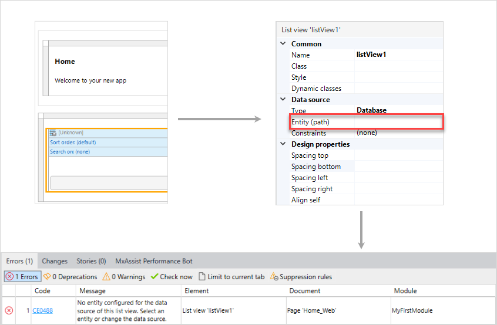
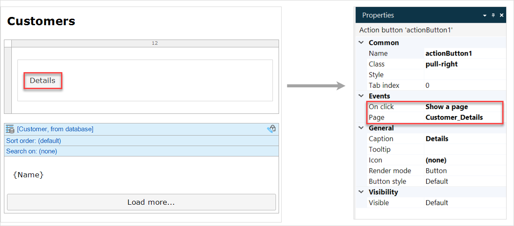
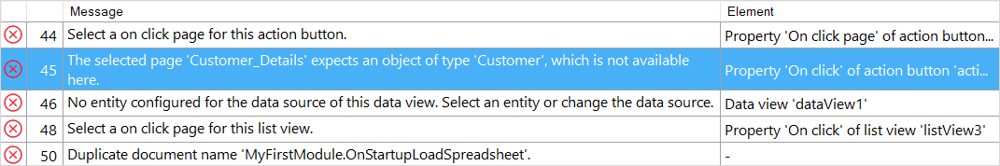
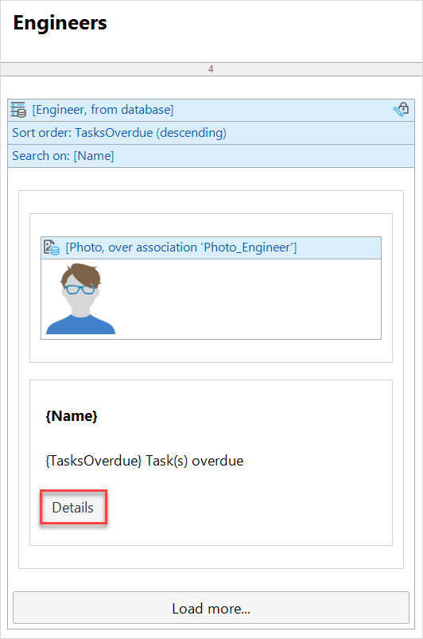
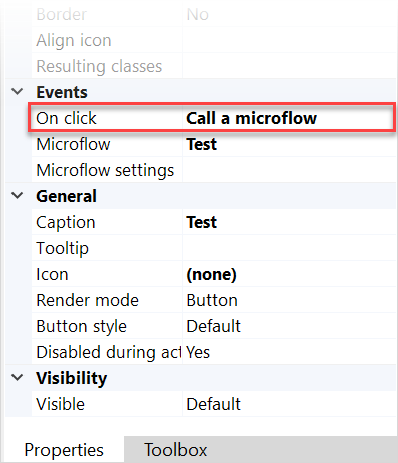
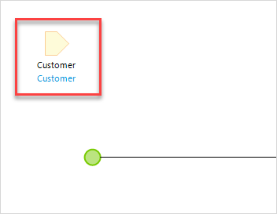
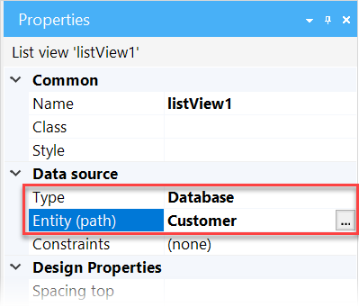
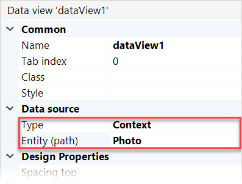
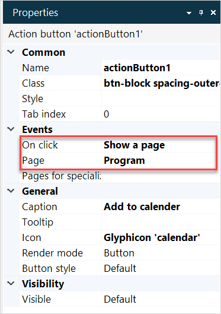

## 1 Introduction 

In this document, we will explain how to solve the most common consistency errors that can occur when configuring pages in Studio Pro. An example of a consistency error is when you do not specify the entity property of a data view on a page. 

## 2 List View Consistency Errors 

If you do not configure a [data source](data-sources) for a [list view](list-view) properly, you will get consistency errors. 

The scheme below shows that the data source of the list view has been set to **Database**, but the specific entity that needs to be retrieved from the database has not been set. This results in a consistency error. 

The table below describes the most common errors you can come across when configuring a list view,  causes of these errors, and ways to fix them. 

| Error Code | Text in the Checks Panel                                     | Cause of an Error                                            | Way to Fix                                                   |
| ---------- | ------------------------------------------------------------ | ------------------------------------------------------------ | ------------------------------------------------------------ |
| CE0488     | No entity configured for the data source of this list view. Select an entity or change the data source. | The **Database/XPath/Association** option is selected as a data source for a list view, but no entity is specified. | To fix the error, do one of the following: <ul><li>Right-click the list view, click **Select Entity** in the drop-down list, and set an entity</li><li>Open list view's properties > **Data source** and select an entity in the **Entity (path)** field</li></ul>You can also change the type of a data source for the list view. |
|            | No microflow configured for the data source of this list view. Select a microflow or change the data source. | The data source is set to **Microflow**, but no specific microflow is selected. | Open list view's properties > **Data source** and select a microflow in the **Microflow** field, or change the type of a data source. |
|            | No nanoflow configured for the data source of this list view. Select a nanoflow or change the data source. | The data source is set to **Nanoflow**, but no specific nanoflow is selected. | Open list view's properties > **Data source** and select a microflow in the **Nanoflow** field, or change the type of a data source. |
| CE0595     | Attribute {AttributeName} is not an attribute of entity {EntityName}. | You have changed the target entity of a list view without updating its contents. The contents of the list view are filled with attributes of another entity. | Open the widget's properties > **Data source** and select another attribute for **Attribute (path)**. |

## 3 Data View Consistency Errors 

Not configuring a [data source](data-sources) for a [data view](data-view) in a proper way results in consistency errors. For example, you have selected **Listen to widget** as a data source, but you have not selected the specific **List widget** you are pointing to.

The table below describes the most common errors you can come across when configuring a data view,  causes of these errors, and ways to fix them. 

| Error Code | Text in the Checks Panel                                     | Cause of an Error                                            | Way to Fix                                                   |
| ---------- | ------------------------------------------------------------ | ------------------------------------------------------------ | ------------------------------------------------------------ |
| CE0488     | No entity configured for the data source of this data view. Select an entity or change the data source. | **Context** is selected as a data source for a data view, but no entity is specified. | Open data view's properties > the **Data Source** section and select an entity in the **Entity** field, or change the type of a data source. |
|            | No microflow configured for the data source of this data view. Select a microflow or change the data source | A microflow is selected as a data source, but no specific microflow is selected. | Open data view's properties > the **Data Source** section and select a microflow in the **Microflow** field, or change the type of a data source. |
| CE0536     | No list widget configured for the data source of this data view. Select a widget or change the data source. | A **Listen to widget** is configured as a data source for a data view, but the specific list view widget does not exist anymore on the same page. | Create a list view on the same page, configure it, and select it as a list widget for the data view; or change the type of the data source. |
| CE0558     | All data views receiving object from the page parameter must have the same entity. | You have several data view on one page that have different entities as a data source. | Select one and the same entity for all data views, or change the data source for them. |

## 4 Context Not Available Consistency Errors

Possible errors that you can get when a page is expecting a context that is unavailable are described in the table below. 

| Error Code | Text in the Checks Panel                                     | Cause of an Error                                            | Way to Fix                                                   |
| ---------- | ------------------------------------------------------------ | ------------------------------------------------------------ | ------------------------------------------------------------ |
| CE1568     | The selected page {Name of the page} expects an object of type {type of object}, which is not available here. | The page has a data view that expects an object of a particular type to be passed to it. This error occurs when the page is called from another page, which does not have this object available. For a more detailed example, see the [Error Fix Example for CE1568](#error-example-1). | Make sure that the object is passed to the page that has a configured data view on it. For more information, see the [Error Fix Example for CE1568](#error-example-1). |
| CE1569     | The selected page {Name of page} expects an object of type X, which is not compatible with the object of type Y that is available here. | You have a widget (for example, a button) that opens a page. The page has a data view that expects an object of particular type to be passed to it. However, the widget is placed inside a data container with another type of object. For a detailed example, see the [Error Fix Example for CE1569](#error-example-2) section. | Make sure that the button is placed in the correct data container and passes the correct type of object to the page. For more information, see the [Error Fix Example for CE1569](#error-example-2) section. |

### 4.1 Error Fix Example for CE1568 {#error-example-1}

When a page expects a context that is not passed to it from a calling page or a microflow, you will get consistency errors. 

Let us study an example: the **Customers** page contains a list view with a list of all customer names (**Customer** is set as **Entity** in the **Data Source** properties), and a **Details** button outside of the list view (placed in a [container](container) only). The **Details** button opens a **Customer Details** page when a user clicks it (the **On Click Action** for the button is set to **Page**). 

However, the **Customer Details** page has a data view that expects an object *Customer* to be passed to it. In other words, this page needs to get data first to be able to display it. 

As this object is not passed to it from the **Customers** page, you get a consistency error.

As the **Details** button to the **Customers** page is outside a data container, it does not know which Customer (object) to pass. The way of fixing this error depends on the following:

* You want to pass a specific *Customer* object from the Customer list to the **Customer Details** page, in other words, the details of a particular customer will be displayed on the **Customer Details** page (for more information, see the [Passing a Specific Object to the Page](#passing-specific-object) section)
* You want to create a new object of the *Customer* type and pass it to the **Customer Details** page, this means that a new customer will be created (for more information, see the [Creating a New Object and Passing it to the Page](#creating-new-object) section)

#### 4.1.1 Passing a Specific Object to the Page {#passing-specific-object}

If you want the **Customer Details** page to open the details of a specific customer, this means you want to pass a specific object to the page. As we already have a list view with the customers list on the **Customer** page, we can fix this error the following way:

1. Open the **Customers** page.

2.  Drag the **Details** button inside the list view.

    

Now the button gets the object of type *Customer* from the list view on the **Customers** page, and it will be passed to the **Customer Details** page. As a result, the details of a particular customer is displayed on the **Customer Details** page. 

#### 4.1.2 Creating a New Object and Passing it to the Page {#creating-new-object}

If you want to create a new customer and fill in the customer's details on the **Customers Details** page, you can do the following:

1. Open the **Customers** page.

2. Open properties for the **Details** button, and set **Create Object** as an **On Click Action**.

3. Set **Customer** as **Entity**.

4.  Set **Customer Details** as **Page**.

    

5. Change the button's caption from **Details** to **Add**, as this button will now create a new customer instead of showing the details of an existing customer.

Now when a user clicks this button, the **Customer Details** page will open, and the new *Customer* object will be created. 

### 4.2 Error Fix Example for CE1569 {#error-example-2}

If a widget opens a page and this widget is inside a data container of entity X, but the referred page expects entity Y, you will get a consistency error. 

Let us study an example: you have a **Details** button on the **Engineers** page that opens the **Tasks** page. 

The button is placed inside a list view; the list view's data source is set to entity *Engineer* in **Properties** > **Data Source**.

The Tasks page has a data view on it, but the data view's data source is set to entity *SmartTask* in **Properties** > **Data Source**. 

This means that data view expects the object of type *SmartTask* passed to it, but the **Engineers** page is passing the object of type *Engineer*.

To fix this error you can do one of the following:

* Place the **Details** button within a data container that will pass the correct type of data to the page (for example, you can place the button inside the list view and set its data source to entity *SmartTask*) 
* Select another page that will not expect any object to be passed to it, or will expect the object of type *Engineer*
* Change the data source of the data view on the **Tasks** page to entity *Engineer*

## 5 Data Consistency Errors

When a widget that expects an object from its data source does not get it or gets an object from a different entity type, it causes errors in data consistency. 

One of the most common errors of this type are described in the table below:

| Error Code | Text in the Checks Panel                                     | Cause of an Error                                            | Way to Fix                                                   |
| ---------- | ------------------------------------------------------------ | ------------------------------------------------------------ | ------------------------------------------------------------ |
| CE0552     | Microflow {name of the microflow} does not return an object. | The data source of a widget (for example, a data view) is set to **Microflow**, but the microflow does not return any object. | Open the microflow and configure a return value for it. Do the following: <ol><li>Double-click the end event.</li><li>In the **End Event** dialog window, set **Type** from **Nothing** to the data type you would like it to return.</li><li>Set the **Entity** option if needed (whether this option is displayed depends on the selected data type).</li><li> Specify the **Return value**.</li></ol> |
| CE0551     | Microflow {name of the microflow} does not return a list.    | The data source of a list view is set to **Microflow**, but the microflow does not return a list. | Open the microflow and configure it to return a list. Do the following: <ol><li>Double-click the end event.</li><li> In the **End Event** dialog window, set **Type** from **Nothing** to **List**.</li><li>Set the **Entity** option.</li><li>Specify the **Return value**.</li></ol> |
| CE1573     | Parameter {Name of the parameter} of the selected microflow/nanoflow does not match available arguments. No arguments available to {Name of the widget}. | You selected a microflow or a nanoflow as an on-click event of a widget (for example, of a button) and the microflow/nanoflow contains a parameter, but no arguments (for example, an object) are available for the microflow. | Place the widget in a data container and make sure that the data source of the data container matches the entity selected in **Data type** property of the microflow/nanoflow parameter. For a detailed example and a fix for it, see the [Error Fix Example for CE1573](#error-fix-example-3) section. |
| CE1574     | Parameter {Name of the parameter} of the selected microflow/nanoflow does not match available arguments. Arguments available to {Name of the widget} are {lust of available arguments}. | You selected a microflow/nanoflow as the data source of a widget, but an argument (or arguments) available for this widget does not match the parameter of the microflow. | Make sure that an argument (for example, an object) available for the widget matches the entity selected in the **Data type** property of the microflow/nanoflow parameter. For a detailed example and a fix for it, see the [Error Fix Example for CE1574](#error-fix-example-4) section. |

### 5.1 Error Fix Example for CE1573 {#error-fix-example-3}

When you set a microflow or a nanoflow as an on-click event for a widget, and this microflow expects an argument (for example, an object) that is not available, this will result in an error. 

For example, on a page named *Customers* you have a button that calls a microflow (i.e. an [**On click** event](on-click-event) of the button is set to *Microflow*):

 

However, the microflow contains a parameter *Customer*:

The microflow parameter expects an argument *Customer*, and since this argument is not available on the page where button is located, it results in an error. 

To fix it, do the following:

1. Open the *Customers* page and drag and drop a data container on it. For example, you can drag and drop a list view.

2.  Set the data source type of the list view to *Database* and set **Entity (path)** to *Customer*.

    

3. Place the button inside the list view.

Now the *Customer* object is available on the page and it matches the microflow parameter *Customer*. 

### 5.2 Error Fix Example CE1574 {#error-fix-example-4}

When you set a microflow/nanoflow as an on-click event for a widget, and this microflow/nanoflow expects a certain argument, but another argument is available on the page, this will result in an error. 

For example, on a page named *Customers* you have a button that calls a microflow (i.e. an [**On click** event](on-click-event) of the button is set to *Microflow*):

 

The microflow contains a parameter *Customer*:

On the *Customers* page you also have a data container, for example, a data view, that has an object *Photo* available. That means that the data source type of the data view is set to *Context* and **Entity (path)** is set to *Photo*:

As the microflow has the parameter *Customer*, and the page has the object *Photo*, they are conflicting and resulting into an error.

The best way to fix this error is to do the following: 

1. Open the page *Customers*.
2. Select the data view and change the **Entity (path)** property from *Photo* to *Customer*.

Now the object available on the page matches the microflow parameter *Customer*.

## 6 Input Widget Consistency Errors

The most common errors for input widgets, their causes, and ways to fix them are described in the table below. For more information on input widgets, see [Input Widgets](input-widgets). 

| Error Code | Text in the Checks Panel                                     | Cause of an Error                                            | Way to Fix                                                   |
| ---------- | ------------------------------------------------------------ | ------------------------------------------------------------ | ------------------------------------------------------------ |
| CE0544     | This widget can only function inside a data container. Move it into a data view, list view or template grid. | You have added an input widget to a page, but it is not inside a data container. Input widgets need to refer to an attribute of a specific entity type. And entities are only available via data containers. For more information about input widgets, see [Input Widgets](input-widgets). | Place this widget into a data container: data view, list view, or a template grid. |
| CE0545     | Select an attribute for this {widget name}.                  | You have added an input widget, and it is inside a data container, but an attribute is not selected for it. | Right-click the widget, click **Select Attribute** in the drop-down list, and set an attribute; or open widget's properties > the **Data source** section and set an attribute in the **Attribute (path)** field. |
|            | Association {Name} must be a reference (not a reference set) | You have added a reference selector, but the association you have selected for it is not of reference type (not one-to-many). | Open your domain model, find the association you have selected for the reference selector, and change it to a one-to-many association. For more information on how to fix this error for the reference selector, see section the [Incorrect Multiplicity for a Reference Selector](#incorrect-multiplicity-reference) section |
|            | Association {Name} must be a reference set (not a reference) | You have added a reference set selector or an input reference set selector, but the association you have selected for it is not of reference set type (not many-to-many). | Open your domain model, find the association you have selected for the reference set selector, and change it to a many-to-many association. For more information on how to fix the consistency error for the reference set selector and input reference set selector, see the [Incorrect Multiplicity for a Reference Set Selector and an Input Reference Set Selector](#incorrect-multiplicity-reference-set) section |
|            | Entity {Name} has no association {Name}                      | You added a reference set selector or an input reference set selector, but you have changed the owner of association. | Open your domain model, select one of the entities and in its properties change the owner of association. For more information on how to fix the consistency error for the reference set selector and input reference set selector, see the [Incorrect Ownership for a Reference Set Selector and an Input Reference Set Selector](#incorrect-ownership) section |

### 6.1 Incorrect Multiplicity for a Reference Selector {#incorrect-multiplicity-reference}

A reference selector is a widget that is used to display and edit one-to-many associations. For more information on the widget, see [Reference Selector](reference-selector).  

For example, you have several employees who are associated with one city where they work. This is a one-to-many association: multiple *Employees* objects are associated with one *City* object.  Associations that refer to a single object in this manner are *references*, as opposed to *reference sets*, in which multiple objects can refer to multiple other objects. In a reference, the "single object" side of the association is always the association's owner. For more information on associations and their types, see [Associations](associations).

If you have a wrong type of association, you will get a consistency error: *Association {Name} must be a reference (not a reference set)*.

To fix this error, do one the following:

1. Open your domain model and double-click the association that you are using for the reference selector.

2.  In **Properties of Association** dialog window, change **Multiplicity** to one-to-many (in our example, multiple 'Employee' objects are associated with one 'City' objects).

    

3. Click **OK** to save changes.

You have changed the association multiplicity and fixed the error. 

### 6.2 Incorrect Multiplicity for a Reference Set Selector and an Input Reference Set Selector {#incorrect-multiplicity-reference-set}

Reference set selector and input set selector are widgets that are used to display and edit many-to-many associations. For more information on these widgets, see [Reference Set Selector](reference-set-selector) and [Input Reference Set Selector](input-reference-set-selector). 

For example, you have several employees who can visit customers in different cities during the week. Thus, many employees are associated with many cities, this is a many-to-many association between an *Employee* entity and a *City* entity (multiple employees are associated with multiple cities). Associations that refer to multiple objects in this manner are *reference set*. For more information on associations and their types, see [Associations](associations). 

If you have a wrong type of association, you will get a consistency error: *Association {Name} must be a reference set (not a reference)*.

To fix the error, do one of the following:

1. Open your domain model and double-click the association that you are using for the reference set selector or the input reference set selector and do the following:  

2.  In **Properties of Association** dialog window, change **Multiplicity** to many-to-many (in our example, multiple 'Employee' objects are associated with multiple 'City' objects).

    

3. Click **OK** to save changes.

You have changed the multiplicity for the association and fixed the error.

### 6.3 Incorrect Ownership for a Reference Set Selector and an Input Reference Set Selector {#incorrect-ownership}

As the reference set selector and the input reference set selector are used to display and edit associations, the ownership is an important property when configuring them. For more information on ownership, see [Associations](associations). 

If you change the owner of the association, you will get a consistency error: *Entity {Name} has no association {Name}*. The owner should be the one that the reference set selector or the input reference set selector is pointing from.

Let us study an example when you have two entities in your domain model: **Cities** and **Employees**.  

The arrow is always pointing away from the context towards the widget. If you want employees to choose the cities, the owner of the association should be an *Employee* entity. Mind that a data container (for example, a data view) where you place a reference set selector or an input reference set selector, should have its data source set to **Context** >**Employee**.  

If you want to view employees that belong to each city, the *City* entity should be the owner. A data container (for example, a data view) where you place a reference set selector or an input reference set selector, should have its data source set to **Context** >**City**. 

If you want to combine both, the ownership should be set to *Both*. Then you can place the reference set selector or the input reference set selector to data containers with data source set to either *City* or *Employee* entities. 

To change the ownership, do the following:

1. Open your domain model.

2. Double-click one of the entities which association you use in the reference set selector or the input reference set selector to open the properties.

3.  In the entity properties > the **Associations** tab, change the **Owner** to **Default** or **Both** depending on your use-case.

    

You have changed the owner of the association.

## 7 File Widget Consistency Errors

File widgets should be placed in a data container, otherwise you will get consistency errors. Another way to fix consistency errors is to place a file widget to a [snippet](snippet). For more information on file widgets, see [File Widgets](file-widgets). 

| Error code | Text in the Checks Panel                                     | Cause of an Error                                            | Way to Fix                                                   |
| ---------- | ------------------------------------------------------------ | ------------------------------------------------------------ | ------------------------------------------------------------ |
|            | A [file manager](file-manager) must be placed in a data view or  snippet that is connected to entity ‘System.FileDocument’ or a specialization. | You have added a file manager to a page, but it is not inside a data view or a snippet that is configured properly. | Place this widget into a data container. If you want to place it into a snippet, mind that you need to configure it properly: set System.FileDocument or its specialization as entity for this snippet. |
|            | An [image uploader](image-uploader) must be placed in a data view or snippet that is connected to entity ‘System.Image’ or a specialization. | You have added an image uploader to a page, but it is not inside a data view or a snippet that is configured properly. | Place this widget into a data container. If you want to place it into a snippet, mind that you need to configure it properly: set System.Image or its specialization as entity for this snippet. |
|            | Move this widget into a data container, for example a data view or list view. | You have added an [image viewer](image-viewer) to your page, but it is not inside a data view or a list view. | Place this widget inside a data view or a list view.         |
| CE0489     | Select an entity for the data source of this [image viewer](image-viewer). | You have added an image viewer to a page, it is placed inside a data view or a list view, but an entity for the image viewer is not specified. | Open image viewer's properties > the **Data source** section and select an entity in the **Entity (path)** field. |
## 8 Image Widget Consistency Errors

When you add an image widget to a page, but do not select an image itself, you will get a consistency error "No image selected" (error code CE0436). 

To fix it, open image properties > the **General** section > the **Image** field and select an image. For more information on an image widget, see [Image](image). 

## 9 On Click Event Consistency Errors 

You can specify an **On Click Event** for different widgets, for example, for buttons or images. 

The most common consistency errors are connected with not configuring the on click event entirely. 

To fix the consistency errors, finish configuring the on click event (for example, for an on click event **Show a page**, select a particular page that should open), or change the on click action. 

##  10 Read More

* [Pages](pages) 
