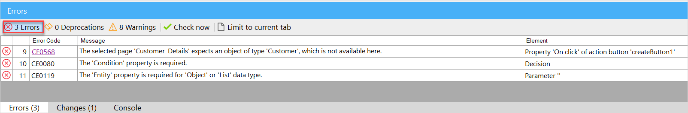

## 1 Introduction 

To make sure that your app is always consistent and properly built, Studio Pro does consistency checks when you build your app. When a consistency check is not met, Studio Pro will notify you about this via consistency errors on the **Errors** tab. 

Errors need to be solved before your app can be published. A consistency error can occur in the following editors or functionalities of Studio Pro:

* Pages 
* Navigation 
* Microflows
* Domain Models
* Integration
* Security

##  2 Read More

* [Page Editor Consistency Errors](consistency-errors-pages)
* [Navigation Consistency Errors](consistency-errors-navigation)
* [Pages](pages)
* [Microflows](microflows) 
* [Navigation in Mendix](navigation)
