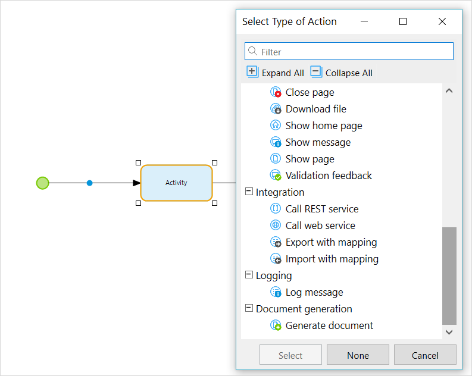

App services are the preferred way of connecting Mendix applications to each other. An app service can be imported and its content can be used. As for now, app services provide the following content:

*   Microflow actions
*   Domain model entities

In the project explorer, an app service can be selected in the 'Add' context menu on a module. See [Select app service](select-app-service) for more information.

See the [Settings](settings) page for more information on document options.

App service actions are directly available in Microflows. If a new activity is added, new app service actions are shown below the standard microflow actions.

An app service action may require parameters, and usually it supplies a return value. The return value can be used in the rest of the microflow. Parameters and return values can be an object or a list type; the entities which are accepted by the app service are included in the domain model of the app service.
