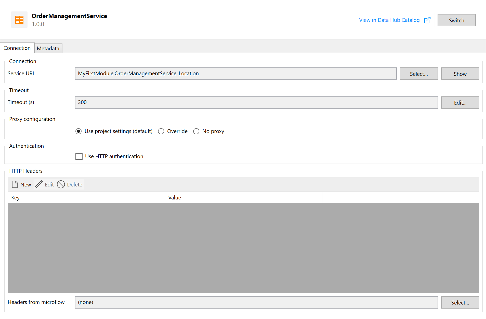
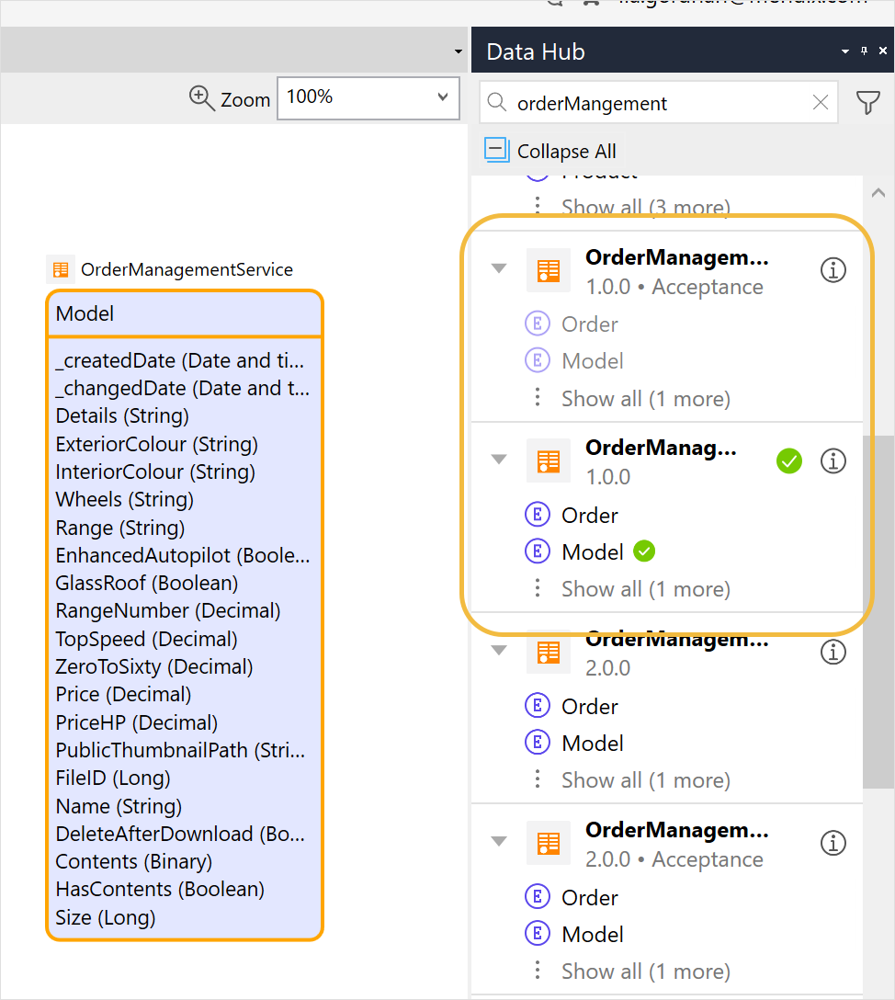

{}[edit further and add x-refs, and notify https://gitlab.rnd.mendix.com/integration/integration.wiki/-/blob/master/refguide/consumed-odata-services.md that this version is now the latest]{}

## 1 Introduction

When an external entity is used in a project module, a consumed OData service document is added displaying the details of the consumed service. This is the API to the publishing app and the data associated with the entity.  

## 2 Connection

The **Connection** tab displays the connection settings for the consumed OData service:

### 2.1 Service URL {#service-url}

The **Service URL** displays the URL of the service endpoint: 

* Click **Select** to select another [constant](/refguide/constants) for the service
*  Click **Show** to display the **Constant** dialog box displaying the service URL or endpoint: 

  {}[what does this do for the current consumed entities from the servcie - describe further]{}

  

### 2.2 Timeout

**Timeout** is the response time for fetching the data from the service endpoint. If the endpoint has not responded after the number of seconds in **Timeout (s)**, an exception will occur. If this happens during a microflow activity, the microflow will roll back or go into your custom [error handling](/howto/logic-business-rules/set-up-error-handling).

Default value: *300 seconds*

### 2.3 Proxy Configuration

**Proxy configuration** allows you to configure whether to use a proxy for the request:

* **Use project settings** – use settings which are defined at the project level (default)
* **Override** – override the project-level settings for this action by specifying the host, port, user name, and password settings for the proxy
*  **No proxy** – do not use a proxy for this service, even if there is a proxy configured at the project level

  {}In most cases, this setting can be ignored, and the default **Use project settings** can be used.{}

  {}[which project the current or the publishing??]{}

### 2.4 Authentication

The **Use HTTP authentication** check box specifies if basic authentication should be used. If checked, you have to specify the following details:

* **User name** – defines the user name that will be used to authenticate over HTTP
* **Password** – defines the password that will be used to authenticate over HTTP

Besides basic authentication, you can use custom authentication. For more information, see the [HTTP Headers](#http-headers) section below.

### 2.5 HTTP Headers {#http-headers}

You can specify additional HTTP request headers to be passed to the endpoint in this list by clicking **Add**, **Edit**, or **Delete** for custom HTTP headers for authentication. Each custom header is a pair with a key and a value. 

Using **Headers from a Microflow**, you can specify a microflow for creating a key and value pair(s) for dynamic values. The microflow must return a list of **System.HttpHeader** objects.

{}
For more flexible HTTP request headers, you can select a microflow that returns a list of **System.HttpHeader**. This microflow may take a parameter of type **System.HttpResponse**. The microflow is called every time a request is made. Initially, the HTTP response parameter will be empty. If the response is **401 Unauthorized**, the microflow is called with that HTTP response and another call is made with the new HTTP headers.
{}

{}
Custom authentication can be done with the microflow where the authentication value is retrieved (such as SSO). For further information on access and authentication, see [Using Custom HTTP Header Validation for Published Entities](data-hub/data-hub-catalog/security.md#httpheadervalidation) in the *Data Hub Guide*.
{}

## 3 Metadata Tab {#metadata}

In the **Metadata** tab, you can select a metadata file or use metadata obtained through a URL:

{}[add a warning??? and verify below for 8.14 - why import metadata file this way when you can do it in the DHC ]{}

### 3.1 Metadata Editor 

To open the **Metadata Editor**, click **Edit**. In the editor, you can specify a URL or file for the metadata:

The following settings are available:

* **Import from** – select **URL** or **File** for the location of the metadata:
  * **URL** – click **Edit** to specify the URL for the metadata
  * **File** – click **Browse** to select an XML metadata file

When you import the metadata, you can add virtual entities from the consumed OData service in the [Data Hub Pane](data-hub-pane).

### 3.2 Consumed OData Service Properties

Click the **Properties** tab for the consumed OData service which displayes the properties that were defined for the OData service document and the following additional properties:

{}[**AD: the above file is not in the attachments folder, please add or this will break the build**]{}

* **Entities** – the URL of the metadata defining the entities and associated datasets
* **Documentation** – an additional description about this service for the current app project
* **Service name** – the name of the published OData service that is consumed
* **Service version** – the version of the service that is consumed
* **Service ID** – the unique identifier of the service in the Data Hub Catalog
* **Application ID** – the unique identifier of the application that the service was published from in the Data Hub Catalog
* **Metadata** – the contents of the metadata file defining the service
*  **OData version** – the OData version: Mendix supports consuming OData 3 and OData 4

{}[consumed OData Service requirments document - waht are the differences between this and the virtual entities doc. %}}

### 4.3 Updating or Switching a Consumed OData Service {#updating}

When you add an external entity to your project, you are consuming the entity from a specific version of a service (the service endpoint), deployed to a given environment. This is the unique endpoint that will be consumed and where the metadata for the service is retrieved, which in turn defines the consumed entity. The consumed OData service document provides this information.

#### 4.3.1 Major and Minor Service Versions

It is important that the publishers of the services use a strict versioning system, for example semantic numbering, when issuing updates to their apps. The service versioning should clearly indicate the level and severity of the changes that have been made when a service is updated according to the following guidelines: 

*  *Major* service updates (for example, when entities or attributes are removed, or input parameters are required) which would be incompatible for the consuming apps and result in the consuming app "breaking". When a major change has been made to a published service we recommend that the service is deployed to a different endpoint (with the service version number clearly indicating that there has been a major change). In this case this service will be registered in the Data Hub Catalog as a different service, and show up in the search results as a separate asset. 
* *Minor* service updates (for example,  additional fields are added to the service or new operations included) which would not break apps that consumed the previous versions. Minor service updates can be deployed to the same service endpoints, thereby ensuring that all consuming apps consume the latest version of the service. 

In the **Data Hub** pane,  a *minor* update that is available for a consumed service  is indicated with an "update" arrow for the service. This means that the service can be **Updated** in the **Consumed OData Service** screen.

{}[create minor and major services and add screenshot of the the update arrow in the DH pane]. %}}

If the same service has been deployed to a different service endpoint, indicating a major update, the new service version will be shown in the **Data Hub** pane as a separate item and users can **Switch** to the new service from the **Consume OData** screen. 
{}[add screenshot of the the update arrow in the DH pane]. %}}

#### 4.3.2 Services Deployed to Multiple Environments

When a published OData services is deployed to multiple environments, each deployment will  be to a different endpoints and therefore be shown in the search results in the **Data Hub** pane separately. In the following example, the consumed **OrderManagementService** version **1.0.0** deployed to a production environment is consumed in app. However, there is also a deployment of the same service deployed to the **Acceptance** environment:

To consume the service deployed to the **Acceptance environment**, follow these steps: 

1. Click  **Update** > **Switch** on the **Consumed OData Service** screen: 

   

2. On the **Switch** dialog box, select from the drop-down list the service that you want to now consume from and click **Switch**: 

   

3. The consumed service will now be consumed from the new selected environment. The information on the **Consumed OData Service** screen will display the changed service details and the **Data Hub** pane will now show that you are consuming from the selected environment: 

   

## 4 Read More

* [Data Hub Pane](data-hub-pane)
* [Consumed OData Service Properties](consumed-odata-service)
