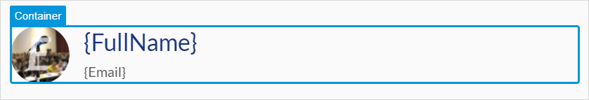

## 1 Introduction

Container widgets provide structure to your page's content.

* [**Layout grid**](layout-grid) – gives structure to your pages, has a built-in behavior to show how a page will look like on different devices:

    

* [**Container**](container) – a layout element where you can place a widget or a group of widgets and simultaneously style, drag or delete them:

    

* [**Group box**](group-box) – groups widgets together, can be configured to collapse or expand with all elements inside it

* [**Tab container**](tab-container) – shows information categorized into tabs

* [**Scroll Container**](scroll-container) – divides layout into regions, such as a header, sidebar, or footer

* [**Table**](table) – consists of a number of rows and columns; each table cell can contain widgets

*   [**Navigation list**](navigation-list) – allows you to select a separate on-click action for each row of this widget

## 2 Performing Basic Functions

{}

## 3 Read More

* [Page](page)
* [Pages](pages)