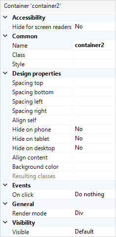

## 1 Introduction

A container is a layout element that can be used to simultaneously style, hide, drag, or delete a group of widgets placed in it:

In a browser, it is rendered as a simple `div` element by default. It is also possible to render a container as one of HTML5 semantic elements (for example, `section`, `main`, `article`, `nav`).

## 2 Properties

An example of container properties is represented in the image below:

{}
{}

Container properties consist of the following sections:

* [Accessibility](#accessibility)
* [Common](#common)
* [Design Properties](#design-properties)
* [General](#general)
* [Events](#events)
* [Visibility](#visibility)

### 2.1 Accessibility {#accessibility}

#### 2.1.1 Hide for Screen Readers 

This property specifies whether to hide the container from screen readers or not.

{} The container should not have any focusable elements inside such as input elements, links, or buttons. These elements will cause the container to be announced by screen readers.
{}

### 2.2 Common Section {#common}

{}

### 2.3 Design Properties Section{#design-properties}

{} 

### 2.4 General Section {#general}

#### 2.4.1 Render Mode

The **Render mode** determines which HTML5 tag will be used to show the container in the web browser. 

| Value     | HTML Tag    |
| --------- | ----------- |
| Div *(default)*      | `div`       |
| Section   | `section`   |
| Article   | `article`   |
| Header    | `header`    |
| Footer    | `footer`    |
| Main      | `main`      |
| Nav       | `nav`       |
| Aside     | `aside`     |
| Hgroup    | `hgroup`    |
| Address   | `address`   |

{}Render mode is not supported on native mobile pages.{}

### 2.5 Events Section {#events}	

#### 2.5.1 On-Click {#on-click}	

The **On-click** property specifies the action that will be executed when the user clicks the container (either with their mouse pointer or by pressing the <kbd>Enter</kbd> or <kbd>Space</kbd> keys when the container is in focus).

{}

### 2.6 Visibility Section {#visibility}

{}

## 4 Read More

* [Page](page)
* [Structure](structure-widgets)
* [Properties Common in the Page Editor](common-widget-properties)
