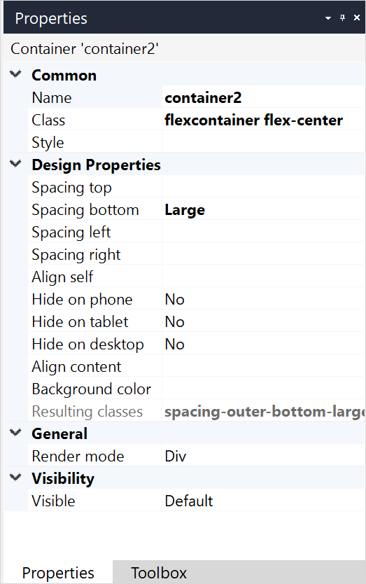

## 1 Introduction

A container is a layout element that can be used to simultaneously style, hide, drag, or delete a group of widgets placed in it:

In a browser, it is rendered as a simple `div` element by default. It is also possible to render a container as one of HTML5 semantic elements (for example, `section`, `main`, `article`, `nav`).

## 2 Properties

An example of container properties is represented in the image below:

Container properties consist of the following sections:

* [Common](#common)
* Design Properties
* [General](#general)
* [Visibility](#visibility)

### 2.1 Common Section {#common}

{}

### 2.2 General Section {#general}

#### 2.2.1 Render Mode

The render mode determines which HTML5 tag will be used to show the container in the web browser. 

| Value     | HTML Tag    |
| --------- | ----------- |
| Div       | `div`       |
| Section   | `section`   |
| Article   | `article`   |
| Header    | `header`    |
| Footer    | `footer`    |
| Main      | `main`      |
| Nav       | `nav`       |
| Aside     | `aside`     |
| Hgroup    | `hgroup`    |
| Address   | `address`   |

_Default value:_ Div

{}Render mode is not supported on native mobile pages.{}

### 2.3 Visibility Section {#visibility}

{}

## 4 Read More

* [Page](page)
* [Container Widgets](container-widgets)
* [Properties Common for Widgets](common-widget-properties)

