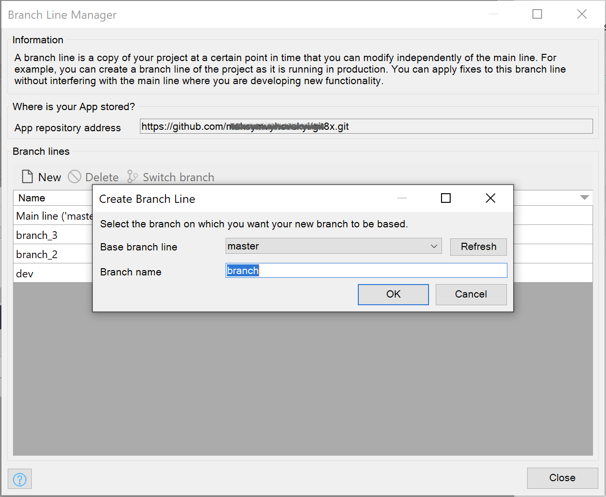

## 1 Introduction

For Git, use the **Create Branch Line** dialog box to create a new [branch line](version-control#branches) via the **Branch Line Manager**:

To view the **Create Branch Line** dialog box,  do the following:

1. Open **Version Control** > **Manage Branch Lines**.
2. In the **Branch Line Manager**, click **New**. 

The **Create Branch Line** dialog box is displayed.

For more information on how to manage branch lines, see the [Managing Development Lines](collaborative-development#managing-branches) section in *Collaborative Development* and [Branch Line Manager](branch-line-manager-dialog). For information on the version control, see [Version Control](version-control). 

## 2 Base Branch Line

**Base branch line** allows you to choose the development line from which you want to create the branch line. 

## 3 Branch Name

Enter a name for the new branch line.

{}
Branch names cannot include special characters (for example, `@`, `$`, `#`). 
{}

## 4 Read More

* [Version Control](version-control)
* [Collaborative Development](collaborative-development)
