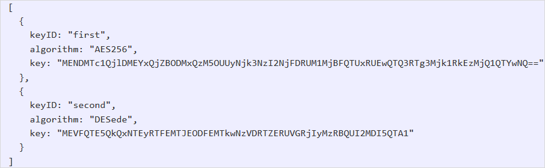

## 1 Custom Settings

You can use custom server settings to configure the Runtime beyond the standard possibilities offered by the Modeler.

{}

Only use this functionality if you know exactly what you are doing. Wrong values can prevent the Runtime from starting.

{}

Each custom setting consists of a name and a value. For example, to enable persistent sessions you add a custom setting with name `PersistentSessions` and value `true`. For a more detailed list of settings and example values please consult the [fully-documented m2ee.yaml](https://github.com/mendix/m2ee-tools/blob/master/examples/full-documented-m2ee.yaml).

## 2 General Settings

The following custom settings can be configured:

| Name | Description | Default value |
| --- | --- | --- |
| TempPath | The location of the temporary files. | [deployment folder]\data\tmp |
| UploadedFilesPath | The location of the uploaded files. A valid path can be: \\FileServer\CustomerPortalFiles. | [deployment folder]\data\files |
| ApplicationRootUrl | Can be used within Java Actions to get the public location of the application. Useful when the HOST header is not available, for example when including a url to the application when sending e-mails from a scheduled event. | In Mendix Cloud, https://\[domain\].mendixcloud.com |
| ScheduledEventExecution | Specify which scheduled events should be executed. Choices are 'ALL', 'NONE' or 'SPECIFIED'. In case of 'SPECIFIED' enumerate the scheduled events using the 'MyScheduledEvents' configuration option described below. | NONE |
| MyScheduledEvents | A comma-separated string with the names of the events. Please don't forget the name of the module. A name can be CRM.UpdateCustomerStatistics. |   |
| PersistentSessions | Defines whether sessions will be persisted in the database or not. When sessions are persisted, statistics will be made about logged-in users. When the Runtime server restarts, sessions still exist and users don't have to log in again. However, making sessions persistent can have a negative influence on the speed of the application: the value can be true or false. | false |
| TrackWebServiceUserLastLogin | Defines whether to update the web service user's 'LastLogin' field on each login. When this happens a database update query has to be sent and this can have performance consequences on heavy load systems. When this setting is set to false, no database interaction is necessary. | true |
| JavaKeyStorePassword | Password for the default Java keystore. | changeit |
| CACertificates | Comma separated list of paths to Authority Certificates. |   |
| ClientCertificates | Comma separated list of paths to Client Certificates. Example: `D:\App\Mx1.pfx, D:\App\Mx2.pfx, D:\App\Mx3.pfx, D:\App\Mx4.pfx` |  |
| ClientCertificatePasswords | Comma separated list of passwords for Client Certificates (should match the "ClientCertificates" order). Example: `pwd1, pwd2, pwd3, pwd4` |   |
| WebServiceClientCertificates | Deprecated since version 7.2. Defines which web service must use which client certificate. The value of this setting must be a comma-separated list of key/value items. A key/value item must be specified as [`"imported web service name": "path to certificate"`] without brackets. Please note that any backslash in the path must be doubled. The whole value must be enclosed by braces. |  |
| ClientCertificateUsages | Introduced in version 7.2. Only use this when 1. You have multiple client certificates, and 2. You want to configure specific certificates for specific servers.  This setting defines which service must use which client certificate. The value of this setting must be a comma-separated list of key/value items. A key/value item must be specified as `"identifier": "path to certificate"`. For web services, use the imported web service name as the identifier. For REST services, use the host name of the remote server as the identifier. Please note that any backslash in the path must be doubled. The whole value must be enclosed by braces (`{ }`). For example:  |  |
| SessionTimeout | Defines after how much time session becomes invalid (in milliseconds). After that timeout a session becomes applicable for removal. The session won't be destroyed until the next time the cluster manager evaluates the active sessions. | 600000 |
| ClusterManagerActionInterval | The interval (in milliseconds) used for performing all cluster manager actions. These actions include, unblocking users, and removing invalid sessions. If nothing is specified the interval is half the SessionTimeout. | 300000 |
| com.mendix.core.StorageService | Defines which storage service module will be used. The storage service module takes care of storing the actual files associated with 'System.FileDocument' objects, such as uploaded files. Possible values are 'com.mendix.storage.localfilesystem' and 'com.mendix.storage.s3'. From Mendix 6.6 onwards 'com.mendix.storage.azure' is also available. | com.mendix.storage.localfilesystem |
| com.mendix.core.SessionIdCookieName | Defines the name of the cookie value which represents the session id. Can be useful to change when running in a container which assumes a certain name for the session cookie (e.g. Pivotal assumes 'JSESSIONID' as session cookie name). | XASSESSIONID |

## 3 Log File Settings

The settings below influence the behavior of the log files. These settings can only be used on-premises. In the cloud these settings do not change any behavior.

| Name | Description | Default value |
| --- | --- | --- |
| LogFileName | The name of the log file. The log files (actual log file plus back-up files) will be placed in the folder specified by the setting Log Path. | Application.log |
| MaxLogFileSize | The maximum size per log file. When the log file reaches this maximum size, the log file will be backed up and a new empty log file will be used. | 2097152 (2 MB) |
| MaxLogFileCount | The maximum count of log files preserved (actual file plus back-up files). When the maximum count is reached, the oldest backup file will be removed. | 10 |

## 4 Database Settings

### 4.1 Common Settings

| Name | Description | Default value |
| --- | --- | --- |
| ClientQueryTimeout | Defines the timeout in seconds for most of the database queries which are executed to load data into client widgets, like data grids. After the duration as specified here, a query will be canceled and an exception will be thrown. |   |
| DatabaseJdbcUrl | Defines the JDBC URL to use for the database connection (which overrides the other database connection settings). This feature is not supported for PostgreSQL databases. |   |
| DatabaseUseSsl | For PostgreSQL databases, defines whether the connection will be made using SSL. | false |
| LogMinDurationQuery | Defines whether database queries are logged via the ConnectionBus_Queries log node if they finished after the number of milliseconds specified here. By default, only the relevant SQL query will be logged. Set the log level of the ConnectionBus_Queries log node to TRACE to show more information about the form or the microflow which leads to this query. |   |
| OracleServiceName | Defines the SERVICE_NAME when you have a connection with an Oracle DBMS. |   |
| ReadCommittedSnapshot | Defines whether the READ_COMMITTED_SNAPSHOT option of Microsoft SQL Server must be enabled or not. See for more information: [Using Snapshot Isolation](http://msdn.microsoft.com/en-us/library/tcbchxcb(VS.80).aspx). The value can be true or false. | true |
| DataStorage.EnableDiagnostics | This setting can be used to generate a uniqueness constraint violation report. | false |

### 4.2 Connection Pooling

The settings below are used to define the database connection pooling behavior. The Runtime uses a pool of reusable database connections. You can for example define how many connections can be used. Connection pooling is implemented using the [Apache Commons Object-pooling API](http://commons.apache.org/pool/) .

| Name | Value | Default value |
| --- | --- | --- |
| ConnectionPoolingMaxWait | When the maximum number of "active" objects has been reached, the pool is said to be 'exhausted'. The "when exhausted" action used by the Connection Bus is WHEN_EXHAUSTED_BLOCK. Sets the maximum amount of time (in milliseconds) the borrowObject() method should block before throwing an exception when the pool is exhausted. When less than or equal to 0, the borrowObject() method may block indefinitely. (!) | 10000 |
| ConnectionPoolingMaxActive | Sets the cap on the total number of active instances from the pool. | 50 |
| ConnectionPoolingMaxIdle | Sets the cap on the number of "idle" instances in the pool. | 50 (since Mendix 3.3, 20 before Mendix 3.3) |
| ConnectionPoolingMinIdle | Sets the minimum number of objects allowed in the pool before the evictor thread (if active) spawns new objects. Note that no objects are created when numActive + numIdle >= maxActive.  This setting has no effect if the idle object evictor is disabled (i.e. if timeBetweenEvictionRunsMillis <= 0). | 0 |
| ConnectionPoolingTimeBetweenEvictionRunsMillis | Sets the number of milliseconds to sleep between runs of the idle object evictor thread. When non-positive, no idle object evictor thread will be run. | 300 000 (5 minutes) |
| ConnectionPoolingSoftMinEvictableIdleTimeMillis | Sets the minimum amount of time an object may sit idle in the pool before it is eligible for eviction by the idle object evictor (if any), with the extra condition that at least "minIdle" objects remain in the pool. When non-positive, no objects will be evicted from the pool due to idle time alone. | 300 000 (5 minutes) |
| ConnectionPoolingNumTestsPerEvictionRun | Sets the maximum number of objects to examine during each run of the idle object evictor thread (if any). When a negative value is supplied, `ceil(getNumIdle())/abs(getNumTestsPerEvictionRun())` tests will be run. This means that when the value is -n, roughly one nth of the idle objects will be tested per run. | -3 |

### 4.3 Migration Settings

The settings below are used to define the source database from which all data should be copied to the main database. You have to specify the settings below only once. The main database should exist and should be empty. During the app start-up, the data will be copied if the settings below are specified. Remove the settings afterwards, because they are not needed any more.

Before the data copy process starts, the source database will also be brought in line with the model, like the main database. This is necessary to make it possible to copy all the data without problems.

| Name | Value | Default value |
| --- | --- | --- |
| SourceBuiltInDatabasePath | Defines the file location of the built-in source database. This setting is only necessary if a non-default location of the built-in database has to be used to copy the data from.  | [deployment folder]/data/database |
| SourceDatabaseHost | The host name and optionally the TCP port number of the source database. Use a colon as separator between host name and port number. Possible values are: db.url.org, db.url.org:1521, 10.0.0.5, 10.0.0.5:1433\. It's possible to use a plain IPv6 address by enclosing it in brackets, like: [::1]:5432 |   |
| SourceDatabaseJdbcUrl | Defines the JDBC URL to use for the source database connection (which overrides the other source database connection settings). This feature is not supported for PostgreSQL databases. |   |
| SourceDatabaseName | The name of the source database. |   |
| SourceDatabasePassword | The password for the connection to the source database. |   |
| SourceDatabaseType | The type of the source database.
Possible values: HSQLDB, MYSQL, ORACLE, POSTGRESQL, SQLSERVER |   |
| SourceDatabaseUseIntegratedSecurity | This setting defines whether integrated security should be used for SQL Server. If true, user name and password will not be used. | false |
| SourceDatabaseUseSsl | For PostgreSQL databases, defines whether the connection to the source database will be made using SSL. | false |
| SourceDatabaseUserName | The user name for the connection to the source database. |   |
| SourceOracleServiceName | Defines the SERVICE_NAME when you have a connection with an Oracle DBMS as source. |   |

## 5 Amazon S3 Storage Service Settings

The following settings influence the behavior of the Amazon S3 Storage Service module. Using these settings manually in the Mendix Cloud is strongly discouraged as the files stored in external systems will not be included in backups creation/restoration.

| Name | Description | Default value |
| --- | --- | --- |
| com.mendix.storage.s3.AccessKeyId | Acts as the username to authenticate with the Amazon S3 service. |   |
| com.mendix.storage.s3.SecretAccessKey | Acts as the password to authenticate with the Amazon S3 service. |   |
| com.mendix.storage.s3.BucketName | Name of the bucket where the files are stored on S3. |   |
| com.mendix.storage.s3.ResourceNameSuffix | Suffix for the keys under which objects are stored. This can be used when buckets are divided into different segments for different users with different credentials (e.g. store objects as "[key].customer1" for customer1 and as "[key].customer2" for customer2) |   |
| com.mendix.storage.s3.PerformDeleteFromStorage | Defines whether a delete of a Mendix File Document should result in an actual delete in the storage service. A reason to not perform an actual delete in the storage service can be when it's also used as a backup service. | true |
| com.mendix.storage.s3.EndPoint | Overrides the default AWS endpoint. Use this setting when the storage service is on a non-AWS location. Both the endpoint (e.g. 's3.example.com') or the full URL, including the protocol, are supported (e.g. `https://s3.example.com`). Note that when setting a custom endpoint path style access will be enabled. For more information, see [Class S3ClientOptions](http://docs.aws.amazon.com/AWSJavaSDK/latest/javadoc/com/amazonaws/services/s3/S3ClientOptions.html#withPathStyleAccess(boolean)). |   |
| com.mendix.storage.s3.UseV2Auth | Let the authentication policy use 'Signature Version 2' instead of the default 'Signature Version 4'. Set this setting to 'true' when the endpoint does not support 'Signature Version 4'. | false |
| com.mendix.storage.s3.EncryptionKeys | List of keys which can be used to encrypt and decrypt data at rest in S3\. The right key to decrypt the data with is automatically selected depending on with which key it was encrypted. Each encryption key consists of a key id, the encryption algorithm and the actual key (Base64 encoded). Example:  |   |

## 6 Microsoft Azure SQL

{}

This is supported from Mendix version 6.9.

{}

These settings can be changed to use a Microsoft Azure SQL database for your Mendix application.

First you need to create an Azure SQL database (for information on how to do this, see this [SQL Database Tutorial](https://azure.microsoft.com/en-us/documentation/articles/sql-database-get-started/)). Make sure your Azure firewall settings allow your Mendix application to reach the Azure SQL database (by default, the Azure firewall doesn't allow external connections).

| Name | Description | Default value |
| --- | --- | --- |
| DatabaseType | SQLSERVER |   |
| DatabaseHost | "your-database-host.database.windows.net:1433" |   |
| DatabaseName | your-databasename |   |
| DatabaseUserName | your-username |   |
| DatabasePassword | your-password |   |

## 7 Microsoft Azure Blob Storage Settings

{}

This is supported from Mendix version 6.6

{}

These settings can be used to store files using the Microsoft Azure blob storage service. Server side encryption can be configured through the Azure Portal (see [https://azure.microsoft.com/en-us/documentation/articles/storage-service-encryption/](https://azure.microsoft.com/en-us/documentation/articles/storage-service-encryption/)).

| Name | Description | Default value |
| --- | --- | --- |
| com.mendix.core.StorageService | Has to be set to 'com.mendix.storage.azure' to select Azure as the storage service |   |
| com.mendix.storage.azure.AccountName | Account name to authenticate with the azure blob storage service |   |
| com.mendix.storage.azure.AccountKey | Account key to authenticate with the azure blob storage service |   |
| com.mendix.storage.azure.Container | Name of the container containing the blob. The container is created if it does not exist yet. |   |
| com.mendix.storage.azure.ParallelismFactor | Maximum number of parallel multi-part file uploads / downloads. We advise you not to change this setting unless you experience slow file transfers for large files. Choosing larger values will lead to higher memory usage. | 5 |
|com.mendix.storage.azure.UseHttps| Introduced in version 7.7. For enabling or disabling secure connections using HTTPS. Can be `true` or `false`. | `true` |

{}

In Mendix 7.7.0, we changed Azure blob storage's default connection protocol from HTTP to HTTPS to encourage secure connections by default. This is a highly recommended best practice (for more information, see [Configure Azure Storage Connection Strings](https://docs.microsoft.com/en-us/azure/storage/common/storage-configure-connection-string)). For existing customers switching to this Mendix version, this should be transparent, unless you use custom domain names (for details, see [Require Secure Transfer](https://docs.microsoft.com/en-us/azure/storage/common/storage-require-secure-transfer)). In that case, you should use the `UseHttps` setting above to revert to the previous default behavior and disable HTTPS.

{}

## 8 IBM Cloud (Bluemix) Object Storage Settings

{}

This is supported from Mendix version 6.7.

{}

These settings can be used to store files using the IBM Cloud object storage service.

Mendix supports unscoped authentication of OpenStack Identity (Keystone) v3\. The credentials related settings must be filled with the corresponding values which can be found in the Service Credentials section of your object storage service.

Note that unlike other storage services, IBM Cloud does not provide server-side encryption.

| Name | Description | Default value |
| --- | --- | --- |
| com.mendix.core.StorageService | Has to be set to 'com.mendix.storage.swift' to select IBM Cloud as the storage service |   |
| com.mendix.storage.swift.Container | Container name of the object storage service |   |
| com.mendix.storage.swift.Container.AutoCreate | If enabled (value `true`) the container will be automatically created if it does not exist. | false |
| com.mendix.storage.swift.credentials.DomainId | Unique identifier of the domain |   |
| com.mendix.storage.swift.credentials.Authurl | Authentication url |   |
| com.mendix.storage.swift.credentials.Username | Username |   |
| com.mendix.storage.swift.credentials.Password | Password |   |
| com.mendix.storage.swift.credentials.Region | Region |   |

## 9 Web Client Settings

The following settings influence the behavior of the Mendix web client.

| Name | Description | Default value |
| --- | --- | --- |
| EnableKeepAlive | Defines whether the web client sends a keep alive request every SessionTimeout/2 milliseconds, to prevent a session timeout. Each click in the browser also acts as KeepAlive. Disabling this property will result in a user being logged out automatically after 10 minutes of inactivity, even if the browser remains open. | true |
| PhoneUserAgentRegEx | Defines the regular expression that is used to determine whether a user is visiting a Mendix application from a phone. The regular expression is matched against the User-Agent header sent by the client's web browser. | Android, Mobile (iPhone, iPod, BlackBerry) |
| TabletUserAgentRegEx | Defines the regular expression that is used to determine whether a user is visiting a Mendix application from a tablet. The regular expression is matched against the User-Agent header sent by the client's web browser. | Android, iPad |
| com.mendix.webui.HybridAppLoginTimeOut | Determines how many minutes your token will remain valid before re-authenticating using your full credentials. This setting defaults to -1, which is equal to no timeout. | -1 |
| com.mendix.webui.FeedbackSizeWarningThreshold | Introduced in version 7.0. A warning is logged when the feedback size exceeds the threshold. Feedback is sent from server to client to instruct (for example, to refresh objects or to open a page). They are serialized as "instructions" in the server response. If there are too many instructions, this can have performance implications, as they all have to be serialized to the client. For this reason, a warning is logged when the threshold is exceeded. | 5000 |
| com.mendix.webui.StateSizeWarningThreshold | Introduced in version 7.0. A warning is logged when the state size exceeds the threshold. The state consists of changes in objects and of objects not committed to the database (yet). If there is too much state, this will have performance implications, as the whole state has to be serialized to the client. For this reason, a warning is logged when the threshold is exceeded. | 100 |
