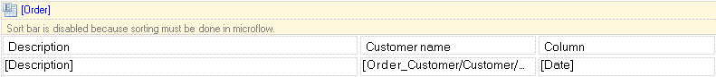

The data grid shows a list of objects in a grid. For example, a data grid can show all the orders a customer has placed.

{}

A data grid showing a list of orders with a description and the referenced customer name.

{}

## Components

### Columns

See [Columns (document template)](columns-document-template).

### Sort bar

See [Sort Bar](sort-bar).

## Appearance Properties

### Column weights

The column weights are percentages separated by semi-colons that determine the widths of the columns. The weights have to add up to 100\. An alternative way of changing the widths of columns is by dragging the separating line between columns.

{}

In the screenshot above the column weights are 50;25;25.

{}

### Cell spacing

Cell spacing specifies the space in between cells

### Cell padding

Cell padding specifies the space between the content of the cell and the cell wall

### Enable striping

With striping enabled you can set the properties of even and uneven datagrid rows individually. This way you can create a striping effect by varying color for the 2 different row styles.

### Style

See [Style](style)

## Common Properties

### Name

The internal name of the widget. You can use this to give sensible names to widgets. The name property also appears in the generated HTML: the widget DOM element automatically includes the class '`mx-name-{NAME}`', which can be useful for [Selenium testing](/howto7/integration/selenium-support).

## Data Source Properties

The data source properties determine which objects will be shown in the data grid. The list of objects in the data grid is constrained by the following mechanisms:

1.  For top-level data grids, the objects passed in the microflow calling the document export action are shown.
2.  For nested data grids, if an entity path is used, only the objects reachable by following the path from the containing object are shown.
3.  For nested data grids, if a microflow is used, the objects returned by the microflow are shown.

### Entity (Path)

The entity (path) property specifies which entity instances will be shown in the data grid. A top-level data grid is always connected to an entity. A nested data grid can either be connected to an entity or to an entity path starting in the entity of the containing data view. The entity path can follow associations irrespective of type and ownership.

### Microflow

When a nested data grid is connected to a template, a microflow is needed to retrieve the data. The input parameter of these microflows is always the object of the containing data view and the output is a list of objects of the type of the nested datagrid.
