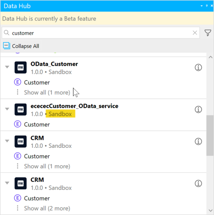

{}[replace all graphics with 8.14 screens and improve on clarity of images]{}

## 1 Introduction 

[Mendix Data Hub](/data-hub/index) enables integration of available data sources from the different sources in an organization into your Mendix apps. This means that new apps can be created using shared datasets that are registered in the [Data Hub Catalog](/data-hub/data-hub-catalog/index). In Studio Pro, this is possible using the integrated functionality of Data Hub Catalog through the **Data Hub** pane.

The **Data Hub** pane enables you to search the Data Hub Catalog and discover the data sources available for your organization. Via this pane you can add the entities that are exposed in the OData services registered in the Data Hub Catalog into your app's domain model, where they are known as [external entities](external-entities). These external entities provide access to the data associated with the entities which can be utlized in your app.

Click  **View** > **Data Hub** to display the **Data Hub** pane:

## 2 Data Hub Pane in the Domain Model

In the domain model, the Data Hub pane is used to search the Data Hub Catalog for services and entities that can be dragged and used:

The following functionality is available in the pane:

* [Search](#search) – Enter a search string of alphanumeric characters to find a service, entity, or attribute in the Data Hub Catalog. Entities can be dragged from the search results into your domain model as external entities.

* [Filter](#search) – By default, the search will search for services in production environments. Click the **Filter** icon to include non-production environments in the search.

* [Search results](#viewing) – The items satisfying the search string will show the service name, service version, environment that the service was deployed to, and the entities in the service. Services and the entities that are currently being used in the current domain model are indicated with a green check-mark in the search results. You can drag entities from the search results into the domain model and use them as a data source for your app project.

*   [View services consumed by your project](#viewing) – When no search string is specified, the consumed entities will be displayed for the project:

To add entities to your project model, see [Adding an External Entity to a Project](external-entities#adding-external-entities).

## 2 Searching the Data Hub Catalog {#search}

As you enter a search term, all the items in the Data Hub Catalog satisfying the search string are listed in the search results. You can do a wildcard search by entering `*` in the search area.

{}
The search strings must be a minimum of 3 alphanumeric characters. Punctuation cannot be used as part of the search term except for the `*` character to perform a wildcard search in the Data Hub Catalog. For further details, see [How to Search in the Data Hub Catalog](/data-hub/data-hub-catalog/search).
{}

By default, the search is restricted to apps and services deployed to a production environment. To include non-production environments in the search, click the **Filter** icon and then **Show development environments**:

{}[8.14 graphic]{}

## 3 Viewing Search Results  {#viewing}

For all items satisfying the search string, the following information is displayed:

* Service name

*  An icon indicating the source of the service (Mendix, SAP, Siemens Teamcenter, or another non-Mendix app)

  {}[list the icon types]{}

* Service version

*  The name of the environment that the service is deployed to (for non-production environments)

  {}By default, search results will show deployments to production environments which will not be named in the search results. Only the names of non-production environments will be displayed.{}

* blue arrow????? Update 

* Green check-mark if the service or entity is already consumed by the project

*  Information icon to view further information on the service and to go directly to the **Service Details** page in the Data Hub Catalog: 

  

  {}[**AD: can you cross-reference "Service Details" to the DHG?**]{}

If you right-click a consumed service, you can do the following:

  * **View in Data Hub Catalog** – click this to go to the **Service Details** page in the Data Hub Catalog
  * **Go to connection settings** – click this to open the [consumed OData service](consumed-odata-service) document

If you right-click an entity in the list and select **View in Data Hub Catalog**, you will go to the **[Entity Details]** page in the Data Hub Catalog.

{}[**AD: can you cross-reference "Entity Details" to the DHG?**]{}

If you right-click a consumed entity and **Go to entity**, the domain model will be opened.

{}[previous section: adding an external entity has now moved to the external-entities doc - watch for ex-refs]{}

##  5 Read More

* [Data Hub Catalog](/data-hub/data-hub-catalog)
* [External Entities](external-entities)
* [How to Consume Registered Assets](/data-hub/data-hub-catalog/consume)
