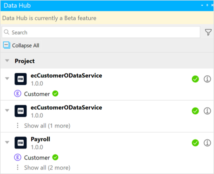
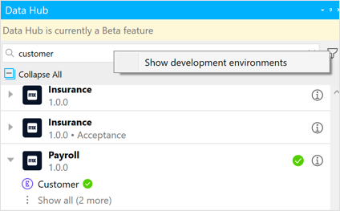
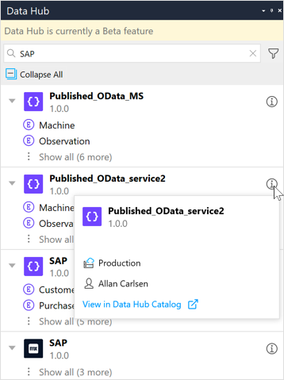

## 1 Introduction 

[Mendix Data Hub](/data-hub/index) enables integration of available data sources from the different applications in an organization into your Mendix apps. This means that new apps can be created using shared datasets that are registered in the [Data Hub Catalog](/data-hub/data-hub-catalog/index). In Studio Pro, this is possible using the integrated functionality of Data Hub Catalog through the **Data Hub** pane.

{}
You need a license to use Data Hub in Studio Pro. You will not For further information see [Data Hub License](consumed-odata-service-requirements#license-limitations).
{}

The **Data Hub** pane enables you to search the Data Hub Catalog and discover the data sources available for your organization. Via this pane you can add the entities that are exposed in the OData services registered in the Data Hub Catalog into your app's domain model. These external entities provide the connection to the data associated with the entities which can be utilized in your app and they are called [external entities](external-entities).

To display the **Data Hub** pane, click **View** > **Data Hub**:

{}{}

## 2 Data Hub Pane in the Domain Model

In the domain model, the Data Hub pane is used to search the Data Hub Catalog for services and entities that can be dragged and used in your app project and when no search string is specified, the consumed services and entities for you project are displayed in the **Project** panel.

### 2.1 The Search Pane

{}{}

The following functionality is available in the **Data Hub** pane:

* [Search](#search) – Enter a search string of alphanumeric characters to find a service, entity, or attribute in the Data Hub Catalog. Entities can be dragged from the search results into your domain model as external entities.
* [Filter](#search) – By default, the search will search for services in production environments. Click the **Filter** icon to include non-production environments in the search.
* [Search results](#viewing) – The search results satisfying the search string will show the service name, service version, environment that the service was deployed to, and the entities in the service. If attributes satisfy the search criteria, they will be displayed under the expanded entity. Services and the entities that are currently being used in the current domain model are indicated with a green check-mark in the search results. You can drag entities from the search results into the domain model and use them as a data source for your app project.

### 2.2 The Project Pane {#projectpanel}

When no search string has been specified in the **Data Hub** pane, the **Project** panel is displayed. This shows the consumed services and the external entities used in the current project. The attributes for consumed entities are also listed:

{}{}

To add entities to your project model, see [Adding an External Entity to a Project](external-entities#adding-external-entities).

## 3 Searching the Data Hub Catalog {#search}

As you enter a search term, all the items in the Data Hub Catalog satisfying the search string are listed in the search results. 

### 3.1 Wildcard Search
You can do a wildcard search by entering `*` in the search area.

{}
The search strings must be a minimum of 3 alphanumeric characters. Punctuation cannot be used as part of the search term except for the wildcard character `*` to perform an empty search in the Data Hub Catalog. It is not possible to use the wildcard in combination with other characters. For further details, see [How to Search for Registered Assets](/data-hub/data-hub-catalog/search).
{}

### 3.2 Service Environments
By default, the search is restricted to apps and services deployed to a production environment. To include non-production environments in your search, click the **Filter** icon and check **Show development environments**:

{}{}

{}
When the development environments setting is checked, all subsequent searches results will also include hits in non-production environments. 
{}

## 4 Viewing Search Results {#viewing}

For all items satisfying the search string, the following information is displayed:

* Service name

*  An icon indicating the source application of the service (for example, Mendix, SAP, Siemens Teamcenter, or other non-Mendix apps)

* Service version

*  The name of the environment that the service is deployed to (for non-production environments)

	{}By default, search results will show deployments to production environments which will not be displayed in the search results list. Only the names of non-production environments will be shown.{}

* Green check-mark if the service or entity is already consumed by the project

*  Blue **Update Service** icon to indicate that there is a later version of the consumed service available in the Data Hub. Click to update the service that is consumed in the project to the contract that is now available:

	

	{}If there is an OData Service update available, then the entities that are listed are those that are available in that version of the OData service. These entities will be "grayed-out" to indicate that they can not be dragged into the domain model as the current contract that consumed in the project is not the same. The version of the consumed OData service shown in the search results must be retrieved by clicking the **Update**. arrow. {}
  
  {}The version number that is shown for the OData service is the latest one that is available in the Data Hub Catalog at the service endpoint—in the example above version 1.0.11 of **Theatre_service** is currently consumed in the project, but version **1.0.12** is now available in the Data Hub Catalog. The search results display the entities available in the new service (also showing one that is locally consumed) however they are greyed-out and cannot be selected until the local service is **Updated** to this one.{}
  
* Information icon to view further details for the service and a link to go directly to the [Service Details](/data-hub/data-hub-catalog/search#search-details) screen in the Data Hub Catalog: 
  
  {}{}
  
### 4.1 Selected Consumed Service
If you right-click a consumed service, you can do the following:

  {}{}

  * **View in Data Hub Catalog** – click this to go to the **Service Details** page in the Data Hub Catalog
  * **Go to connection settings** – click this to open the [consumed OData service](consumed-odata-service) document

### 4.2 Selected Entity
If you right-click an entity and select **View in Data Hub Catalog**, it will take you to the entity details page in the [Data Hub Catalog](/data-hub/data-hub-catalog/index).

If you right-click a consumed entity and **Go to entity**, it will take you to the entity in the domain model.

### 4.3 Selected Attribute
If you right-click an attribute of a consumed entity and **Go to attribute**, it will take you to the attribute in the domain model.

##  5 Read More

* [Data Hub Catalog](/data-hub/data-hub-catalog)
* [External Entities](external-entities)
* [Consumed OData Service](consumed-odata-service)
* [How to Consume Registered Assets](/data-hub/data-hub-catalog/consume)
