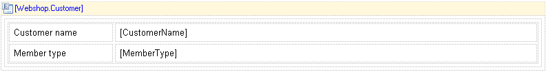

The data view is used for showing the contents of exactly one object. If, for example, you want to show details of a single orderline this is most easily achieved with a data view. The data view typically contains a table with static labels and dynamic data widgets like a dynamic label. In more complex templates, a data view can contain data grids and other data views for related objects.

A data view showing orderline information

## Common Properties

{}

## Data Source Properties

The data source properties determine which objects will be shown in the data grid. The list of objects in the data grid is constrained by the following mechanisms:

1.  For top-level data grids, the objects passed in the microflow calling the document export action are shown.
2.  For nested data grids, if an entity path is used, only the objects reachable by following the path from the containing object are shown.
3.  For nested data grids, if a microflow is used, the objects returned by the microflow are shown.

### Entity (Path)

The entity (path) property specifies of which entity an instance will be shown in the data view. A top-level data view is always connected to an entity. A nested data view can either be connected to an entity or to an entity path starting in the entity of the containing data view. The entity path can follow associations irrespective of type and ownership.

### Microflow

When a nested data view is connected to an entity, a microflow is needed to retrieve the data. The input parameter of these microflows is always the object of the containing data view and the output is an object with the entity type of the nested data view.
