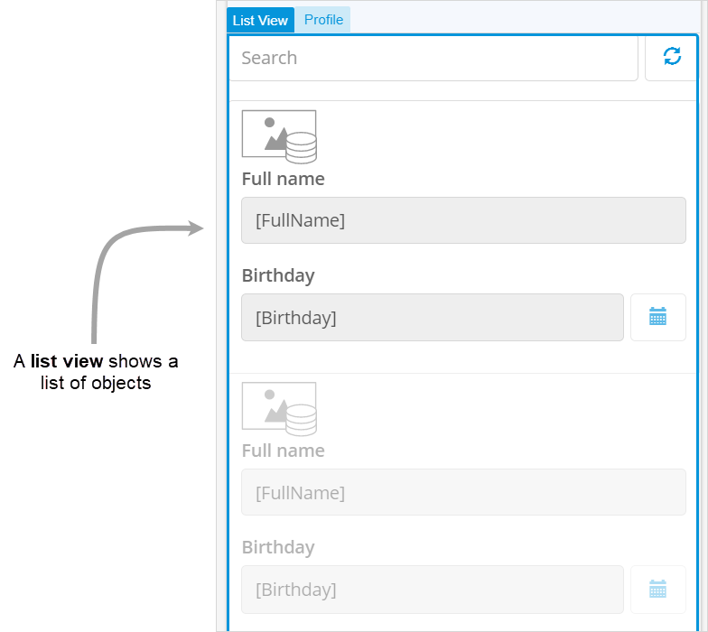

## 1 Introduction

Data widgets display contents of one object or a list of objects. 

The Data widgets category contains the following widgets:

* [Data view](data-view) – This widget shows the contents of exactly one object. If, for example, you want to show details of a single program item, you would use a data view for this:

    {}
    {}

* [Data grid](data-grid) – This widget shows a list of objects in a table format. For example, a data grid can show all the orders a customer has placed. Using controls provided by the data grid you can browse, search, and edit those objects.

    {}
    {}

* [Template grid](template-grid) – This widget shows a list of objects in a tile view. For example, a template grid can show a list of employees with their profile pictures. Using controls provided by the template grid you can browse, search, and manipulate those objects.

    {}
    {}

* [List view](list-view) – This widget shows a list of objects. For example, you can display list of all profiles using a list view. 

    {}
    {}

## 2 Performing Basic Functions

{}

## 3 Read More

* [Page](page)
* [Pages](pages)