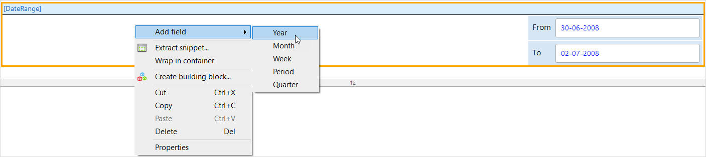
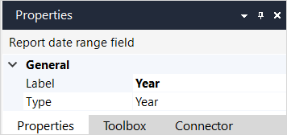

## 1 Introduction

A **Date range field** can be placed inside a [Report date parameter](report-date-parameter) to make it easier for an end-user to select a data range, rather than having to specify a from and to date. The from and to dates of the selected period are then stored in the from and to field of the date range selector.

To add a date range field, right-click the widget and choose **Add field** from the pop-up menu.

## 2 Date Range Field Properties

An example of date range field properties is represented in the image below:

{}
{}

Report parameter properties have only a [General](#general) section.

### 2.1 General Section{#general}

#### 2.1.1 Label

The **Label** property specifies the text that is displayed beside the date range field.

#### 2.1.2 Type

**Type** determines the sort of range which the end-user can select.

| Type | Behavior | Example | Range |
| --- | --- | --- | --- |
| Year | Allows the end-user to select a calendar year.<small>[1]</small> | 2019 | 1 January 2019 to 31 December 2019 |
| Quarter<small>[2]</small> | Allows the end-user to select a quarter of the year. | 2019 > 2 | 1 April 2019 to 30 June 2019 |
| Month<small>[2]</small> | Allows the end-user to select a month of the year. | 2019 > May | 1 May 2019 to 31 May 2019 |
| Week<small>[2]</small> | Allows the end-user to select a week of the year. | 2019 > Week 19 | 5 May 2019 to 12 May 2019 |
| Period<small>[2]</small> | Allows the end-user to select one of the following periods: last week, this week, next week, last month, this month, next month, last quarter, this quarter, next quarter. | | |

<ul style="list-style-type:none">
<li><small>[1]</small> The year will be between the **Min. year** and **Max. year** specified in the [report date parameter](report-date-parameter) widget.</li>
<li><small>[2]</small> You also need to add a **Year** date range field if you use a date range field of this type.
<ul style="list-style-type:none">
    <li>The end-user will need to choose the year before they can choose a date range field of this type.</li>
    <li>The end-user can only choose one of these types, plus the year.</li>
</ul>
</li>
</ul>
