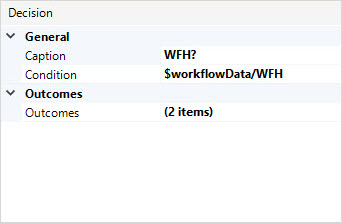

## 1 Introduction

A decision is an element that makes a choice based on a condition and follows one and only one of the outgoing paths. For example, you need to use a decision to follow different paths when a new hire works remotely or when they work from the office.

## 2 Properties

An example of decision properties is represented in the image below:

Decision properties consist of the following sections:

* [General](#general)
* [Outcome](#outcome)

### 2.1 General Section {#general}

#### 2.1.1 Caption

The **Caption** describes what happens in this element. It is displayed in the workflow element to make the workflow easier to read and understand without needing to add annotations.

#### 2.1.2 Condition

**Condition** is configured based on an [expression](expressions). The expression should result in a Boolean or an enumeration.

For the expression resulting in a Boolean, two paths are possible: **true** and **false**. For example, you can use the expression resulting in a Boolean if you want to follow different paths if a new employee is working from home (and either send their devices to the home address or set up a workstation in the office).

The number of conditions available for the enumeration type depends on the corresponding enumeration values. There is also the *empty* condition available for enumeration: if the enumeration parameter or an attribute of an object is unassigned, the sequence flow with the caption **(empty)** is followed.

### 2.2 Outcomes Section {#outcome}

**Outcomes** allows you change the outgoing paths of the decision. 

## 3 Read More

* 