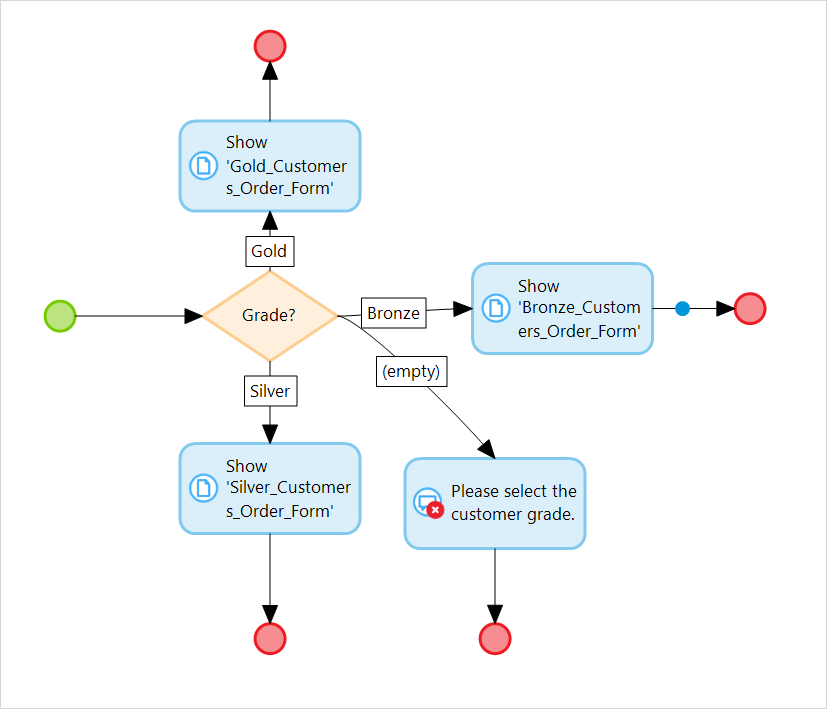

## 1 Introduction
Decisions are elements that split or merge sequence flows based on conditions set for these elements. Decisions have a shape of a diamond.

There are following types of decisions:

* [Decision](decision) – makes a choice based on a condition and follows one and only one of the outgoing sequence flows

	

* [Object Type Decision](object-type-decision) – makes a choice based on the type of an object of a generalized entity

	

* [Merge](merge) – merges incoming flows 

	
