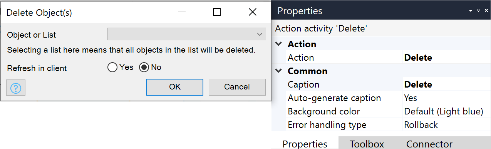

{}
This activity can only be used in **Microflows**.
{}

## 1 Introduction

Delete object(s) can be used to delete one or more objects.

## 2 Properties

An example of delete object properties is represented in the image below:

There are two sets of properties for this activity, those in the dialog box on the left, and those in the properties pane on the right.

The delete object properties pane consists of the following sections:

* [Action](#action)
* [Common](#common)

## 3 Action Section{#action}

The **Action** section of the properties pane shows the action associated with this activity.

You can open a dialog box to configure this action by clicking the ellipsis (**…**) next to the action.

You can also open the dialog box by double-clicking the activity in the microflow or right-clicking the activity and selecting **Properties**.

### 3.1 Object or List

The name of the object or list of objects that will be deleted. If you choose a list, all objects in that list will be deleted.

### 3.2 Refresh in Client

This setting defines how changes are reflected in the pages presented to the end-user.

Default: *No*

#### 3.2.1 Microflow is Called from the Client in an Online App

If **Refresh in client** is set to *No*, the deletion is not reflected in the client.

If set to *Yes*, the deletion is reflected across the client, which includes reloading the relevant [data sources](data-sources).

{}
Deletions are always reflected in the client. [Data sources](data-sources) are only reloaded if **Refresh in client** is set to *Yes*.
{}

#### 3.2.2 Microflow is Called in an Offline, Native, or Hybrid App

When inside a microflow that is called from an offline, native, or hybrid app, the **Refresh in client** option is ignored and functions as if it was set to **No**.

For more information, see the [Microflows](offline-first#microflows) section of the *Offline-First Reference Guide*.

## 4 Common Section{#common}

{}

## 5 What Happens During a Delete?

Clicking a Delete button or triggering a delete activity will initiate the delete events. In addition, when an object is removed through the configured delete behavior, it will execute all before and after events.

* Events: all before and after events are executed, and if any before-delete event returns false, an exception can be thrown
	* If an exception occurs during an event, all the applied changes are reverted with the default error handling behavior
	* Changes made prior to the rollback will be kept
* Database: if an object has the state **Instantiated**, there will be no database communication required
	* For any other status, a delete query is executed in the database
* Result: the object will be removed from memory and if applicable from the database
	* All delete behavior for the associations is validated, and any associated objects are removed as well

