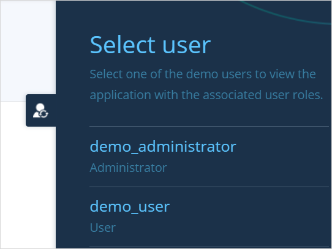

title: "Demo Users"
parent: "project-security"
tags: ["studio pro", "demo users", "demo-users", "security, "project security]

## 1 Introduction

Demo users are a demonstration of each [user role](user-roles)what existing in your app. You can use demo users to test how your app looks like for each user role or to demonstrate your app to other people. 

When the application is started for the first time, the specified demo users are created automatically.

The demo users are only created and shown when running your application locally on your development machine, or when running in a sandbox.

{}

After they are created automatically, demo users do not differ in any way from other local users that are defined in your application. This means that you can still manually sign in using their user name and password, even after disabling the demo users feature. Also, the demo users are never automatically removed from the database.

{}

## 2 Enabling Demo Users

To use demo users you need to enable them. Select **Yes** to be able to delete/add/edit demo users and use them to [test your application](#test-your-app). To disable demo users, select **No**.

## 3 Demo User Properties

### 3.1 Username

The name of the demo user. This name must be unique, and cannot be the same as the name of the [administrator user](administrator).

### 3.2 Password

The password of the demo user is created automatically when the demo user is created. It cannot be changed, but it's possible to put a copy of this password on the system clipboard. This makes it possible, for example, to share the credentials of a demo user with someone else.

### 3.3 Entity

The entity of the demo user. This must be the System.User entity, or a specialization thereof.

### 3.4 User Roles

Here you can select the user roles of the demo user. Each demo user must have one or more roles.

## Testing Your App via Demo Users {#test-your-app}

After signing in to your application as the [Administrator](administrator), a user icon is shown at the right-hand side of your screen. You can click this icon and the menu bas **Select user** will be displayed. It shows a list of all the demo users. Selecting a user from this list will sign in to your application using the credentials of this user, thus allowing you to test or demo your application with the user's role(s). This allows for rapid testing of your application with different user roles.

## Read More

